## 第1章　投资常识　巴菲特亲自讲给你

> 金融行业从业者想要赚钱，就得说服其客户：“不要只是坐在那儿，想办法做点什么。”但对客户来说，要想让财富增长，就必须遵循相反的准则：“什么也不要做，等着就足够了。”试图击败市场是不可能的，而这是唯一可以让你避免陷入其中的办法。

## 第2章　股市收益　必然等于企业长期业绩

`均值回归（reversion or regression to mean, RTM）`

> 投资者对市场的信心起伏不定，市盈率也会随之上下波动。每当贪婪主宰市场的时候，我们就会看到市盈率居高不下；而当希望成为市场的主旋律的时候，市盈率就会会较为适中；而当失望与恐惧弥漫市场时，市盈率则会一落千丈。于是，股价会起伏波动，周而复始，投资者的情绪波动也会反映在投机收益上，有时它们可能暂时偏离经济基本面长期向上的发展趋势。

### 经济基本面决定股市最终表现

> 可以肯定的是，股票市场收益有时会远远超过经济基本面（比如说20世纪20年代末、20世纪70年代初以及20世纪90年代末，甚至是目前的行情）。但这只是暂时现象，经济基本面就像一块强大的磁铁，很快就会把股市这块铁吸到自己身上，尽管从偏离到回归往往需要经历一段时间（例如，20世纪40年代中期、20世纪70年代末，以及2003年出现的股市低谷）。这就是所谓的均值回归（reversion or regression to mean, RTM）

> 一旦盲目专注于瞬息万变的短期股市时，投资者总是会对长期历史趋势视而不见。当股市收益高于长期平均值时，我们却不认为这很少是因为投资基本面很好，也就是说增长并非是因为收益增长率和股利收益率得到提升。相反，股票收益率的剧烈波动，更多还是源于投资者的心理因素，并通过不断变化的市盈率反映出来。
>
> ---
>
> 尽管股票价格经常与企业价值脱钩，但长期而言，决定股价的依然是现实。因此，虽然投资者从情感和直觉上更愿意认为，历史必然要延续到未来，但是在现实生活中，任何包含着高股票投机收益的历史收益率，对我们认识未来都是彻头彻尾的误导。至于为什么不能用历史收益率来预测未来，我们只需要记住伟大的英国经济学家——约翰·梅纳德·凯恩斯（John Maynard Keynes）在81年前写下的话：
>
> *用历史经验归纳得来的前提去推测未来，非常危险。除非我们能解释历史如此的根本原因。*

> 他（约翰·梅纳德·凯恩斯）指出，对股票的长期预期是经营（“对资产在整个寿命期内的预期收益进行预测”）和投机（“对市场的心理进行预测”）的结合。

### 以10年视角看投资，收益极为稳定

> | 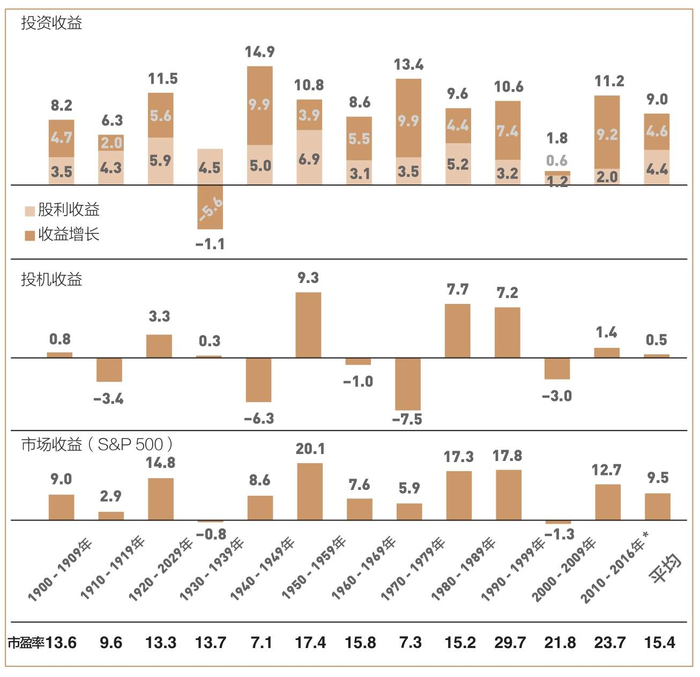 |
> | :----------------------------------------------------------: |
> |      图2-2　10年期的投资收益，1900—2016年（年度百分比）      |
> | *此处统计至2016年。市盈率参考每个10年期期末的数据。1900年的市盈率是12.5。 |
>
> 图2-2最上面的部分，显示了1900年以来10年期的年均投资收益率。我们首先可以看到，在每个10年期内，股利收益在总收益中的份额均非常稳定：全部是正值，平均值为4%，只有2次超出了3%～7%的范围。
>
> 再看一下收益增长对投资收益的贡献，除了20世纪30年代“大萧条”时期之外，收益增长对投资收益的贡献在每个10年期内均为正值，并且在几个10年期超过了9%，一般在4%～7%，平均值为4.6%。
>
> 结论：总投资收益仅在一个10年期内出现过负值。这些10年期的总投资收益——企业经营所创造的盈利——极为稳定，在各年度基本保持在8%～13%，平均值为9%。

> 1999年4月，市盈率增长到了*史无前例的34倍*，但市场很快回归理性，此后的股市大跌顺理成章。

### 以10年视角看投机，收益波动巨大

> 投资收益与投机收益之和等于股票市场总收益。**尽管投机收益在绝大多数10年期内均对总收益产生了较大影响，但从长期来看，却几乎没有任何影响。**9.5%的年均收益率几乎全部是由企业创造的，而只有区区0.5%来自投机收益。
>
> 其中的原因很清楚：股票收益几乎完全取决于由企业创造的投资收益。至于反映在投机收益上的投资者心理因素，几乎对股市总收益没有影响。因此，**决定长期股票收益的是经济因素，而心理因素对短期市场的影响将随时间逐渐消失。**

### 投资者心理摸不透，市场长期走势可以预测

> 股票市场提供的长期收益，几乎完全取决于投资收益，也就是美国企业创造的利润和股利。换句话说，虽然梦想（我们为购买股票所支付的价格）经常脱离现实（企业的内在价值），但长期的主导力量依然是客观现实。

> 预期市场基本是投资者预期的产物。他们总想猜测其他投资者如何预期，以及其他人会对市场上的新消息产生怎样的反应。预期市场的本质就是投机，而真实市场的实质则是投资。因此，股票市场就是对商业投资的巨大干扰。
>
> 绝大多数情况下，它把投资者的注意力吸引到那些转瞬即逝、起伏不定的短期预期上，而不是那些真正有价值的东西——投资收益只能源于企业经营创造的长期收益。

> 我送给投资者的建议是忽略金融市场上的那些短期噪音，关注企业经营的长期状况。想要投资成功，就要摆脱股票价格的预期市场，融入企业的真实市场。

> 在大多数情况下，你对自己的股票值多少钱，肯定会有自己的想法。真正的投资者……应该做得更出色，他们应该忘却股票市场，把目光集中到股利回报以及企业的经营成果上。

## 第3章　指数基金　最简单的工具往往最有效

`标准普尔500指数`, `道琼斯·威尔逊整体市场指数（Dow Jones Wilshire Total Market Index）`, `区间依赖型（period depends）`

> 千万要注意，不要把简单和愚蠢等同起来。实际上，早在1320年，奥卡姆的威廉（William of Occam，14世纪逻辑学家）就已经阐述了这个概念：当有多个解决问题的答案时，一定要选择最简单的那个（“如无必要，勿增实体”）。正因如此，“奥卡姆剃刀”原理才成为科学研究的一个重要原则。因此，想要拥有所有美国企业，最简单的办法，就是持有一个整体股票市场的投资组合，或者与之对等的组合。

> 在过去90年里，一般公认的美国股票市场投资组合，正是以标准普尔500指数为代表。该指数创建于1926年，目前包括500只股票。从本质上看，它包含了美国最大的500家公司，并以各公司股票的市值为权重，采用加权平均法计算。到目前为止，这500家公司的股票市值已经达到所有美国股票市值的85%左右。这种市值权重型指数的优点是它的净值不需要通过买卖股票来调整，而可以根据股票价格的变动自动调整。

> 作为一个极具可比性的量度指标，标准普尔500指数成为衡量基金经理经营业绩的理想标准，乃至股票市场的基准收益率。今天，标准普尔500指数依然是考核养老金基金和共同基金管理人经营业绩的参考标准。

> 道琼斯·威尔逊整体市场指数（Dow Jones Wilshire Total Market Index）。它容纳了3 599只股票，其中包括标准普尔500指数中的500只股票。但是，由于其成分股也是按股票市值进行加权平均的，因此，其余3 099只股票仅占其价值的15%左右。
>
> 作为涵盖范围最广的美国股票指数，它是衡量股票总体价值的最佳指标，也是评判全体投资者美国股票投资收益情况的权威标准。

> 不管采用何种衡量指标，我们都应该认识到，对构成这个股票市场的所有上市公司而言，股票市场的总收益必然等于所有投资者获得的收益之和（注：未扣除费用）

> 对于这样一个低成本，且涵盖整个市场的基金，其长期收益率注定要高于股票投资者的整体收益率。一旦认识到这一事实，我们就会发现，指数基金的优势体现在长期，而且表现在每一年、每一月和每一周，甚至是每一天的每一分钟。不管这个时间框架有多长，股票市场的总收益减去中间成本，必然要等于全体投资者所能得到的净收益。**如果数据不能证明指数化投资是赢家，那么这些数据肯定有问题。**

### 指数基金表现优于90%的主动型共同基金

> | 表3-2　标准普尔500指数胜过主动型共同基金的比例，2001—2016年  |
> | :----------------------------------------------------------: |
> | 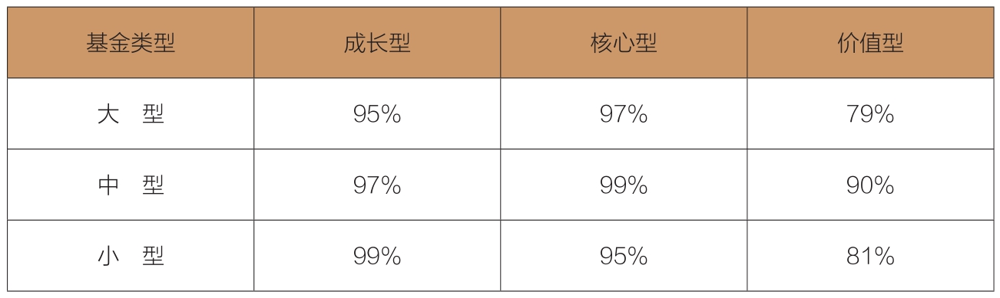 |
>
> **标准普尔500指数的表现优于97%的主动型大盘核心股基金。**除了标准普尔500指数以外，其他用来比较的指数还包括标准普尔500成长型和价值型指数。采用这三种基准指数的基金，又可以根据规模分为大型、中型和小型。表3-2显示出指数的绝对优势，因此，指数基金的蓬勃发展也就顺理成章。

### 投资的真理：人多的地方不要去！

> 过去40年，标准普尔500指数以年均10.9%的速度增长。当下，面对较低的股利收益、较低的收益增速预期和较高的市场估值，如果有人假设这样的收益率会在今后40年里持续下去，那么他就太不聪明了。

> “奥卡姆剃刀”那个颠扑不破的真理：不要一窝蜂地和别人凑热闹，投资者似乎总喜欢不辞劳苦地去挑选股票，希望找到能给自己带来意外之喜的市场宠儿，或是试图抢先一步，未卜先知，猜测股票市场的前景（总之，这也是绝大多数投资者最喜欢做，但是最徒劳的两件事情）。事实上，我们只需要所有方案中最简单的一个——买入并持有一个低成本、追踪整体股票市场的组合。

## 第4章　成本　长期收益的“胜负手”

### 扣除成本后，击败市场是一场输家游戏

> 作为一个集体，所有投资者的收益总和必定等于市场收益总和。但是请注意：这是扣除投资成本之前的情况。
>
> 一旦扣除了金融中介成本——五花八门的管理费、组合换手费、经纪人佣金、销售税、广告费、各种运营费，以及法律服务费，投资者的整体收益必然而且永远会低于市场收益总和，而其中的差值便是这些成本之和。这就是投资领域无可争辩的事实。

> 投资者群体赚取的总收益必然要少于金融市场实现的总收益。这些成本到底有多少呢？对单个投资者来说，每年的交易成本相当于交易额的1.5%左右。交易次数较少的投资者，承担的中间成本也较低（1%左右），交易越频繁，中间成本就越大。**换手率超过200%的投资者承担的中间成本约为3%。**

> 在主动型股票共同基金中，管理费和运营费——两者统称为费率（expenses ratio）——每年平均大约为1.3%。按照基金资产加权后，大约为0.8%。然后，我们再加上另外0.5%的销售费。这是假设初始销售费为5%，平均到10年的结果。如果投资者仅持有5年，每年承担的费用就会增加一倍——也就是每年需要摊销1%（许多基金都有销售费，经常分摊到10年或更久，大约60%的基金是“免费”基金）。

> 正如美国作家厄普顿·辛克莱（Upton Sinclair）所言：“当一个人可以因为不了解而赚钱，那了解这件事对他来说将变得难如登天。”

> 投资者太过轻视投资成本，尤其是以下3个原因，更促使他们低估这些成本的重要性：
>
> - 股票市场的收益率一直保持在较高水平（1980年过后，股票市场的平均年收益率达到11.5%，而基金的回报率看起来也不错，达到10.1%）。
>
> - 投资者在关注短期收益时，忽视了交易成本在整个投资期内产生的流出效应。
>
> - 很多此类成本是隐性的（投资组合交易成本、手续费变动，以及不必要的资本利得带来的税金等）。

> | 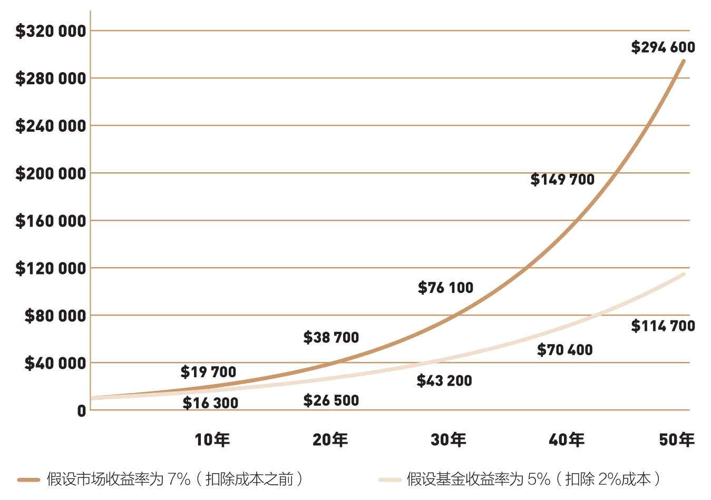 |
> | :----------------------------------------------------------: |
> | 图4-1　神奇的复利效应与高昂的复利成本：10 000美元的初始投资在50年内的增长趋势 |
> 
> 看看图4-1的两条收益曲线。5%和7%的差距在最初几年看起来并不大。然而，这两条收益曲线逐渐分离，最终有了天壤之别。50年后，基金的累计价值只有114 700美元，比市场的累计回报少了179 900美元。为什么？原因就是复利效应造成的巨大成本。

当你的资金规模越发庞大时，你以为不多的费率将以可怖的速度吞噬你的资产

> 在投资领域，时间并不会为任何人治愈任何创伤，有时候反而会在伤口上撒盐。谈到报酬，时间是你的成本，但是一旦考虑到成本，时间就成了你的敌人。

> | 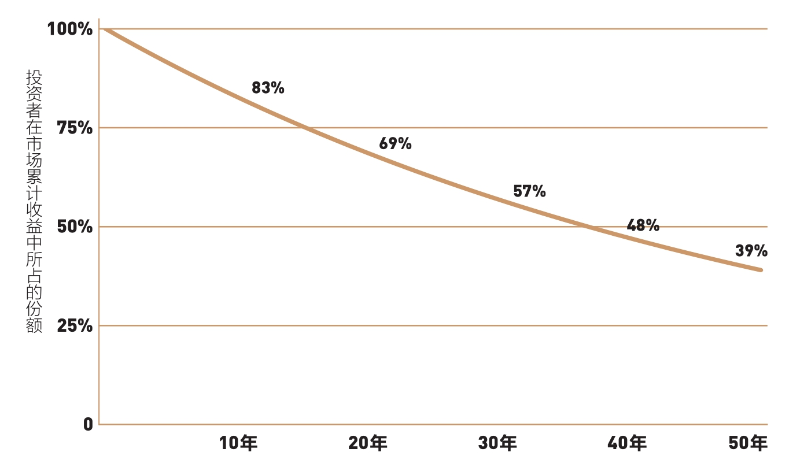 |
> | :----------------------------------------------------------: |
> |     图4-2　残酷的复利效应：收益率落后于市场2%的长期后果      |
>
> 第1年年底，资产的潜在价值仅消失了2%左右（10 700美元和10 500美元）。到了第10年，流失的价值为17%（19 700美元和16 300美元）。到了第30年，流失的价值为43%（76 100美元和43 200美元）。到50年投资期结束时，在通过持有市场组合积累起来的收益中，有将近61%被成本所吞噬，投资者只得到了39%。

复利不只是体验在增长，当收益低于成本（费率、通胀等）时，所需支付的成本费率也会以复利的形式快速蚕食本金。

> 长期来看，复利收益注定敌不过复利成本，我希望你永远不要忘记这一点！

> 投资的成败取决于成本的高低！所以说，各位一定要准备好笔，认真算一算。你一定要认识到，没有必要去参与这场绝大多数个人投资者及共同基金股东热衷的游戏，陷入疯狂的股票交易无法自拔。市场上存在低成本的指数基金，能保证投资者获得企业经营收益带来的合理报酬。

> （彼得·林奇）在退休时也不得不对《巴伦周刊》（*Barron’s*）杂志说：“标准普尔500指数在10年内增长了343.8%，可普通股票基金只增长了283%。因此，专业投资人士的介入，反而让绩效变少了。大众投资指数基金应该会更好。”

## 第5章　费率　“到低成本池塘里钓鱼”

> 几乎所有基金专家，无论是财务顾问、金融媒体还是投资者，挑选基金时都非常看重过往业绩，甚至完全不参考其他信息。但过往业绩只能告诉我们过去发生了什么，无法告诉我们即将发生什么。就像各位即将学到的，强调基金的过往业绩非但没有帮助，甚至经常会适得其反。常识告诉我们：基金业绩总会起起伏伏。
>
> 还是有一些东西值得我们牢记：在选择基金时，不该过分依赖过往的业绩；你应该更加注重影响基金业绩的持续性因素：共同基金的持有成本。只有成本是永恒的。

> 业绩起起伏伏，而成本始终存在
>
> - 最常见，且最广为人知的一项成本是基金费。
> - 第二项重要成本是每次购买基金时支付的手续费。
> - 第三项重要成本来自投资组合买卖证券的成本。

> 成本会带来显著影响！表5-1显示，成本最低的基金和成本最高的基金，平均费率相差1.43%。这个成本差异在很大程度上解释了它们在收益上的差异。在过去25年，成本最低的基金的净年收益率为9.4%，而成本最高的基金的净年收益率却只有8.3%。因此，降低成本就可以提高收益。
>
> |         表5-1　股票共同基金的收益与成本，1991—2016年         |
> | :----------------------------------------------------------: |
> | 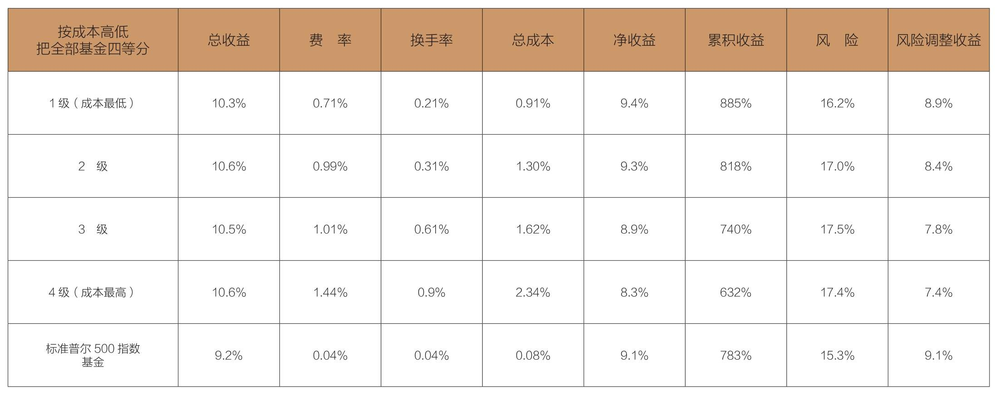 |
> | 注：成本包括费率和预计的换手成本，但不包括销售佣金。上述成本加上每一组的净收益即为总收益。 |
>
> 还有一个显著差异：随着成本的上涨，风险也在增加。如果用年收益的波动值衡量风险，那么可以看到，成本最低的基金蕴含的风险（16.2%）明显高于成本最高的基金（17.4%）。考虑到风险对收益的抵减作用，经过风险调整后，成本最低的基金的年度净收益率为8.9%，比成本最高的基金的年度净收益率（7.4%）足足高出1.5%。

> 我们夸大了成本的重要性了吗？我认为并没有。以下几段文字来自晨星一位倍受尊敬的分析师，除了可以确认我的结论，还值得参考：
>
> 在共同基金这一领域，费率绝对能够帮助你作出更好的决策。就目前我们所测试的任何情况及时间，低成本基金的表现都优于高成本基金。
>
> 费率是评估基金绩效非常有用的参考数据。在所有资产类别里，跨越所有时间段，成本最低的基金的收益总是高过成本最高的基金。
>
> 投资者应该把费率当作选择基金的首要评估指标。它是最值得信赖的业绩预测器。

> 事实上，通过指数基金锁定市场平均水准的报酬，往往可以使投资者们有机会获得平均水准以上的报酬，其表现也往往优于主动型股票或债券的投资组合。这就是如今基金投资领域呈现出的矛盾：获得平均水准的收益，是投资者所能达成的最好结果。

## 第6章　股利　对长期收益影响巨大

> 股利的长期复利效应如此惊人，而且企业分派的股利金额相对稳定，共同基金经理人十分重视股利吗？错！因为共同基金所签订的管理合约，是按基金净资产而不是股利收益收费。当股市的股利收益偏低，基金费用会消耗掉基金获得的绝大部分股利收益。

> 结果是，股票基金获得的大部分股利收益被费用吃掉。在主动型成长基金里，费用消耗了基金收益的100%；在主动型价值基金里，费用消耗了基金收益的58%。
>
> 主动型基金与对应的指数基金的差异非常惊人。2016年，对应的价值型指数基金的费用消耗了其收益的2%；低成本成长型指数基金的费用消耗了其收益的4%（见表6-1）。
>
> |              表6-1　股利收益和基金费用，2016年               |
> | :----------------------------------------------------------: |
> | 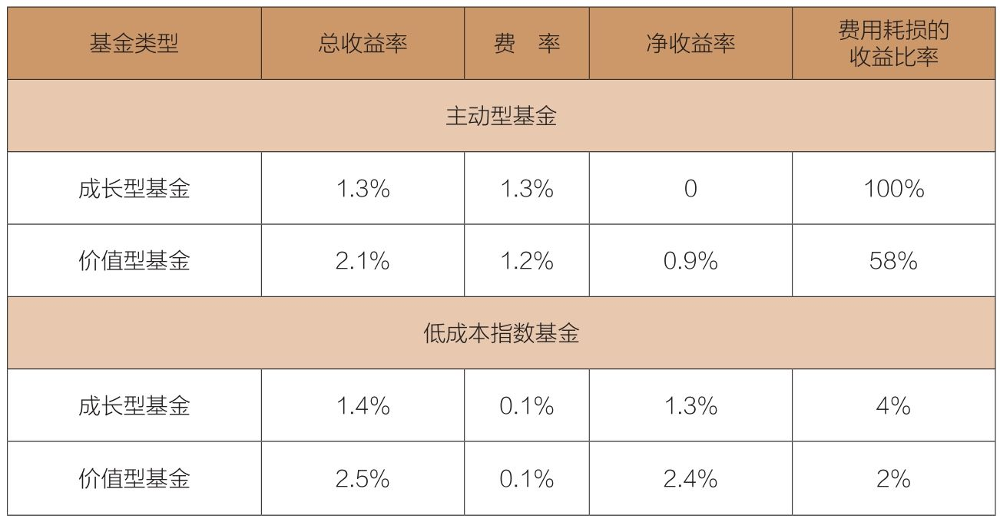 |
>
> 

> “我十分认同博格提出的有关低成本、低换手率的概念，以及继续持有、保持简单的主张……在我阅读过的博格著作中，我尤其喜欢他在股利方面提出的那些建议。”

## 第7章　行情和热点　制造盲目的乐观和贪婪

`资金加权收益率（dollar-weighted return）`

- **时间加权收益率（Time-Weighted Return）**：这是基金公司**对外宣传**的收益率。它剥离了资金进出的影响，只单纯衡量“基金经理的投资能力”（即假设你在期初投入1块钱，一直持有不动，期末能变成多少钱）。它**不关心**你期间是加仓了还是减仓了。

- **资金加权收益率（Dollar-Weighted Return）**：这是**你账户里实际发生的收益率**。它**非常关心**你何时加仓、何时减仓。如果资金流入/流出的时机不对，即使基金经理很牛，你的实际收益也可能很低甚至亏损。

### 错误的基金和错误的时机，让收益大打折扣

> 更严重的是，投资者对“新经济”基金、科技基金和业绩成长型基金趋之若鹜，而对相对较为保守的**价值型基金**冷眼相待。1990年，只有20%的资金投资于**激进的成长型基金**，但到1999年和2000年年初，基金收益达到峰值时，却有高达95%的资金涌入这类基金。2002年泡沫破裂后，投资者买入成长型基金的数额回落到360亿美元。此时市场即将触底，投资者却仍然把资金抽出成长型基金，转而投资于价值型基金，不过已经来不及了。

> 理性的投资者不仅应注意到第4章提到的低成本原则，还需要牢记本章提到的观点，排除情绪的影响。换句话说，投资者不应该追逐行情。

> 指数基金的美妙之处不仅体现在它的低费用，更重要的在于，它绝不像无数一诺千金但却毫无回报的基金，它的魅力永不减退。和那些热门基金不同的是，无论市场阴晴涨跌，指数基金在整个投资期内都将岿然不动，情感永远也不会进入你的收益计算公式。
>
> 在投资中，赢家的公式就是通过指数基金而拥有整个股市，然后把自己变成完全的旁观者，什么也不所做。无论发生什么，一定要坚持你所正在做的事情。

> 巴菲特的“4E”原则：“费用（expense）和情绪（emotion）是股票投资者（equity investor）最大的敌人（enemy）。”

## 第8章　税金　经常被忽视的重要成本

> 还有一种经常被忽略的成本，让投资者实际获取的收益遭到进一步削减。在这里，我指的就是税金——包括联邦政府、州政府和地方政府征收的所得税[(1)](javascript:void(0))。在这方面，指数基金同样具有巨大优势。事实上，大多数主动型基金不具有节税效应。为什么？因为它们的经理人关注短期表现，疯狂进行短线交易。

中国ETF/一级市场（如支付宝代销），交易/粉红：免个税、印花税，**需承担交易佣金**；

基金所得的税金情况：

| 收益类型              | 主动管理型基金 | 指数基金 |
| --------------------- | -------------- | -------- |
| **申购/赎回差价收入** | 暂免个税       | 暂免个税 |
| **二级市场买卖差价**  | 暂免个税       | 暂免个税 |
| **基金分红收入**      | 暂免个税       | 暂免个税 |
| **印花税**            | 暂免           | 暂免     |

股票所得的税金情况：

| 收益类型                       | 是否缴纳个人所得税 | 税率/规则      |
| ------------------------------ | ------------------ | -------------- |
| **流通股买卖差价**             | **暂免**           | 0%             |
| **限售股/原始股转让差价**      | **缴纳**           | 20%            |
| **股息红利（持股>1年）**       | **暂免**           | 0%             |
| **股息红利（1个月<持股≤1年）** | **缴纳**           | 实际税负10%    |
| **股息红利（持股≤1个月）**     | **缴纳**           | 实际税负20%    |
| **卖出股票印花税**             | **缴纳**           | 成交金额的0.1% |

> 以往强调长线投资的大多数基金经理，开始转向短线投机。但指数基金遵循着相反的策略——买入并“永久”持有。指数基金投资组合的年换手率已降至3%左右，其伴随的交易成本微不足道。

> “共同基金一直都未能对已实现的资本利得采取有效的管理，以至于无法对投资者的应纳税款进行有效递延……假如先锋500指数基金能够对所有资本利得进行递延处理，它的最终收益率可以超过92%的主动型基金。”

**资本利得（Capital Gains）**：指基金买卖股票赚到的**差价**。在美国，这笔钱一旦“实现”（即卖出股票），就需要向投资者**分配**，投资者**当年就要为这笔收益交税**。

**“递延处理”（Deferral）**：就是通过合法的投资策略，**尽量延迟卖出股票**，让赚到的差价**暂时不变成需要交税的“已实现资本利得”**

## 第9章　低收益率　我们不得不面对的未来

`债券的偿付风险`

> 你应该还记得本书第2章里介绍的原理：长期来看，股票市场收益取决于商业活动，也就是企业的股利收益和利润增长。然而，矛盾的是，1974年9月24日先锋基金创立以来的43年，股市贡献的收益超过了企业赚取的报酬，而且两者之间的差异是美国商业历史之最。
>
> 特别是，在这43年里，标准普尔500指数成分股的股利收益和利润合计的年均收益率只有8.8%（其中股利收益率3.3%、利润增长率5.5%），但股票市场提供的年均收益率达到11.7%（见图9-1）。
>
> 市场收益中，有2.9%属于投机收益，约占总收益的25%。这项收益率反映投资者上调了对股市的估值，*市盈率翻了不止3倍，从7.5倍增长到23.7倍*（1900—2016年，投机性收益只占总收益的0.5%，大约只有1974年后的1/5）。
>
> | 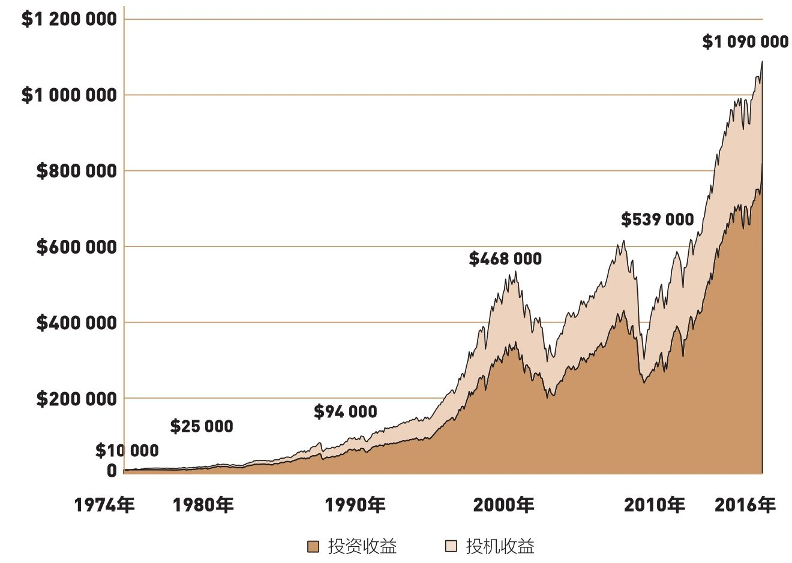 |
> | :----------------------------------------------------------: |
> |          图9-1　累计投资收益和投机收益,1900—2016年           |

> 债券的偿付风险指债券到期后未被偿付。

> 由60%股票和40%债券构成的平衡型投资组合
>
> 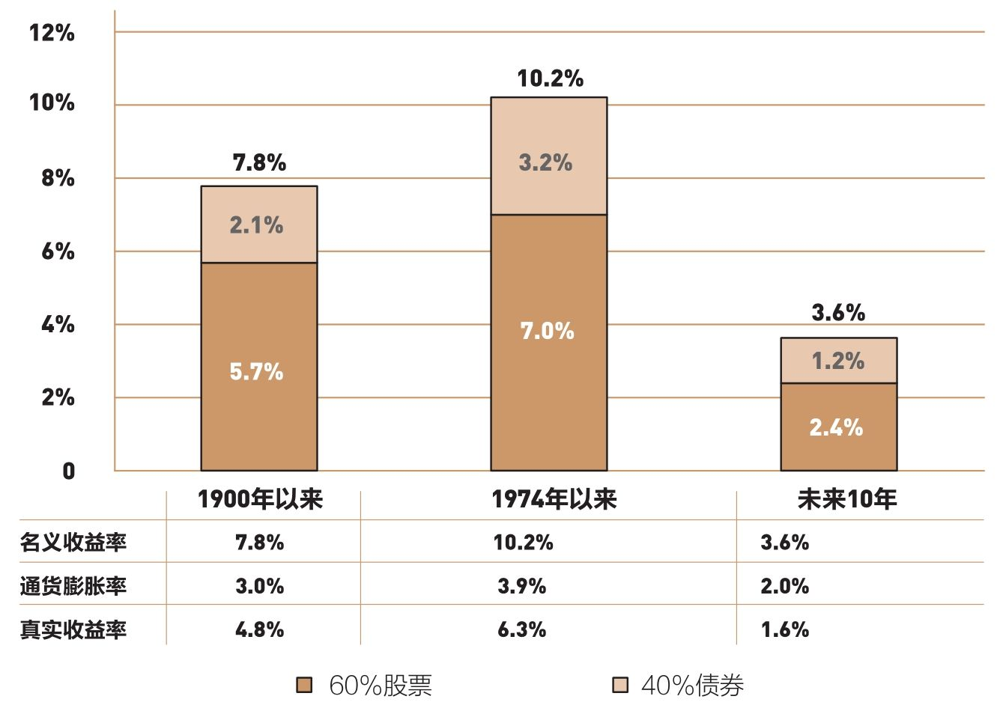

## 第10章　选中长期赢家　如同在草堆里寻针

### 40多年里，80%的基金不复存在了

> 尽管识别以前的赢家并不难，但鲜有证据证明它们的业绩能延续到未来。我们首先看看基金的历史业绩。图10-1总结了创建于1970年的355只股票基金此后46年的业绩发展情况。首先，最惊人的事实摆在你面前：已经有281只基金不复存在，占比接近80%。如果你投资的基金都不能长久，那么长期投资又从何谈起呢？
>
> | 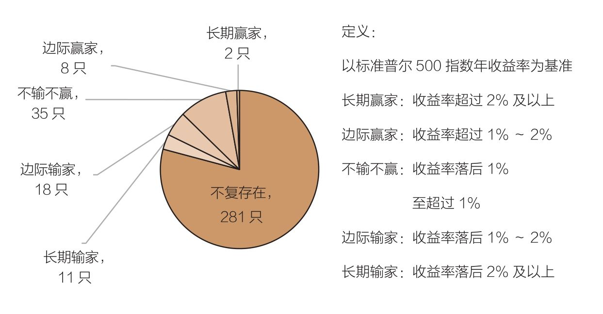 |
> | :----------------------------------------------------------: |
> |     图10-1　赢家与输家：共同基金的长期收益，1970—2016年      |
>
> 

> 你尽可以放心大胆地假设幸存的基金不一定业绩最好，但消亡的基金业绩肯定最差。某些情况下，这些基金经理会走人（主动型股票基金经理的平均任期不到9年）。大型金融集团可能会收购他们所管理的公司，并由这些新所有权人“对原有产品进行清盘”（*事实上，这些大型集团主要想帮助自己的资本，而不是基金投资者的资本创造收益*）。投资者自然会抛弃这些业绩不佳的基金。尽管基金破产的方式很多，但很少会有一种利于投资者

### “大钱包”：超额收益的天敌

> 当投资者注意到麦哲伦基金和反向基金创造的杰出业绩时，资金就会大量涌入，基金资产规模将会急剧扩张。但是，正如沃伦·巴菲特说过的：“大钱包是超额收益的最大敌人。”事实证明了这一点。就在这两只受欢迎的基金扩张时，它们的业绩开始衰退。虽然主动型基金很少能快速达到麦哲伦基金或反向基金那样的规模，但多数基金经理都会面临类似的难题：表现优异，资金流入；表现差劲，资金流出。这源于这个行业对基金收益率的极度敏感。

> 所谓“草堆”，就是包含整个股票市场的投资组合。我们可以通过低成本指数基金得到这个草堆。这样一只低成本指数基金的收益率基本会达到或超过355只基金中的345只（长期存活的74只基金中的64只，外加281只不复存在的基金）。我认为，在未来几年里，一只追踪标准普尔500指数的指数基金，必定会创造出等同于股票市场表现的业绩——这并不是什么魔术，而只是相当简明的数学规则。

> 如果你准备做一辈子的投资，通常有两种选择。
>
> 第一种，选择3～4只主动型基金，希望能够选中一只优秀基金，但这些基平均存活约10年，基金经理的任期平均约9年。结果可能是，你一辈子拥有过30～40只基金，每一只基金都有沉重的费用和换手成本。
>
> **第二种，投资1只费用低、交易成本少、包括众多股票的指数基金，即使没有任何基金经理，仍然可以追踪指数表现。事实上，没有任何一只主动型基金能够提供像指数基金一样稳定的表现。**

> 沃伦·巴菲特在2013年致伯克希尔·哈撒韦公司股东的信中谈到他在遗嘱里指示应如何管理他妻子的信托基金。他没有试图挑选表现优异的主动型基金，而是指示受托人将90%的基金投资于“成本极低的标准普尔500指数基金”（我建议投资先锋集团的基金）。通常我们都认为，巴菲特属于在草堆里寻针的人，但他最终决定买下整个草堆。

> 基金过去的业绩，无助于预测其未来业绩。请注意，每只基金的公开说明、营销资料或是广告中，都会特别注明（虽然字体太小，以至于常常不被人们注意）：“过去的业绩不能保证未来的结果。”它们的话，请一定要相信！

## 第11章　均值回归　优秀短期业绩的宿命

`均值回归`

> 在风光无限的牛市里，越是看重短期业绩，你的钱会消失得越快。

> 如果按照以短期业绩为准评出的星级挑选基金，那么成功的概率有多高呢？答案是非常低！《华尔街日报》2014年的一项研究表明，2004年被评为5星的基金，只有14%在10年后仍被评为5星，36%的基金评级下降为1星，其余50%的基金评级下降到3星以下。是的，基金业绩具有均值回归的倾向，甚至会回归到平均水平以下。

> 从这个数据里，我们可以总结出，均值回归在基金收益方面发挥着重要作用。无论是第一档的基金，还是第五档的基金，它们的表现难以持续。我不太容易感到意外，但这些数据的确让我吃惊。它们反驳了大多数投资者和投资顾问的预期：基金经理的能力可以持续。结果证明，我们只不过是一群“随机漫步的傻瓜”

> 结论很清楚：均值回归的确存在。当一只基金收益率明显高于行业平均水平时，随后通常都会回归甚至低于平均水平。如前一章所述，绝大多数共同基金的收益落后于以整体股票市场为投资对象的指数基金。因此，我们需要记住的是：共同基金领域的明星很少是恒星，多数不过是彗星。它们如闪电般划过天空，便消逝在茫茫的天际之中，只留下一丝淡淡的痕迹。

> 如果我们扪心自问，或许就能明白为什么我们会难以接受均值回归这件事，因为这种现象不只体现在基金收益上，而是涉及我们生活的每个角落。2013年，诺贝尔经济学奖得主丹尼尔·卡尼曼出版了《思考，快与慢》一书，书中回答了这一问题：“我们的大脑倾向于因果关系的解释，而不擅长处理纯粹的数据。当我们关注某一事件时，大脑就会去寻求该事件发生的原因……但它们（基于因果关系的解释）会出错，因为**实际情况，可能就是不涉及因果的均值回归。**”

## 第12章　投资顾问　大多数毫无价值

> 美林基金经纪人从他们客户的腰包里掏走20亿美元“为其投资”，最后只剩下可怜的1.28亿美元，你还会相信投资顾问吗？
>
> 没有任何证据表明顾问的建议能够提升投资者的收益，相反的证据倒比比皆是，指望他们帮你赚钱，现实吗？可取吗？

> 专业投资顾问擅长提供其他有价值的服务，包括资产配置指导、税收规划、工作时如何储蓄、如何安排退休计划。关于金融市场的行情，多数投资顾问也能提供意见。

> 最近，哈佛商学院的两位教授组织了一次研究。研究结果显示，1996—2002年，“和投资者直接进行的投资（投资者直接购买基金）相比，通过经纪人进行基金投资（由投资顾问向投资者出售基金）的业绩较差，投资者每年损失约90亿美元”。

> 还有一些证据有力地证明，基金投资者如果根据股票经纪人（不同于投资顾问）的建议进行投资，将会给收益造成更严重的负面影响。富达投资针对1994—2003年这10年进行了研究，结果显示，通过经纪人管理的基金的收益在所有基金中最低（其他基金类型包括私人管理型基金、公共管理型基金、金融集团管理型基金以及银行管理型基金）。

> 大多数投资者只能强吞苦果，赎回基金。基金资产从最初的11亿美元，跌至1.28亿美元。美林决定对“互联网战略基金”进行清盘，再把这只基金合并到美林的另外一只基金中（在辉煌的历史上留下这样一段败笔，对美林来说，也许是永远无法洗刷的耻辱）。

当基金收益糟糕时，其中一个结果是清盘合并。其他还有基金转型、更换基金管理人、向监管部门报告并提出“持续运作”的解决方案和基金清算。

> 虽然这结果相当让人失望，而且美林也示范了惨痛的失败，但注册投资顾问仍然可以在很多方面提供价值。我倾向于接受这样的观点：对很多投资者来说，投资顾问能提供优质的服务，让你保持平静，规划适合你的风险偏好的投资组合，处理共同基金涉及的各种难题和琐碎事务。不过，迄今为止，所有证据都一再验证了我最初的假设：从整体上看，指望投资顾问帮你找到赚钱的基金，既不现实，也不可取。

## 第13章　严控成本　尽可能化繁为简

`蒙特·卡洛模拟（Monte Carlo simulation）`

- **蒙特·卡洛模拟（Monte Carlo Simulation）**，简单来说，就是**利用计算机进行成千上万次的“虚拟历史重演”**，以此来测算某件事发生的概率。

> 最终的模拟（蒙特·卡洛模拟）结果：按1年期计算，约29%的主动型基金收益超过指数基金；按5年期计算，约15%的主动型基金占优。然而，按50年的话，只有2%的主动型基金能胜过指数基金（见图13-1 ）。
>
> | 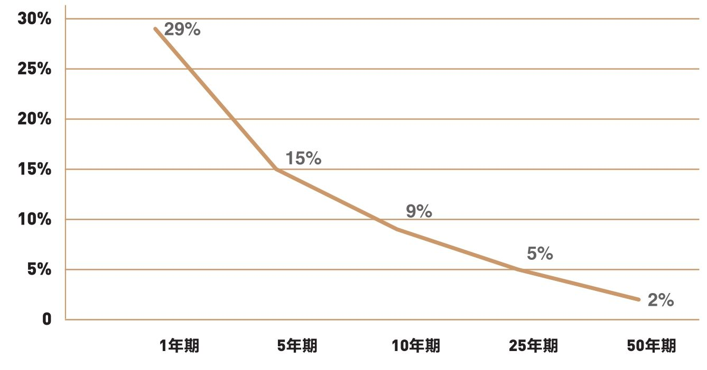 |
> | :----------------------------------------------------------: |
> |        图13-1　主动型基金收益胜过被动型指数基金的概率        |

> 随着时间的推移，所有这些令人生厌的成本——基金费率、手续费、换手成本、税金，以及生活成本的缓慢提高（通货膨胀）——从长期来看，都在真真切切地侵蚀着我们的投资价值。只有在极少数的情况下，投资者才能真的拿到基金公布的收益。

> 通往投资成功的路上充满了危险的急弯和洼坑，千万不要忘记用简单的数学规则来避开这些危险。因此，要尽可能分散投资，减少投资费用，不要让情绪使你陷入大多数投资者经历的灾难。相信你的常识，关注涵盖整个股票市场的指数基金。认真考虑你的风险承受能力,明确你对所购股票的收益预期，然后，坚持自己的策略，不要动摇。

> 还有一点必须补充，并非所有指数基金的结构都一样。即便以指数为基础的投资组合基本相同，它们的成本也有可能相去甚远。有些基金的费率微乎其微，可以忽略不计；有些基金的费率高得令人难以接受；有些基金不收取手续费；也有近1/3的基金收取前期费，而且可以选择在5年（常见的支付年限）内分期支付佣金；还有一些基金则需支付标准的经纪佣金。

> 在10家大型基金组织以标准普尔500指数为基础发行的基金中，成本最低的基金与成本最高的基金之间的成本差居然达到了1.3 %（见表13-1）。更糟糕的是，高成本指数基金甚至还会向投资者预收手续费。
>
> |              表13-1　标准普尔500指数基金的成本               |
> | :----------------------------------------------------------: |
> | 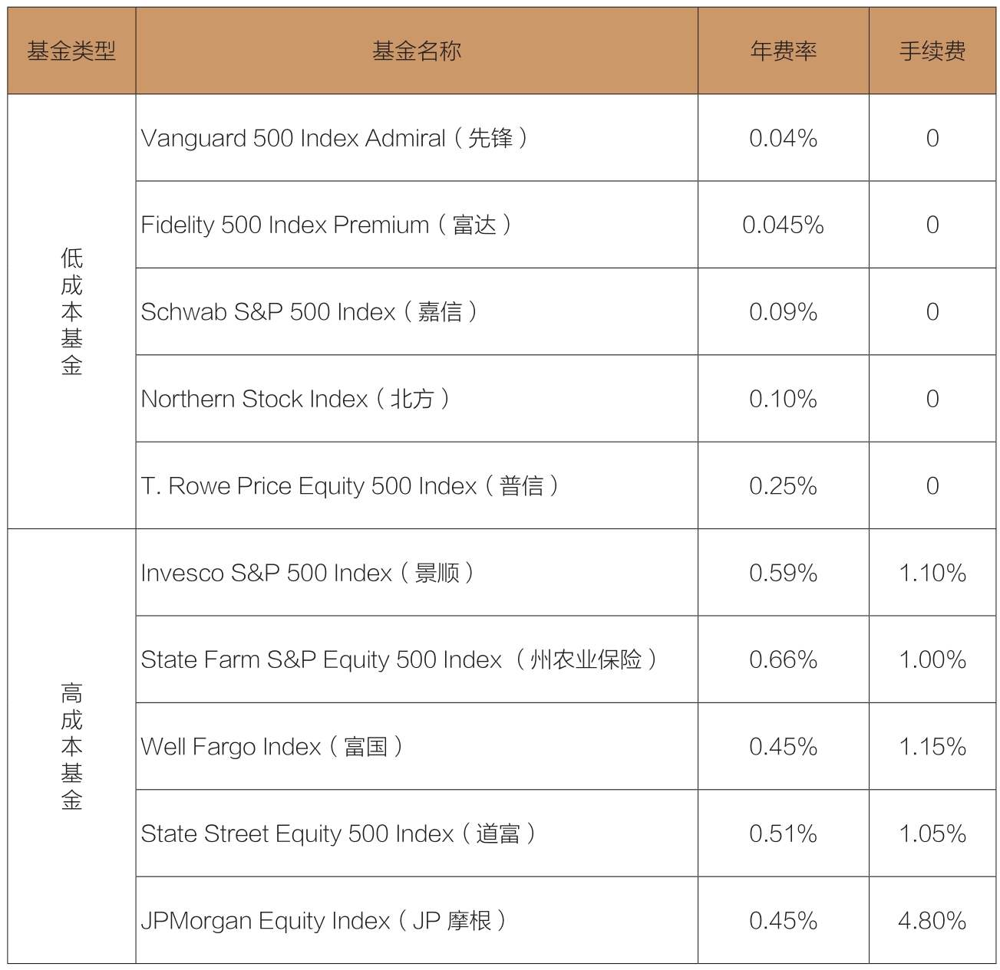 |
>
> 目前，大约有40只传统指数基金以跟踪标准普尔500指数为投资策略。令人吃惊的是，在这些基金中，14只基金需要预收手续费，介于1.5%～5.75%。明智的投资者应该选择那些没有手续费且营运成本低的指数基金。这些成本直接影响基金股东能得到的净收益。

### 确保自己赚钱，而不是帮基金经理赚钱

> 明智的投资者将挑选有信誉的基金公司，购买其成本最低的指数基金。

> 数年前，有人曾经问一位富国银行的代表：“你们的基金凭什么收取如此高的费用？”这位代表回答：“你不了解，这是我们的现金牛。”换句话说，它能为基金经理带来丰厚的利润。只要精心为你的投资组合挑选成本最低的基金，你就可以确保指数基金是在帮你赚钱，而不是在帮基金经理赚钱。

### 无论市场是否有效，指数工具都会起作用

> 无论市场是有效还是无效，市场某一板块的全体投资者只能赚到这个板块的收益。在无效市场上，最成功的基金经理可能会创造非同寻常的巨额收益。但永远不要忘记：作为一个整体，市场中任何一个板块的投资者都只能取得平均收益，而且事实也必将如此。

> 注意：我们可以通过指数基金对某一特定市场板块进行有效的投资，但是，要用赌博的方法去预测哪个板块，归根到底也只是赌博。而赌博永远是输家的游戏。
>
> 为什么这么说呢？因为*情绪和心理这两个因素，很有可能会给投资者的收益造成负面影响*。不管一个板块的盈利如何，这个板块的投资收益都极有可能落后于大盘。无数的证据表明：最受欢迎的板块基金肯定是那些刚刚创造出辉煌业绩的基金。而*追逐热门基金，往往是失败的开始*。

> 因此，在挑选准备下赌注的市场板块时，一定要三思而后行。尽管选择低成本的指数基金也许不那么令人兴奋，但这绝对是让你走向最终胜利的决策，也是数学规则的体现。请记住以下几点：**避免将问题复杂化，尽可能化繁为简，严控成本，你的投资必将走向繁荣。**

> 按照莫布森的计算，一只基金在15年内连续战胜市场的概率只有1/223 000，至于能在21年内连续超过市场的基金，在3 100万只基金中才能找到1只。不管数字如何，有一点是相同的：战胜指数基金的可能性微乎其微。

## 第14章　债券型指数基金　优秀业绩有目共睹

> 原因其实很简单。影响股票市场和每只个股的因素不计其数，**但债券市场投资者获取的收益，基本只受一个决定性因素的影响：利率水平。**

> 既然如此（注：作者前文预估在未来10年里，债券的年均收益率是3.1%。），聪明的投资者为什么要持有债券？
>
> 首先，长期由一系列短期构成，而在许多短时间段里，债券提供了比股票更高的收益率。在1900—2017年的117年里，债券胜过股票42年；在112个滚动式5年期里，债券超过股票29次；甚至在103个滚动式15年期里，债券也超过股票13次。

> 债券共同基金通常会向投资者提供三种（或更多）选择，以权衡收益和风险。短期组合适用于愿意牺牲部分利息，以降低波动风险的投资者；长期组合适用于寻求最多利息，并能接受高波动性的投资者；中期组合在收益和市场波动性之间寻求平衡。这些选择有利于债券基金吸引持有不同策略的投资者。

