## 1 储蓄

### 第一章 你应该存多少钱

`表型可塑性`


> 收入动态小组研究（PSID）的数据表明，随着时间的推移，收入会越来越不稳定，而不是越来越稳定。研究人员利用这些数据发现，从1968年到2005年，“家庭收入波动幅度呈现25%~50%的扩大趋势”


> 当我们有能力多存钱时，我们就应该多存钱；当我们没有能力多存钱时，我们可以少存一些钱。我们不应该使用一成不变的规则，因为我们的财务状况很少是一成不变的。


> 数据清楚地表明，人们对自己能存多少钱感到担忧。不幸的是，储蓄不足带来的压力比储蓄本身更有害。布鲁金斯学会的研究人员在分析了盖洛普的数据后证实，“储蓄压力的负面影响大于其积极影响”8。
>
> 这意味着，只有当以一种没有压力的方式存钱时，存更多的钱才更有益。否则，存钱本身就是弊大于利。

平衡储蓄的焦虑与压力，可被接受的方长久。


### 第二章 如何存更多钱

`边际效用递减`


> 为什么支出没有随着收入成比例地增加呢？因为经济学上有一个理论叫边际效用递减。这是一个术语，但它的意思很简单，它意味着每增加一单位消费所带来的效用都比前一单位带来的效用小。


> 事实上，世界上所有的消费追踪和目标设定都无法弥补资金上的不足。


> 伦敦经济学院的研究人员发表的一篇题为《为什么人们一直贫穷？》的论文，阐述了缺乏初始财富（而不是动力或天赋）是如何使人们陷入贫困的。
>
> ---
>
> （我们）发现，如果该计划使个人的初始资产超过一个阈值，她们就可以摆脱贫困，但如果没有达到这个阈值，她们就会再次陷入贫困


> 最具持续性的致富方法是增加收入，并投资创收资产。


> 如果你想存更多的钱，那么你可以在你能省的地方省一省，然后重点是，专注于增加你的收入。


> 增加收入最好的方法就是找到能够将你的内在财务价值变现的方式。这里我将探讨人力资本的概念，或者说你的技能、知识和时间的价值。人力资本可以被认为是一种可以转化为金融资本（金钱）的资产。
>
> 将人力资本转化为金融资本的好方法有哪些？以下是五个你应该考虑的方法：
>
> 1. 出售时间和专业知识
> 2. 出售技能/服务
> 3. 教学
> 4. 销售产品
> 5. 公司内部晋升


> 出售时间、技能或产品都是很好的选择，但它们不应该是最终目标。最终目标应该是所有权——用你的额外收入来获得更多的创收资产。


### 第三章 如何让花钱没有负罪感

> 你需要的是一种新的看待消费的角度，这样你就可以毫无顾虑地做出财务决定。为了做到这一点，我推荐两个小窍门，将它们结合使用，你会在花钱时完全没有内疚感。它们是：
>
> 1. 两倍法则。
> 2. 专注于长期满足感最大化。


> 两倍法则
>
> ---
>
> 我喜欢这个原则，因为它消除了疯狂购物给我带来的内疚感。因为知道自己的消费会伴随着同等规模的创收资产，所以我从不担心自己会过度挥霍。


> 如果每天的咖啡可以提高你对职业的掌控程度，在这种情况下，钱就花得值。你可以用同样的逻辑来解释购买的合理性，这也可以增强你的自主性或使命感。


> 最终，你的钱应该用来创造你想要的生活。这才是重点。因此，困难不在于花钱，而是弄清楚你真正想从生活中得到什么。


### 第四章 你可以接受生活方式多大程度上的改变

> 是什么导致了范德比尔特家族财富的崩溃？主要是生活方式等方方面面的改变。
>
> 生活方式的改变是指人们随着收入的增加相应地增加了支出，或向同阶层的人看齐。


> 事实上，我相信生活方式的少许“腐化”可以是令人振奋的。毕竟，如果你不能享受你的劳动成果，那么努力工作有什么意义呢？
>
> 界限在哪里呢？你能承受生活方式多大程度的“腐化”呢？一般来说，这取决于个人的储蓄率，但对大多数人来说，答案是50%左右。


> 年收益率、收入水平和收入增长率的差异远没有那么重要。在测试了所有这些东西后，我发现储蓄率是最重要的。决定你加薪储蓄率（以如期退休）最重要的因素就是当前的储蓄率。


### 第五章 你应该负债吗

`押注对冲`


> 如果一年生沙漠植物的所有种子都发芽了，然后经历了一个漫长的干旱期，所有的后代都会死亡。整个物种就灭绝了。因此，一些种子会处于休眠状态，以应对不确定的未来。
>
> 这种行为被称为押注对冲，是一种降低风险的策略，旨在最大限度地提高生物体的长期繁殖成功率。不需要在某一年里最大化地繁殖后代，而是要在漫长的岁月里生生不息。


> 什么时候应该考虑负债？尽管大家考虑负债的原因有很多，但基本可以归入两类：
>
> 1. 降低风险。
>
> 2. 获得大于借贷成本的回报。


> 确定这些未来收益现值的正确方法是按每年4%的比例将该现金流折现。然而，有一个更简单的方法可以用来估算：将终身收入的总增量除以2。
>
> 这将大致相当于按每年4%的利率将未来40年的现金流进行折现。我更喜欢这个更简单的方法，只要在脑子里过一遍就行。因此，在40年内增加的80万美元收入，相当于现在的40万美元。
>
> 最后，还应扣除你在上学期间可能损失的所有收入。因此，如果你的年收入为7.5万美元，而你想获得MBA学位（学制两年），那么你应该从终身收入预期增长的现值中减去15万美元（两年的收入）。
>
> 综上所述，今天的MBA学位价值是：
>
> （80万美元/2）-15万美元=25万美元
>
> 25万美元。假设你目前每年赚7.5万美元，这就是你为一个可增加80万美元终身收入的MBA学位最高应该支付的金额。


> 俄亥俄州立大学的研究人员得出了同样的结论：工薪贷、信用卡以及向家人和朋友借的钱造成的压力最大，而抵押贷款造成的压力最小。


### 第六章 你应该租房还是买房

`债务收入比`


> 无论是买房的一次性成本还是持续性的维护成本，房子往往都是负债而不是资产。当然，租客也不能免受这些财务成本的影响，因为这些成本可能已经包括在租金中。


> 租房的主要成本（不包括每月支付的租金）是长期风险。这种风险表现为未来租房成本不确定、住房状况不稳定和搬家成本。
>
> 例如，尽管租客能够锁定未来12~24个月的房租，但他们不知道10年后的房租将是多少。他们总是按市场价格租房，而市场价格可能会大幅波动。与此相比，房东确切地知道他们未来将为住房支付什么。
>
> 更重要的是，租房时，你的住房状况会不稳定。你也许找到了一个你喜欢的住处，但房东却可能大幅提高租金，迫使你再次搬家。这种住房状况不稳定可能会导致经济和心理上的不稳定，尤其是对那些努力养家的人来说。


> 不幸的是，当把住房看作一种投资时，情况就没有那么乐观了。诺贝尔经济学奖得主罗伯特·席勒计算出，1915—2015年，经通胀调整后，美国住房市场的年实际收益率“仅为0.6%”。45更重要的是，这部分实际收益大部分发生在2000年之后。


> 当你把美国住房作为一种投资时，你必须将其与同一时期对另一种资产的投资进行比较。这就是所谓的投资机会成本。
>
> 例如，我的外祖父母用2.8万美元购买了他们的房子，并在1972年至2001年每月支付280美元的抵押贷款。2001年前后，房子的价值约为23万美元。但如果他们不买房子，而是把这些钱投资到标准普尔500指数上呢？


> 在心理上，持有30年美国股票要比偿还抵押贷款困难得多。当你拥有的是一套房子时，你不会每天看股价，也可能永远不会看到它的价值减半。然而，美国股市并非如此。事实上，从1972年到2001年，有三次主要的市场崩溃（分别是1974年、1987年和21世纪初的互联网泡沫破裂），其中两次崩溃的跌幅超过50%！
>
> 这就是为什么住房是一种与股票或其他风险资产根本不同的资产。虽然你的房子不太可能暴跌，但它也不太可能成为你敲开财富大门的入场券。更重要的是，即使你看到你的房价大幅上涨，你也只能在将其出售并在其他地方购买更便宜的房子，或者重新租房的情况下才能变现。
>
> 这是否意味着你应该永远租房，并将因此省下来的所有钱投资于其他资产？不一定。正如我之前所说的，你需要考虑非经济原因。更重要的是，考虑买房也有社会原因。


> 买房的最佳时机是当你能满足以下条件时：
>
> - 你计划在那个地方待10年。
>
> - 你有稳定的个人和职业生活。
>
> - 你负担得起。
>
> 如果你不能满足以上所有条件，那么你最好选择租房。


> 如果你能负担得起，那么买房就更容易了。这意味着你可以支付20%的首付，并将你的债务收入比维持在43%以下。我用43%这个比例，是因为这是合格（低风险）抵押贷款最大的债务收入比。49需要提醒的是，债务收入比的定义为：
>
> *债务收入比=月负债/月收入*


> 无论最后你在买房这件事情上做什么决定，重要的是做对你个人和财务状况都最有利的决定。因为买房可能是你做过的最大、最情绪化的财务决定，你应该花时间来做正确的决定。


### 第七章 如何为房屋首付和其他“大额购买”存钱


> 你想买你的第一套房子。或者你想结婚，或者你只是想要一辆新车。无论你下定决心要做什么，你都该存钱。
>
>  但是，最好的方法是什么呢？应该持有现金，还是在等待期间投资？

> 我问了几位与我合作多年的财务顾问，他们的回答都是一样的——现金，现金，现金。*当谈到为首付（或其他大件物品）存钱时，现金是最安全的方式。不管什么时候都是这样。*


> 事实上，自1926年以来，在大约30%的时间里，比起投资债券，持有现金能同样或者更好地实现2.4万美元的储蓄目标。（前提是：当存钱时间小于两年时）


> 如果你的攒钱期限不到3年，持有现金。如果攒钱期限超过3年，则投资债券。


> 事实上，当为5年（或更长时间）后的大额购买攒钱时，你可以找到一个平衡的投资组合，使之更适合自己的时间表和风险状况。


> 从短期来看，现金才是王道。而随着时间的推移，你必须考虑其他选择。除非你愿意为每年的通货膨胀付出代价，否则你将需要持有债券，可能还有股票，让你的钱在一段时间内保持购买力。


### 第八章 何时可以退休

`交叉资产`


> 本根（*威廉·本根（William P. Bengen） 是一位美国财务规划师（CFP），他最重要的身份是金融规划界“4%法则”之父。本根本人并未固守4%的教条，近年（2023年左右）他建议退休人员可以将初始提取率上调至4.5% ~ 5%，而非死守4%。*）发现，在历史上，退休人员可以在至少30年的时间里，每年从股债比例为1∶1的投资组合中取出4%，而不会把钱花光。尽管为了应对通货膨胀，取款金额每年都会增长3%，事实也是如此。
>
> ---
>
> 如果某人有一个100万美元的投资组合，他在第一年取出40000美元，在第二年取出41200美元，以此类推，至少30年之后钱就被用完了。事实上，从历史经验来看，使用4%法则时，资金被耗尽是不太可能的。专业理财规划师迈克尔·基茨用4%法则对1870年以来的数据做了一项回归分析，他发现：“30年后，4%法则使财富涨5倍的概率比耗尽本金的概率要大。”


> 要遵循4%的法则，你需要在退休前存下25倍于预期年度支出的钱。当你攒够了这笔钱时，你就可以退休了。这就是为什么我在第四章讨论加薪如何影响退休金的积累时使用了这一法则，核心就是4%法则。


## 2 投资

### 第九章 为什么要投资

`折现率`


> 投资是唯一能让你在时间的洪流中奋起反击，并将不断减少的人力资本转化为生产性金融资本的方法。金融资本会让你在未来很长一段时间都有收益。


> 如果一家银行承诺每年为你的存款支付1%的利息，那么你今天给他们100美元，一年后你会得到101美元。反过来应用这个逻辑，一年后101美元的现值是100美元。
>
> 在这个例子中，未来的101美元用1%的利率折现到现在，这1%通常被称为折现率。


> 如果你将在未来40年里每年赚5万美元，那么你未来40年的总收入将是200万美元。然而，假设折现率为3%，这些未来收益的现值约为120万美元。
>
> 这意味着你的人力资本价值约为120万美元。假设这些估计是准确的，那么你应该愿意用努力工作换取120万美元。为什么？因为你可以用这120万美元来复制你未来的收入。
>
> 换句话说，如果你今天投资这120万美元，年收益率为3%，在未来40年里，你每年可以提取5万美元，然后钱就被花光了。
>
> *正如你所看到的，每年5万美元的现金流与你未来40年的收入完全相同！这就是为什么说人力资本和金融资本是可以互换的。*
>
> 这一点很重要，因为你的人力资本正在减少。你每工作一年就会减少人力资本的现值，因为你未来的收入少了一年。
>
> 因此，保证你将来有一些收入（政府资助收入之外）的唯一方法就是积累金融资本。

按照期末年金现值公式计算（假设每年末获得收入）：

```math
1156000 \approx 50000 \times \frac{1-(1+0.03)^{-40}}{0.03}
```

**期末年金现值公式**（也称为**普通年金现值公式**）是金融学中最基础、最重要的公式之一。它解决的问题是：**如果未来每年年末固定收到/支付一笔钱（PMT），持续 n 期，在给定的折现率（r）下，这些钱在当前此刻值多少？**

其标准数学公式为：

```math
PV \equiv PMT \times \frac{1-(1+r)^{-n}}{r}
```

计算得出结果约为 **115.6万美元**（约等于120万）。

这段话不是在教你算账，而是在告诉你——**你的工资是“分期付款”的债券，其当前价值远低于纸面总额。因此，你必须利用长期的时间窗口（40年），用“持续买入”优质资产来对抗时间对购买力的无情稀释。** 


> 从本质上讲，通过投资，你正在将自己重建为一种金融资产，一旦你失业了，这种方式就可以为你提供收入。所以，在你停止朝九晚五的工作后，你的钱可以继续为你工作。
>
> ---
>
> 这一概念有助于解释为什么一些职业运动员可以一年赚数百万美元，但最终还是破产了。*他们没有足够快地将人力资本转化为金融资本*，以维持他们离开体育职业后的生活方式。


> 不管你是如何赚钱的，意识到你的能力最终会消失是投资的最佳动力之一。


### 第十章 你应该投资什么

`债券`, `REITs（房地产投资信托基金）`, `头寸`,  `REITs指数基金`, `林迪效应`

**头寸：**在金融投资领域，“头寸”（Position） 就是你“持有的份额”或“资金配置的比例”。简单来说，它指的就是你在这个资产上“下了多少注”。

**林迪效应指出：**某样东西在未来的受欢迎程度与它在过去存在的时间成正比。


> 建立财富的正确方法是探索所有路径，以找到最适合你的方法。这就是为什么我说，如果你想变得富有，那么你需要不断购买各种各样的创收性资产。


> 最难的部分是确定拥有什么样的创收资产。大多数投资者在创建投资组合时很少冒险投资股票和债券。我能理解他们。不过，这两种资产类别是积累财富的绝佳选择。
>
> 但股票和债券也只是投资的冰山一角。你如果真的想增加财富，就应该考虑投资当今世界提供的所有选择。


> 《财富、战争与智慧》一书的作者巴顿·毕格斯研究几个世纪以来哪种资产类别最有可能使财富保值和增值，得出了类似的结论。他说：“鉴于其流动性，你不得不承认，股市是财富最好的去向。”


> 尽管我刚才对股票大加赞扬，但投资股票并不适合胆小的人。事实上，股市在一个世纪里会有几次超50%的价格大跌，每4~5年下跌30%，至少每隔一年下跌10%。
>
> 正是股票这种高度波动的特性使人们在动荡时期难以坚持持有。即使是经验最丰富的投资者，看到10年的增长在几天内消失也会感到痛苦。
>
> 对抗这种波动最好的方法是着眼于长期。虽然这不能保证收益，但*历史证据表明，只要有足够的时间，股市往往会弥补其周期性的损失。时间是股票投资者的朋友。*


> 你可以分散投资个股、指数基金和ETFs，这会让你留有更大的敞口。例如，标准普尔500指数基金可以为你投资美国股票，而全球股票指数基金将为你投资全球股票。
>
> 我更喜欢持有指数基金和ETFs而不是个股，原因有很多（下一章将主要讨论），主要是因为指数基金是一种简单又廉价的实现分散投资的方法。


> 债券是投资者向借款人发放的贷款，借款人承诺在一定期限内偿还。这个“一定期限”被称为债券期限。许多债券需要在债券期限内定期支付利息（称为息票）给投资者，然后在期限结束时偿还全部本金。支付的年息除以债券价格就是收益率。如果你以1000美元购买债券，每年得到100美元利息，那么这只债券的收益率将为10%（100美元/1000美元）。


> 债券应该是分散风险的资产，而不是风险资产。


> 我推荐债券是因为债券具备以下特点：
>
> 1. 当股票（和其他风险资产）价格下跌时，债券价格往往会上涨。
> 2. 债券比其他资产的收入流更稳定。
> 3. 债券可以提供流动性，以再平衡你的投资组合或偿还债务。


> 在市场抛售期间，当其他资产的价格都在下跌时，债券是唯一价格往往会上涨的资产。这种情况往往发生在投资者抛售风险较高的资产以购买债券的时候，也就是通常所说的“避险”。因此，债券可以在最糟糕的时候充当主要的投资工具。


> 更重要的是，*那些留有债券敞口并在危机期间调整了投资组合的投资者在随后的复苏中获得了更大的收益。*例如，我很幸运地在2020年3月23日调整了我的投资组合。市场见底的那天，我卖出了一些债券，买入了一些股票。是的，这个时机完全是运气，但我持有债券并能够出售一些债券购买股票，这并不是运气。


> 你可以直接购买单只债券，但我建议通过债券指数基金或ETFs购买，因为这样更容易。


> 无论你如何购买债券，它们都可以发挥提供增长以外的重要作用。俗话说得好：“买股票是为了吃得好，但买债券是为了睡得好。”


> 买投资性房产类似于买个股，因为它们无法分散投资。当购买投资性房产时，你承担了该房产的所有风险。房地产市场有可能蓬勃发展，但如果你的房产有太多潜在问题和成本，结果可能会很糟糕。
>
> 鉴于大多数投资者不太可能拥有足够多的投资性房产来实现多元化，单一投资性房产的风险是一个问题。


> 如果你喜欢房地产，但不想自己管理，那么REITs可能比较适合你。REITs会持有和管理房地产，并将这些房地产的收入支付给基金持有者。
>
> ---
>
> 法律规定，REITs至少要将应税收入的90%作为股息支付给股东。这一要求使其成为最可靠的创收资产之一。


> 无论你决定如何投资REITs，它们通常都与股票一样可以带来收益（或收益更高），且*在经济景气时期与股票的相关性较低*。这意味着当股票表现不佳时，REITs也能有较好的表现。
>
> 然而，像其他大多数风险资产一样，公开交易的REITs往往会在股市崩盘时遭到抛售。在股市下行时，不能指望信托投资基金分散风险。


> 我认识不少人，他们通过在网上销售产品赚了几万到几十万美元。更重要的是，如果你已经通过社交媒体、电子邮件或网站拥有了受众，那么销售产品就是从这些受众身上赚钱的一种方式。


> 例如，我发现我在自己的博客OfDollarsAndData.com上的收入渠道已经从小规模的联营伙伴关系扩大到包括广告销售和更多的自由职业机会。*我的博客写了好几年才开始赚钱，但现在总有新的机会冒出来。*


> 少数资产类别没有进入上述名单，原因很简单：它们不产生收入。黄金、加密货币、大宗商品、艺术品和葡萄酒没有与其所有权相关的可靠收入流，所以我没有将它们包括在我的创收资产列表中。
>
> 当然，这并不意味着你不能用这些资产赚钱。只不过它们的估值完全基于感知，即别人愿意为其支付多少钱。没有潜在的现金流，感知就是一切。
>
> ---
>
> 出于这个原因，我的大部分投资（90%）都在创收资产上，剩下的10%分散在非创收资产上，如艺术品和各种加密货币。


> 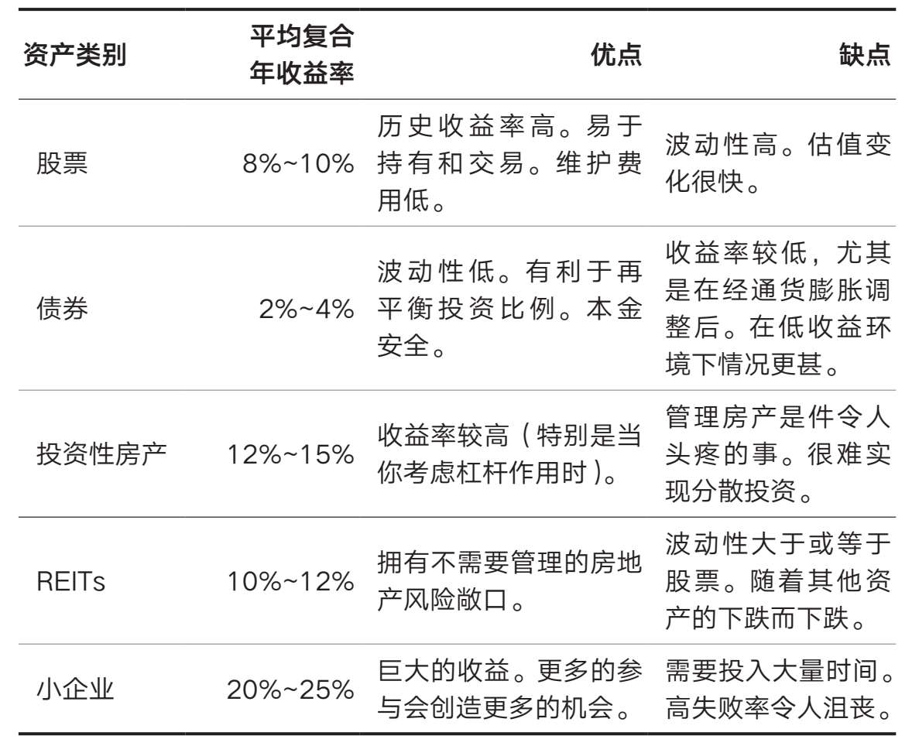


### 第十一章 为什么你不应该购买个股

`宽基指数`


> 虽然我不赞成达伦所做的事（注：以每股111美元的价格买入超过3万美元GME股票，两小时内跌倒70美元割肉卖出，损失了1.2万美元），但我认同他的做法。因为达伦只赌他愿意输的东西，而且可以确保由此带来的任何损失都不会影响他未来的经济状况。如果你决定投资个股，希望你也能这样做。

留足安全边际，非要赌则选自己输得起的赌局。


> 达伦的故事是选股者的一个缩影。精神上的混乱，害怕错过的心情，得意、胜利、痛苦和遗憾，这一切都完美地封装在一个两小时的窗口内。
>
> 与情绪做斗争只是选股的冰山一角。我知道这一点，是因为我几年前也投资过个股。除了情绪上的困难，你还必须应对业绩不佳的时期，以及你实际上没有任何选股技巧的可能性。


> 我已经放弃了挑选个股，我建议你也这样做。
>
> ---
>
> 最初，我放弃投资个股，是出于“金融角度”的思考。这是一个很好的论点，你可能听说过，但与反对选股的存在主义论点相比，它就相形见绌了。
>
> ---
>
> 反对选股的传统观点（金融角度）已经存在了几十年。这个观点是：由于大多数人（甚至是专业人士）的业绩无法跑赢宽基指数，你不应该费心去尝试。
>
> ---
>
> 从1926年到2016年，4%的股票贡献了美国股票高于美国国债的全部超额收益。
>
> ---
>
> 你确定你能找到这4%的股票而避开96%的股票吗？
>
> ----
>
> 根据杰弗里·韦斯特的计算，“自1950年以来在美国股市公开交易的28853家公司中，到2009年有22469家（78%）倒闭”。事实上，“在任何一组给定的美国上市公司中，有一半在10年内就倒闭了”。
>
> ---
>
> 1920年3月，道琼斯工业平均指数的20家公司中，没有一家在100年后仍在该指数中。没有什么是永恒的。
>
> ---
>
> 你可以看到问题所在。战胜一篮子股票（一个指数）的表现是如此之难，以至大多数专业投资者都无法做到这一点。你试图找到的获胜股票的比例非常低。即使是那些赢家股票也不会是永远的赢家。
>
> ---
>
> 反对选股的存在主义论点很简单：*你怎么知道自己是否擅长挑选个股？在大多数领域，判断一个人是否具有该领域的技能所需的时间都相对较短。*
>
> ---
>
> 在《共同基金明星真的能选股吗？》中，研究人员发现：“扣除成本后，前10%的基金中较大的正阿尔法值极不可能是抽样变异性（运气）的结果。”81换句话说，10%的专业选股者实际上拥有经得起时间考验的技能。然而，这也表明90%的人可能没有这种技能。
>
> 为了论证，让我们假设前10%的选股者和后10%的选股者可以很容易地识别他们的技能（或缺乏技能）。这意味着，如果我们随机寻找一名选股者，我们有20%的机会可以确定其技能水平，在80%的情况下无法确定其技能水平！*这意味着，80%的选股者很难证明自己擅长选股*。
>
> ---
>
> 这就是我所说的存在危机。为什么你想玩儿一个你无法证明自己擅长的游戏（或使之成为一份职业）？如果你这么做是为了好玩，那就像我的朋友达伦那样，拿出一小部分钱来做这件事，全部亏掉也没关系。但是，对那些不是为了乐趣而做这件事的人来说，为什么要花那么多时间在你的技能如此难以衡量的事情上呢？


> 了解个股投资风险最好的方法是熟悉金融的基础知识和相关经验文献。但如果你做不到这一点，那么，你只能把5%或10%的资金投入个股。你一定要严格计算收益率——年化收益率，然后问自己：“我能通过只买一只代表股市整体的指数基金跑赢这个收益率吗？”


### 第十二章 你投资了吗
`周期性调整市盈率（CAPE）`


> 罗斯林对儿童死亡率的理解和塞德对赛马心脏数据的使用证明，一条准确的信息可以让复杂的系统变得更容易理解。
>
> ---
>
> 可以指导你所有投资决策的一条信息是：大多数市场在大多数时候都会上涨。
>
> ---
>
> 这是事实，尽管人类历史的进程是混乱的，有时是破坏性的，正如沃伦·巴菲特强调的那样：
>
> 在20世纪，美国经历了两次世界大战、代价高昂的军事冲突以及其他重创，大萧条，十几次的衰退和金融恐慌，石油危机，流感肆虐，以及一位名誉扫地的总统的辞职。然而道琼斯指数却从66点上升到11497点。


> 正如那句老话所说：“种一棵树最好的时间是10年前，其次是现在。”
>
> 当然，你总感觉这不是正确的决定，因为你总想着未来的价格可能会更低。
>
> 你猜怎么着？这种感觉是准确的，因为很有可能未来的价格会更低。
>
> 然而，*数据表明，最好的办法是完全忽略这种感觉。*
>
> ----
>
> 如果你在1930—2020年随便哪一天买入道琼斯工业平均指数，那么它在未来某个交易日回调的可能性超过95%。
>
> 这意味着大约20个交易日中有1个交易日（一个月一次）会给你提供绝对的机会，而另外19个交易日会让你在未来的某个时候感到后悔。
>
> ---
>
> 你知道在那之前，道琼斯工业平均指数收于6547点以下是什么时候吗？
>
> 1997年4月14日——12年前。
>
> ---
>
> **这就是为什么市场择时虽然在理论上很有吸引力，但在实践中却很难。**


#### 一次性买入/平均买入

> 如果你曾通过这两种方法投资标准普尔500指数，你会发现大多数情况下平均买入策略的表现不如一次性买入策略。
>
> 我们从图12.2中得到的真正收获不是这个峰值，*而是这条曲线经常低于0。当曲线低于0时，平均买入策略的表现不如一次性买入策略，当曲线高于0时，平均买入策略的表现优于一次性买入策略。*
>
> 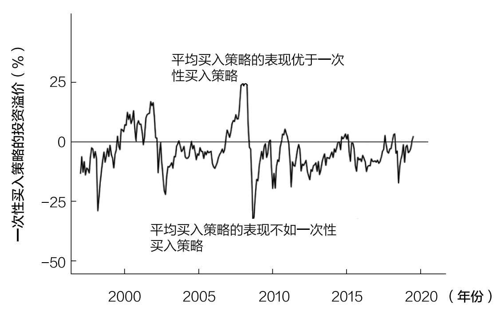
>
> **只有在市场崩盘之前的峰值时刻，平均买入策略的表现才会优于一次性买入策略（如1929年、2008年等）。**
>
> 虽然我们似乎总是处于市场崩盘的边缘，*但事实是，重大下跌是相当罕见的。*这就是为什么大部分时间里，平均买入策略的收益低于一次性买入策略。


> 表12.1 各类资产平均买入策略相较于一次性买入策略表现汇总表：
>
> 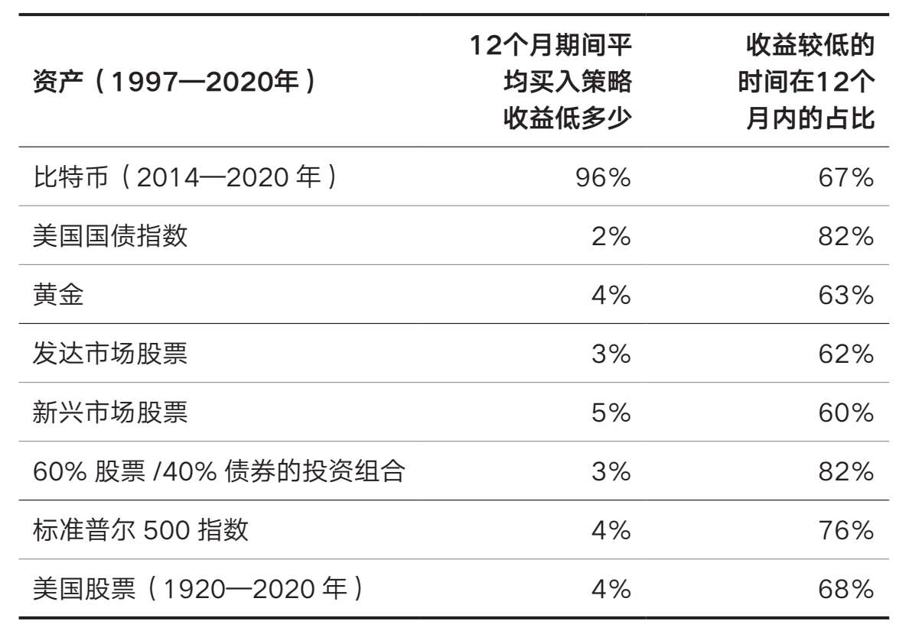
>
> 正如大家看到的，对大多数资产来说，任何12个月内，平均买入策略的收益比一次性买入策略的收益低2%~4%，且收益低的时间占比为60%~80%。
>
> 这意味着，如果你随机选择一个月开始平均买入一项资产，其收益很可能会低于该月对该资产的一次性买入。


> 一次性买入是不是比平均买入风险更大？答案是肯定的！


#### 一次行买入投资组合（股票+债券）风险与定投相当

> 如图12.4所示，当投资标准普尔500指数时，一次性买入策略的标准差总是高于平均买入策略。标准差显示了一个特定的数据序列与其平均结果的偏离程度。因此，*标准差越高，投资策略的风险也越高*。
>
> 图12.4 连续12个月平均买入策略与一次性买入策略投资标准普尔500指数的标准差：
>
> 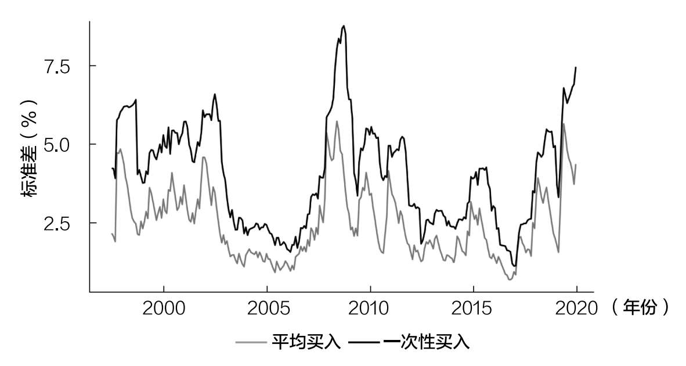
>
> 一次性买入风险更高，因为一旦买入，就相当于承担了相关资产的全部风险，而平均买入策略在整个买入期间都会持有部分现金。我们知道，股票的风险比现金高，因此，*你持有的股票越多，风险就越高。*


> 然而，如果担心风险，那么也许你应该考虑一次性买入更保守的投资组合。
>
> 例如，如果你原本打算用平均买入策略建立一个股票投资组合，你现在可以考虑用一次性买入策略投资60%股票/40%债券，在相同的风险水平下获得略好的收益。
>
> 总而言之，按60%股票/40%债券的配置一次性买入风险平衡的投资组合带来的收益通常要高于平均买入股票的投资。
>
> 图12.5 连续12个月平均买入标准普尔500指数vs一次性买入60%股票/40%债券的投资组合：
>
> 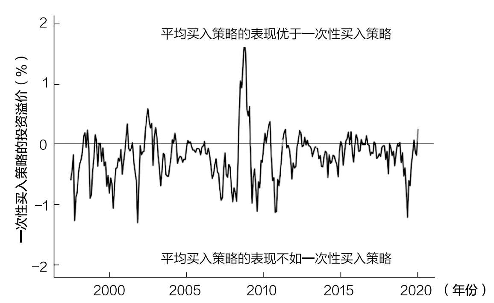
>
> 图12.6 连续12个月平均买入标准普尔500指数与一次性买入60%股票/40%债券投资组合的标准差：
>
> 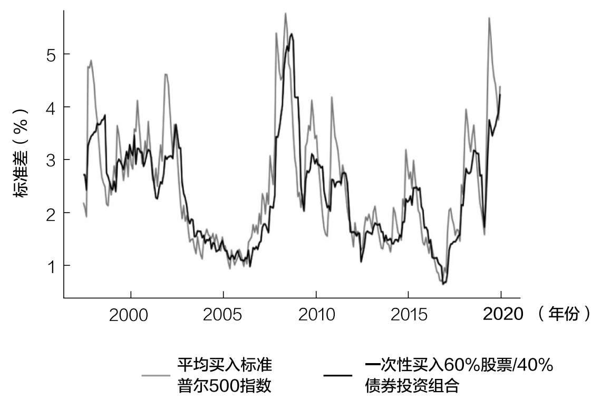


> 表12.3 1960年以来平均买入策略相较于一次性买入策略表现汇总表：
>
> 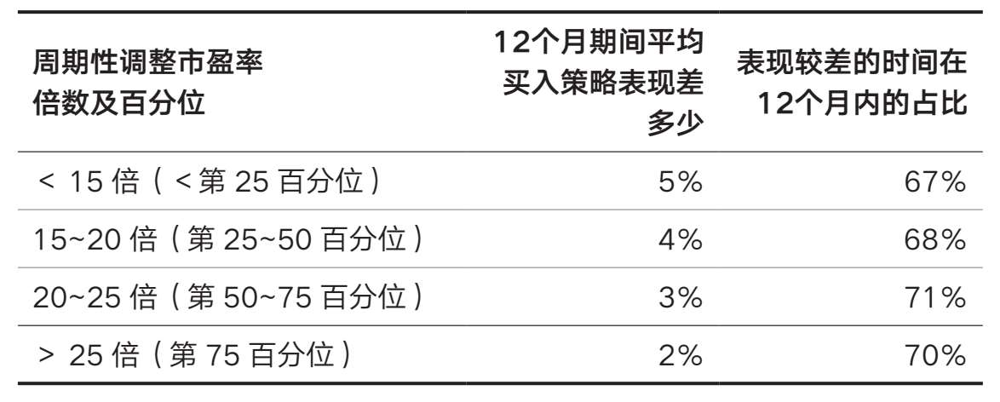
>
> 平均买入策略与一次性买入策略的收益差确实随着周期性调整市盈率的提高而减少，但不巧的是，我们在试图分析估值最高的时期时，遇到了样本数量问题。
>
> 例如，如果我们只考虑周期性调整市盈率大于30倍（大约是2019年底的水平）的情况，那么在未来12个月里，平均买入策略比一次性买入策略的收益高1.2%。然而，在过去10年间，周期性调整市盈率超过30倍的情况只在互联网泡沫时出现过！
>
> *但你如果因为周期性调整市盈率太高而等待，就可能会错过一些大额收益。*例如，周期性调整市盈率最近一次超过30倍是在2017年7月。如果你当时转而持有现金，到2020年底，你将错过标准普尔500指数65%的涨幅（含股息）。
>
> 如果你认为市场估值过高，应该大幅回调，你可能需要等待多年，才能证明你是正确的。在你用估值作为持有现金的借口之前，请考虑这一点。


> 当考虑一次性买入还是分批买入时，现在一次性买入总是更好的选择。这适用于任何资产、任何时间以及任何估值方式。一般来说，等待时间越长，收益越低。
>
> 我说“一般”是因为，在市场崩盘时，分批买入可以获得更好的收益。然而，恰恰是在市场崩盘的时候，你最不愿意投资。


> 如果你现在仍然担心一次性投入一大笔钱，真正的问题可能是你正在考虑的投资组合对你来说风险太大。这个问题如何解决呢？方法是现在一次性买入更保守的投资组合。


### 第十三章 为什么不应该等待逢低买入


> 这表明，即使有充分的信息，逢低买入的表现通常也比定期定额投资法差。因此，你如果持有现金，希望在下一个底部买入，结果可能会比现在买入更糟糕。
>
> 为什么？
>
> 因为当你等待心爱的美食时，你会发现它永远不会到来。结果，你会错过几个月（或更多）的复利，因为市场不断上涨，把你甩在后面。


> 你应该尽快、尽可能多地投资。
>
> 这就是持续买入的核心理念，它超越了时间和空间。
>
> 例如，如果你从1926年起随机选择一个月，开始购买一篮子美国股票，并在接下来的10年里一直买入，那么你有98%的概率战胜持有现金的投资者，有83%的概率战胜5年期美国国债的投资者。更重要的是，在这样做的时候，你往往能获得10.5%的收益。


### 第十四章 为什么投资要靠运气

`收益风险序列`


####  所处时代带来的差异

> 想想看：一个出色的投资者（每年跑赢市场5%）赚的钱会比一个糟糕的投资者（每年跑输市场5%）少，这仅仅是因为他们开始投资的时间不同。这是一个精心挑选的个例，但它展示了熟练投资者（表现优异的投资者）如何仅仅因为在艰难的市场环境中投资而输给非熟练投资者（表现不佳的投资者）。


#### 投资收益的顺序很重要

> 正如你所看到的，就算每年投入同样的5000美元，基于收益顺序的不同，投资组合的最终价值也会有很大的差异：在前期负收益的情况下，其投资收益比后期负收益的情况下多10万美元。
>
> 人生晚年（当投资本金最多的时候）获得负收益，比你第一次开始投资时经历负收益要糟糕得多。换句话说，结局就是一切。


> 幸运的是，研究表明，市场上一两年的糟糕情况不太可能对你的退休生活产生重大影响。正如金融专家迈克尔·基塞斯所发现的那样：“事实上，在对数据进行更深入的研究后我们发现，退休头一两年的收益与投资组合中能够维持的安全提现率之间几乎没有关系……即使退休始于市场崩盘时期。”
>
> 但基塞斯发现，退休头十年的收益（特别是经通胀调整后的收益）可能会产生重大影响。虽然一两个糟糕的年份没什么大不了，但糟糕的十年可能会造成严重的财务损失。这说明了为什么退休后第一个十年的投资收益如此重要。


> 不管你的财务状况如何，你总是可以选择与坏运气做斗争。更重要的是，坏运气并不总是像看起来的那么坏。有时候这只是游戏的一部分。


### 第十五章 为什么不应该害怕波动

`避免回撤策略`


> 弗雷德·史密斯已经束手无策了。他已经将自己的大部分净资产投入这家名为美国联邦快递的包裹递送公司，而他之前的融资伙伴通用动力公司刚刚拒绝了他的额外融资。
>
> 那天是星期五，史密斯知道他必须在下周一为下一周的航空燃油支付2.4万美元，但问题是，美国联邦快递的银行账户上只有5000美元。
>
> 史密斯做了他唯一能想到的“理智的”事情——他飞到拉斯维加斯，用剩下的5000美元玩儿21点。
>
> 到了周一早上，美国联邦快递总经理兼运营总监罗杰·弗洛克检查了公司的银行账户，感到震惊。弗洛克立即质问史密斯发生了什么事。
>
> 史密斯承认：“与通用动力董事会的洽谈失败了，我知道我们周一需要钱，所以我坐飞机去拉斯维加斯，赢得了2.7万美元。”
>
> 是的。史密斯把公司仅剩的5000美元拿去玩儿21点了，还赢了一大笔钱。
>
> 弗洛克仍然很震惊，他问史密斯怎么可以用公司仅剩的5000美元来冒险，史密斯回答：“有什么区别吗？如果没有支付燃料公司的资金，我们无论如何也飞不起来。”
>
> 史密斯的故事说明了风险和不作为的代价——**有时你能承担的最大风险就是完全不承担风险。**


> 在投资方面尤其如此。尽管金融媒体经常会提到对冲基金破产或彩票中奖者破产，但它们有多少次讨论过一个持有现金几十年却仍未能创造财富的人？几乎没有。
>
> *问题是，那些行事谨慎的人多年来都看不到自己行为的后果，而这些后果可能与承担过多风险的后果一样具有破坏性。*


> 如果你想获得向上积累的财富，你必须接受随之而来的波动和周期性下跌。这是长期投资成功的入场费。


> 让我们先假设你非常保守。你告诉精灵，无论哪一年股市下跌5%或以上，你都会避开股市，转而投资债券。
>
> 我们将其称为**避免回撤策略**，因为它在股市回撤过高（对你而言，5%或以上）的年份将所有资金投资于债券，并在其他年份将这些资金转移到股票上。避免回撤策略是，在任何特定年份，要么完全投资于债券，要么完全投资于股票。


> 那么应该多保守才合适呢？如果你想将财富最大化，应该避免多大比例的回撤？
>
> 答案是15%或以上。
>
> 在市场下跌15%或以上的年份投资债券，在所有其他年份投资股票，这将使你的长期财富最大化。
>
> 事实上，如果你在市场下跌15%或以上的所有年份都持有债券，你获得的收益将比在1950—2020年执行买入并持有策略的收益高出10倍以上。
>
> 图15.6 避免回撤策略（15%或以上）回撤期间持有债券的收益情况，灰色阴影区域显示了该策略持有债券的时间：
>
> 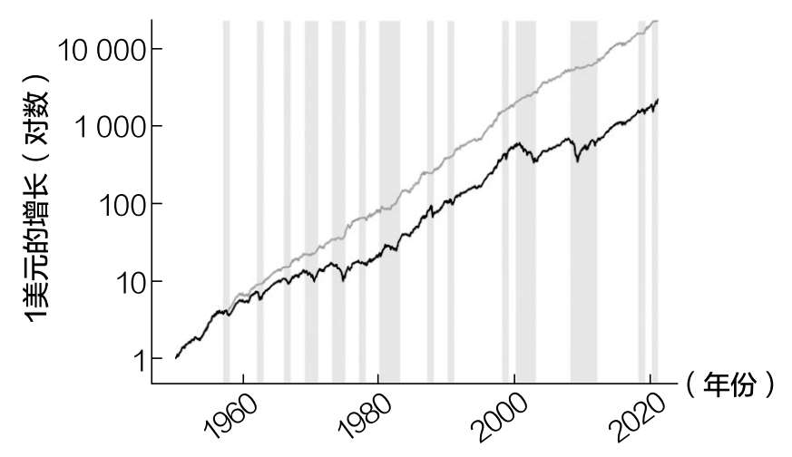


> 将回撤下限提高到15%以上（例如20%、30%等）会给你带来更差的回报，当股票更有可能赔钱时，你却投资股票。
>
> 为什么？
>
> 因为*标准普尔500指数年内较大的回撤通常与年底较差的收益表现有关*。看看标准普尔500指数的年化收益率与年内回撤的对比图（图15.7）就能很好地明白这一点。
>
> 图15.7 最大回撤vs年化收益率（1950—2020年）：
>
> 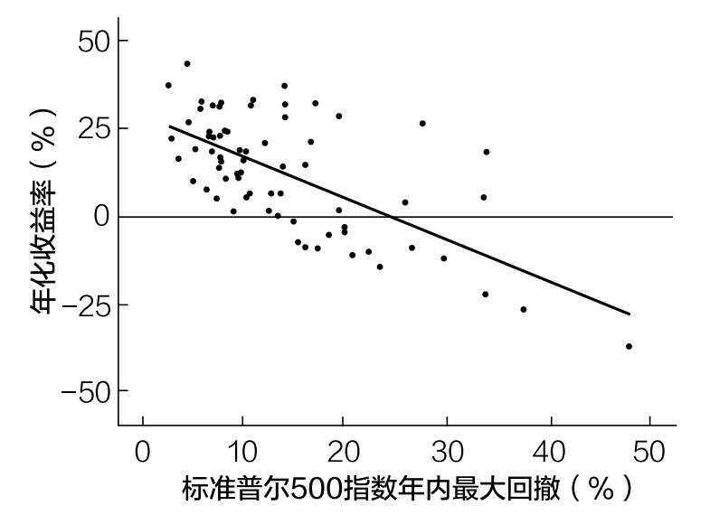
>
> 正如你在图15.7中所看到的，最大回撤和年化收益率之间呈负相关。那些大幅下跌的年份股市通常不会有好结果。
>
> 然而，并非所有的下跌都是坏事。实际上，自1950年以来，标准普尔500指数每年都有正收益，年度回撤为10%或以下。

这段话揭示了一个极其简单但常被忽视的数学现实：“巨大的年内回撤”与“年底正收益”在数学上是互斥的。

假设某年出现了较大的年内回撤（比如跌了 **-20%**）：

要想在年底实现正收益（假设 **+5%**），指数必须从底部反弹多少？

```math
计算： (1 - 20\%) \times (1 + X\%) \equiv (1 + 5\%) \\
解得： X \equiv 31.25\%
```

在一个自然年度内（剩余时间可能只有几个月），从深坑里迅速反弹超过30%是一件极其罕见的事情。因此，只要年内出现了深幅回撤，当年的年化收益率（年底结算）大概率是**负数**或**极低的正数**。

这张图**击破投资者最危险的幻觉**——**“年内均值回归”幻觉**。


> 更重要的是，你必须接受，波动性是投资者的必修课，是投资游戏的一部分，而这场游戏我们不一定会输。想想沃伦·巴菲特的长期商业伙伴查理·芒格的智慧：“如果你不愿意以平静的态度应对一个世纪内两三次50%的市场价格下跌，你就不适合成为普通股投资者，你就注定得到平庸的结果。”


### 第十六章 危机期间如何投资
> 我们知道33%的损失需要50%的收益才能回本。因此，一旦我知道你预计市场需要多长时间复苏，我就可以将50%的上涨转化为年度收益。
>
> 其公式为：
>
> **预期年收益率=（1+回本需要的收益率）^（1/回本年限）-1**
>
> 但由于我们知道“回本需要的收益率”是50%，我们可以将这个数字代入并简化这个方程为：
>
> 预期年收益率=（1.5）^（1/回本年限）-1
>
> 因此，如果你认为市场复苏需要：
>
> ·1年，那么你的预期年收益率=50%
>
> ·2年，那么你的预期年收益率=22%
>
> ·3年，那么你的预期年收益率=14%
>
> ·4年，那么你的预期年收益率=11%
>
> ·5年，那么你的预期年收益率=8%


> 但在几十年的期间内，股市亏损的可能性有多大？
>
> 在分析了39个发达国家在1841年至2019年的股市表现后，研究人员估计，在30年的投资期限内，相对于通胀而言，*投资股市的损失概率为12.5%*。


> 如果你在1989年日本股市达到顶峰时将所有现金投入日本股市，30年后你的这笔投资就会缩水。但个人投资者做出这种一次性重大财务决策的频率有多高？几乎不存在。
>
> 大多数人会分批买入创收资产，而不是一次性买入。如果你分批购买，而不是一次性投入，你在几十年里赔钱的可能性就会更小。
>
> 图16.6 每天投资日本股市1美元的投资组合市场价值vs投入成本：
>
> 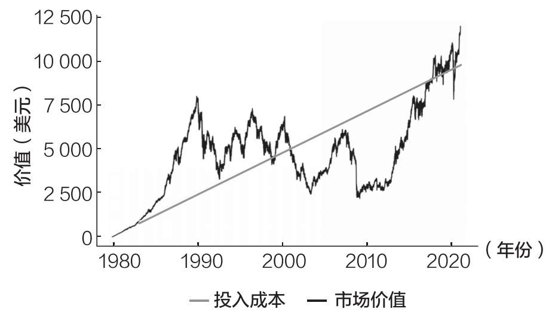


> 如果你仍然害怕在危机期间买入，我能理解你。纵观历史，我们很容易找到这样的例子：事后看来，这样做是愚蠢的。但我们不能根据例外情况或可能发生的情况进行投资。否则，我们永远都不会投资。


> 弗里德里希·尼采说过的那样：“忽视过去，你将失去一只眼睛；生活在过去，你的两只眼睛都会失去。”
>
> 了解历史很重要，但沉迷于历史会让我们误入歧途。这就是为什么我们必须根据数据告诉我们的情况进行投资。著名金融作家杰里米·西格尔对这一点做了最好的总结。他写道：“与令人印象深刻的历史证据相比，恐惧对人类行为的影响更大。”


### 第十七章 应该什么时候卖出

> 卖出迫使你面对投资世界中两个最强烈的行为偏见——担心在市场上行时错过机会，担心在市场下行时赔钱。这种情绪上的恶习会让你质疑你做出的每一个投资决定。
>
> 为了避免这种心态上的混乱，你应该设定一组条件，当你想在某个位置卖出时，参照已经设定的条件，你可以直接卖出，而不是受情绪左右。这将使你可以根据自己的情况，按计划出售你的投资。


> 如果你不需要再平衡你的投资组合，摆脱集中（或亏损）的头寸，或试图满足财务需求，那么我认为你没有理由出售资产，永远没有。


> 当涉及卖出资产时，我们可以使用同样的推理，但得出相反的结论。由于市场往往会随着时间的推移而上涨，最佳的做法是尽可能晚地卖出。因此，（尽可能晚地）分批次卖出通常比一次性卖出要好。


#### 投资组合在平衡——降低风险

> 图17.3 60%股票/40%债券的投资组合30年后的最终价值：
>
> 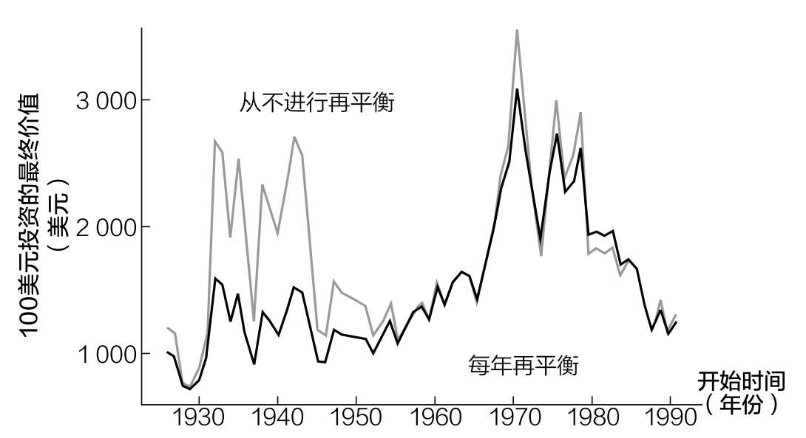
>
> 图17.3说明，在大多数情况下，再平衡通常不会提高收益。那么，人们为什么仍然这样做？
>
> 为了降低风险。
>
> 正如图17.4所示，在大多数时候，从不进行再平衡策略下的回撤比每年再平衡策略下的回撤更大。
>
> 图17.4 60%股票/40%债券的投资组合30年内的最大回撤：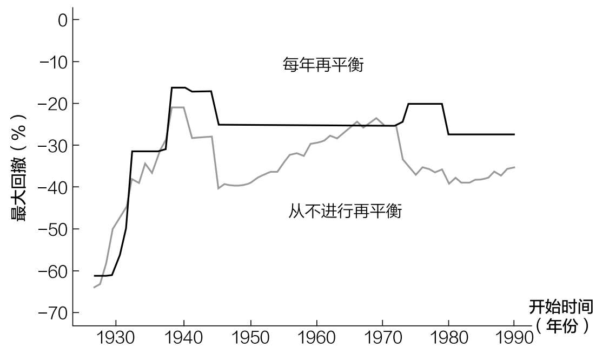


> 然而，在股票长期下跌期间（如20世纪30年代初和70年代初），情况可能恰恰相反。在这些情况下，再平衡实际上增加了波动性，因为它通过出售债券来购买继续下跌的股票。
>
> 尽管这些情况很罕见，但它们表明，周期性再平衡并不是风险管理的完美解决方案。然而，我确实建议大多数个人投资者在一些时间点上进行再平衡（只不过很难找到合适的时间点）。


> 先锋领航集团的研究人员在对50%股票/50%债券投资组合的最佳再平衡频率进行分析后得出了类似的结论。他们在论文中写道：“无论投资组合是每月、每季度还是每年再平衡，经风险调整后的收益都没有特别大的不同。然而，**再平衡的成本随着再平衡次数的增加而显著增加**。”
>
> 著名金融作家威廉·伯恩斯坦在研究了全球股票组合之间的再平衡频率后得出结论：“**没有最优的再平衡周期**。”
>
> 所有这些分析都说明了同样的事情：什么时候再平衡并不重要，只要你定期再平衡就行了。因此，**我建议每年进行一次再平衡**，原因有两个：
>
> 1. 不需要花太多时间。
> 2. 与年度纳税时间重合。


> 无论选择什么样的再平衡频率，你都应该避免不必要的税费。这就是为什么我不建议你在应税账户（经纪账户）中频繁进行再平衡。因为每次这么做，你都得缴税。


> 还有一种不需要纳税的再平衡策略——持续买入。这是有道理的。你可以通过买入资产来平衡投资组合的配置。我称之为积累型再平衡，因为你是通过持续买入头寸少的资产来实现再平衡的。


> 使用一套预先确定的规则将使你在卖出过程中不受情绪的影响。
>
> 无论你用什么策略，不要一次卖掉全部头寸。为什么？因为税收问题，并且如果证券的价格在你卖出后飙升，你后悔的可能性很大。


> 如果你从来没有享受过投资的结果，那投资还有什么意义？


### 第二十章 最重要的资产

> 时间是，而且永远是你最重要的资产。你在20多岁、30多岁和40多岁时如何利用时间，将对你50多岁、60多岁和70多岁的生活产生巨大影响。不幸的是，这个道理需要一段时间才能被认识到。对此，我有切身体会。


## 书目

- 《股市长线法宝》——杰里米·西格尔
- 《财富、战争与智慧》——巴顿·毕格斯


