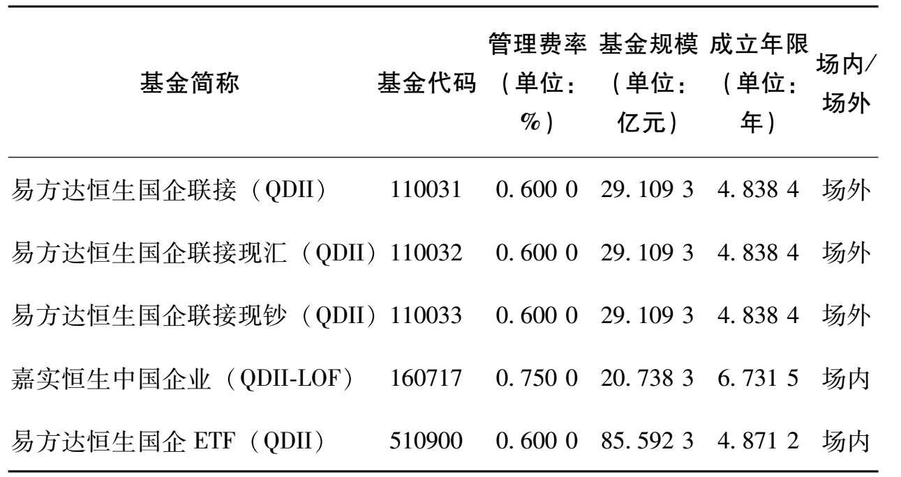
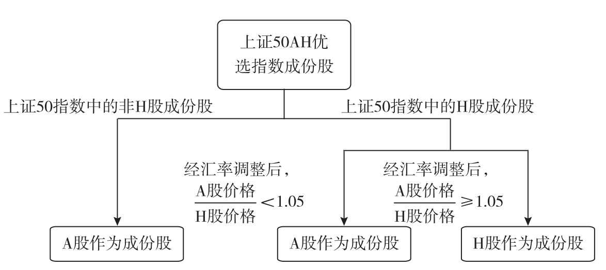
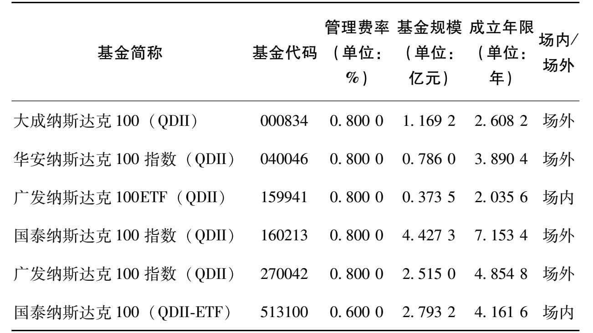
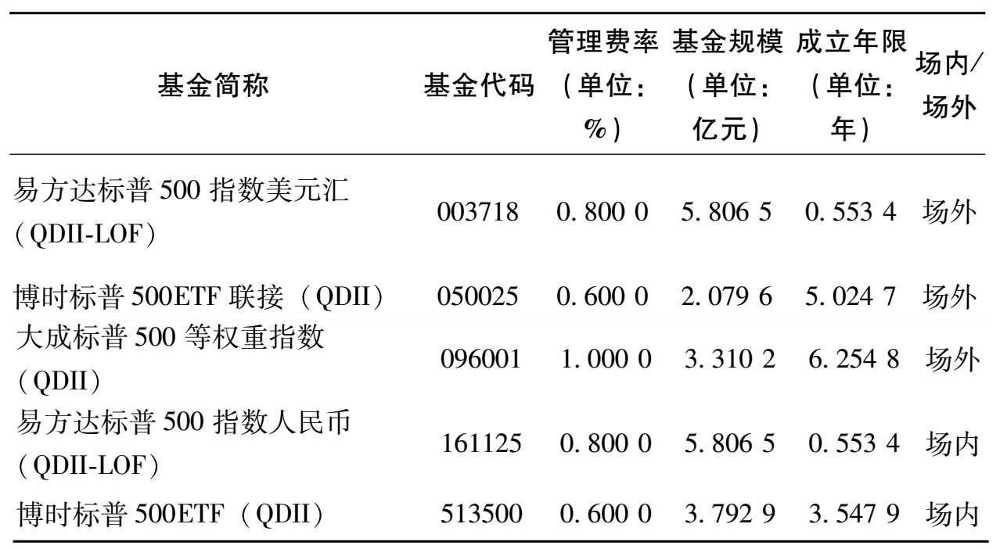
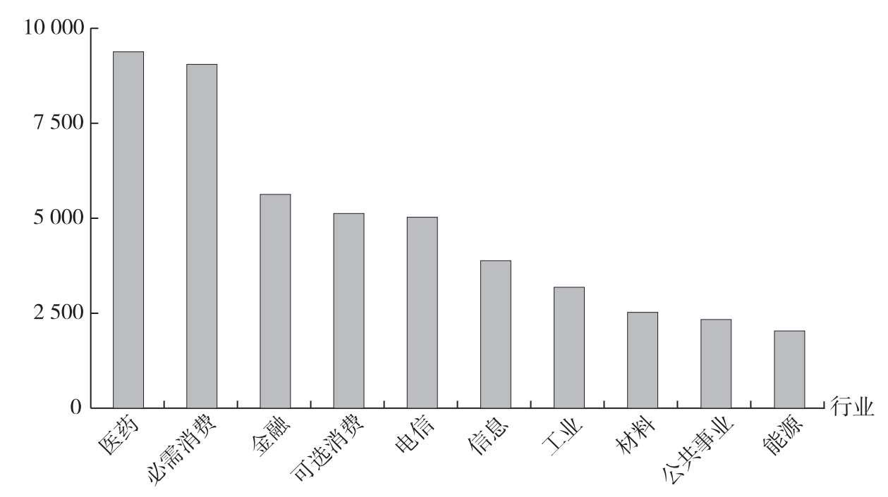
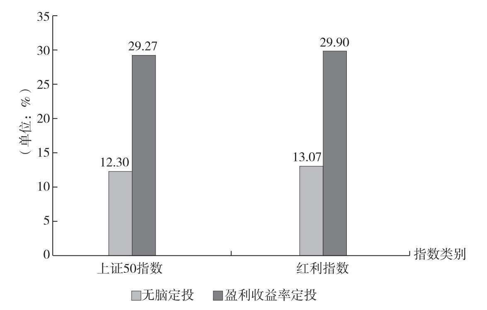

## 第1章 想成为富人，你得攒资产

> 现金是死的，它自己不会增值，所以我们要用现金去买“资产”，例如股票、基金等。只有资产才能自己“生钱”，避免贬值的悲剧。记住一句话，现金不是资产，长期不用的现金，我们应该拿来买真正的资产。

> 减少消费并不是说要做“葛朗台”式的吝啬之人，而是说要更加理性地消费，而不是承担自己支付不起的消费。

> 所有不能产生现金流的资产，价格都是由供求关系决定的。

> 这里有一个比较通用的概念：**能产生现金流的资产通常比不能产生现金流的资产长期收益率更高；能产生现金流的资产中，现金流越高，长期收益率更高。**

> 《股市长线法宝》（*Stocks For The Long Run* ）的作者杰里米丁·西格尔（Jeremy J.Siegel）教授对200多年的美国金融市场做过统计，*股票是长期投资中收益最高的资产，其次是企业债券和短期国债。而且任何债券都无法长期跑赢通货膨胀，只有股票可以长期跑赢通货膨胀。*

> 如果有人说他可以轻轻松松帮你取得年化30%以上的收益率，甚至月赚30%，那毫无疑问，这是骗局。

> 复利的关键在于，如何获取长期稳定的投资收益。

### 最适合上班族的基金——指数基金

> 简单理解，基金就是一个篮子，里面可以按照预先设定好的规则，装入各种各样资产。这样做的好处是，把一篮子资产分割成若干小份，一小份才几元，用较少的资金就可以投资了。这样一来，原来普通人买不起的资产，现在可以通过购买基金的方式投资了。
>
> 例如：
>
> - 装入各种短期债券、短期理财、现金，就是货币基金。
> - 装入各种企业债、国债，就是债券基金。
> - 装入各个公司的股票，就是股票基金。
> - 装入股票和债券，就是混合基金。

## 第2章 投资工具这么多，为什么要选指数基金

### 什么是指数

> 指数是一个选股规则，它的目的是按照某个规则挑选出一篮子股票，并反映这一篮子股票的平均价格走势。
>
> ---
>
> 例如我们熟悉的沪深300指数。沪深300指数是由上海和深圳证券市场中选取300只A股作为样本编制而成的成份股指数。
>
> 沪深300指数样本覆盖了沪深市场六成左右的市值，具有良好的市场代表性。沪深300指数是沪深证券交易所第一次联合发布的反映A股市场整体走势的指数。它的推出，丰富了市场现有的指数体系，增加了一项用于观察市场走势的指标，有利于投资者全面把握市场运行状况，也进一步为指数投资产品的创新和发展提供了基础条件。

### 谁开发的股票指数

`上证系列指数`, `深证系列指数 `, `中证系列指数`, `纳斯达克指数`, `标普500指数`, `道琼斯指数`, `恒生指数`, `H股指数`, `MSCI系列指数`

> 指数也不是凭空产生的，开发指数的机构主要有两类：证券交易所和指数公司。
>
> 国内有三大指数系列。上海证券交易所（简称上交所）开发的上证系列指数，深圳证券交易所（简称深交所）开发的深证系列指数，以及中证指数有限公司开发的中证系列指数。

> 指数基金把指数这个抽象的概念，变成了可以实际交易的产品。
>
> 因为指数的规则是公开的，所以各家基金公司拿到指数的规则之后，都可以自己开发出对应的指数基金产品。像国内比较出名的沪深300，追踪这个指数的指数基金就有几十只之多。因为追踪的是同样的指数，它们持有股票的种类、数量、比例都非常接近，所以它们的表现也都非常接近，并且都跟沪深300表现也比较近似。

> 简单来说，指数基金是一种特殊的股票基金。一般的股票基金依赖于基金经理的个人决策能力，而指数基金不一样：它是以某指数作为模仿对象，按照该指数构成的标准，购买该指数包含的证券市场中全部或部分的证券，目的在于获得与该指数相同的收益水平。

> 指数基金的概念我们已经了解了，看起来平平无奇。为何巴菲特还会如此推崇指数基金呢？这是因为指数基金有很多独有的好处。它主要有三个好处，还能帮助我们规避一些投资中的风险。
>
> 1. 指数基金“长生不老”（注：成份股不断更新）
> 2. 指数基金能长期上涨
> 3. 指数基金成本低

> 中国内地股市的平均收益也是非常不错的。衡量上交所平均股价的上证综指，从1991年年初的100点，上涨到了2017年5月的3 117点。再加上股息收益，年化收益率也达到了15%左右。详见图2.3。
>
> 

> 只要国家有一个稳定的环境，指数背后的公司就能创造越来越多的盈利。或许某些年份遭遇困境，盈利会下滑，但长期看盈利会不断上涨。这是指数长期上涨的根本动力。
>
> 股神巴菲特也提到过，买指数基金就是买国运。只要相信国家能继续发展，指数基金就能长期上涨，我们就能分享国家经济增长的收益。

> 点数代表指数背后公司的平均股价，而指数的点数是长期上涨的。看点数投资，可能某一段时间里有效，但长期看，就是刻舟求剑。

> 指数基金还有一个优势，就在于它成本比较低。
>
> 这里说的成本，主要是针对基金自身的运作成本。每只基金在运作的时候，每年都会收取基金**管理费和托管费**。
>
> ---
>
> *管理费是基金公司收入的主要来源。*
>
> 主动型基金一般会收取基金规模的1.5%作为管理费。
>
> 国内指数基金的平均管理费率在0.69%左右。部分规模较大、运行时间较长的基金，管理费率会降到0.5%以下。
>
> ---
>
> *托管费是交给基金的托管方的。*基金的庞大资产，并不是直接存放在基金公司，一般会在第三方托管方，例如某家大型银行。托管费就是支付给托管银行的费用。
>
> 国内指数基金的托管费率平均在0.14%左右，低的可以做到0.1%。托管费比管理费低很多，所以一般更重视管理费率是否较低。

> 市场越成熟，基金公司之间的竞争越激烈，基金整体的费率就会越低。对于我们基金投资者来说，这是一件好事情，相当于把原本归属基金公司的利润，让给了基金投资者。

### 投资中有很多风险

> 第一类风险是**个股黑天鹅风险**。黑天鹅风险指的是突发的无法预料的风险。这种风险只有发生了我们才意识到会有这种风险。
>
> 例如乳制品行业曾经遭遇过“三聚氰胺”事件、白酒行业遭遇过“塑化剂”事件。
>
> 因为指数基金包括几十上百只股票，单只股票出现问题并没有多少大碍。

> 第二类风险是**本金永久损失的风险**。假如我们看好了一家公司，觉得非常不错，打算长期投资，结果公司第二年倒闭了，只收回来很少的本金，亏损的部分再也无法从这个公司身上赚回来了。这就是本金永久损失的风险。
>
> 指数基金只会按指数去买股票，而且不会选择亏损、财务有问题的公司。指数基金所买入的几十只上百只股票，即使下跌也会有些限度，不会跌没。这种特性帮我们规避了本金永久损失的风险。

> 第三类风险是**制度风险**。投资市场的制度还是有很多不完善的地方。像传统股票基金，还是会存在利益输送、内幕交易等各种不完善的问题。人是有私欲的，让人来选股难免会受到主观情绪的影响。
>
> 指数基金是按照指数来选股，而指数的规则是早就确立好了的，任何人都可以查询、监督。所以指数基金不会有利益输送等情况出现。

## 第3章 常见指数基金品种

### 401（k）计划对我们有什么启示

> 国内大多数的家庭，目前并没有配置多少股票资产。如果想退休后过上体面的生活，必须要配置一定的股票类资产。如果每个月配合工资来定投低估值的指数基金，实际上就是对现有五险一金的一个很好的补充。相当于自制了一个401（k）计划。

### 指数基金的分类

`宽基指数`, `行业指数`

> 指数基金最常见的一种分类，就是分为宽基指数和行业指数。
>
> 有的指数基金在挑选股票的时候，并不限制非得是投资哪些行业；但有的指数基金在挑选股票的时候，会要求只投资哪些行业的股票。
>
> 例如消费行业指数基金，就要求主要投资消费行业的公司，这种指数基金就是行业指数基金。而像沪深300指数基金，它挑选股票的时候，并不限制行业，这种就是宽基指数基金。

### 常见宽基指数基金

`上证50指数`

#### 上证50指数

`发布日期`, `基准日期`

> 上证50指数是从上交所挑选沪市规模最大、流动性好、最具代表性的50只股票组成样本股，以综合反映沪市最具影响力的一批优质大盘企业的整体状况。

> 指数的发布日期是这个指数正式推向市场可供投资者查询的日期。不过指数公司会往前推一段时间，作为指数的基准日期。像上证50，它是2004年1月2日发布的，但却是以2003年12月31日为基准日期开始运作的。

> 编制上证50指数的目的是反映上交所的大盘股走势，所以上证50挑选的都是以大盘股为主的股票。
>
> 虽然说上证50是上交易所挑选规模最大，流动性最好的50只股票，但实际上指数挑选股票的时候，还有一些“潜规则”。
>
> 例如：上市不满一个季度的股票不选；暂停上市的股票不选；财务上有问题的股票不选；多年亏损的股票不选。
>
> 这些规则基本国内的指数都会默认遵循，可以一定限度地保护指数基金投资者的利益不受损失。

> 上证50里，规模最小的都有350多亿，规模最大的有万亿级别的公司。我们来看一下截至2017年5月底，上证50指数的前10大股票。详见表3.1。
>
> |              表3.1 上证50指数前10大股票及其代码              |
> | :----------------------------------------------------------: |
> |  |
>
> 资料来源：Choice金融终端。

> 这些股票基本都是关乎国计民生的大公司，一般是国家控股或在对应的行业里是数一数二的龙头公司。如果我们投资上证50，就持有了这些规模最大的50家企业的股票了。
>
> 这种大公司也被称为蓝筹股。
>
> 什么是蓝筹股？蓝筹这个词来自西方赌场。在西方赌场里，一般有三种颜色的筹码，其中蓝色筹码最为值钱。后来就用**蓝筹股，代表规模较大、有较大影响力的公司。**

> 上证50并不是一个投资市场整体的指数，它更多的是投资大盘股。

> 目前追踪上证50指数的指数基金有很多。由于篇幅所限，这里也不可能一一介绍，我们在投资的时候，可以挑选规模比较大、历史比较长、追踪效果还可以的品种。上证50相关的指数基金如表3.2所示。（注：本章节所列举的指数基金数据，都是截至2017年5月底的数据。）
>
> 
>
> 
>
> 资料来源：Choice金融终端。

> 指数基金从交易渠道上可以分为场内指数基金和场外指数基金。这个场指的是证券交易所。

> 我们如果想获得指数基金，可以跟基金公司**申购**。我们把钱给基金公司，基金公司给我们对应的基金份额，这就是基金的申购。如果我们不想要这个基金，我们可以把基金份额还给基金公司，基金公司按照基金净值给我们对应的现金，这就是基金的**赎回**。

> 场内基金在证券交易所上市，可以有“申购赎回”和“买入卖出”两套交易体系，其中买入卖出方式需要在证券交易所中进行，是通过股票交易软件来操作的。如果基金没有在证券交易所上市，那就是场外基金，它只有“申购赎回”一种交易方式。

> 这里有一个小细节，追踪同一个指数的不同指数基金，它们的单价可能会差很多，有的基金单价是0.9元，有的基金单价却是3元。这主要是由于基金成立时间的不同而导致的，对我们的投资并没有什么影响。
>
> 举个例子，一只上证50指数基金A，基金净值1元；另一只上证50指数基金B，基金净值2元。如果上证50指数上涨50%，那A基金净值会涨到1.5元，B基金会涨到3元，它们上涨的百分比是大致相同的。当然，前提是指数基金追踪指数的效果是正常的。

> **如果一个指数基金规模较小，它清盘的概率就比较大。基金清盘并不是说我们的投资血本无归了，而是按照某一个基金净值强制赎回，导致我们的投资中断。**如果基金规模太小，那么基金公司运作这个基金可能就是亏本的，基金公司就有可能停止这个基金的运作。所以一般挑选指数基金的时候，会避开规模较小的指数基金，最好规模在1亿以上再考虑。

#### 沪深300指数

`增强型指数基金`, `联接基金`

> 沪深300指数（简称沪深300）是由中证指数公司开发的，从上交所和深交所挑选规模最大、流动性最好的300只股票。它的成份股数目比上证50多，也都是以大公司为主。沪深300指数所包括的公司，从市值规模上来说，占到国内股市全部规模的60%以上，比较有代表性，所以沪深300也被认为是国内股市最具代表性的指数。

> 沪深300指数的代码有两个：000300和399300。这是因为沪深300指数同时包括上海和深圳两个交易所的股票，所以沪深300在上交所的代码是000300，在深交所的代码是399300。这两个代码其实都是代表沪深300指数的。

> 沪深300指数仍然是以大公司为主的，不过因为数量扩充到300只，所以覆盖范围更广。它基本上把国内的大型上市公司都包括在内了。沪深300指数中，规模最小的公司也在百亿规模以上。

> 挑选指数基金，一般有两种思路。第一种思路是寻找费用最低、误差最小的品种，这是“指数基金之父”约翰·博格所提倡的。因为基金费用越低、误差越小，指数基金的表现就越贴近于指数。这也是挑选指数基金最常用的方式。

> 我们知道，指数基金的目的是复制指数。不过有的时候，股市会出现一些比较明显的能获得超额收益的机会。于是，有的指数基金就会在追踪指数的基础上，去做一些操作来赚取超额收益，例如打新、量化模型等，希望相对于指数获得一些增强收益。这就是增强型指数基金。

> 增强型指数基金主要是场外指数基金

> 联接基金是基金公司开发的特殊品种。场内基金投资需要开股票账户，具体操作在步骤上也比较麻烦，也没有自动定投的功能。所以基金公司就开发了一个联接基金，方便从场外来投资。
>
> 联接基金是一种场外基金，通过申购赎回来交易。但它并不直接投资股票，而是通过投资对应的场内指数基金来实现复制指数的目的，也是指数基金的一种。

> 很多基金公司成立ETF基金（交易型开放式指数基金）的时候，大多数也会成立对应的ETF联接基金。ETF联接基金是投资到对应的ETF基金上的，一般不会再单独收取基金管理费，因为ETF已经收取了基金管理费，若再对ETF联接基金收取费用则会导致双重收费。所以联接基金不再单独收费，整体费率跟对应的ETF基金一样。

> 沪深300代表了中国上市企业中规模最大、流动性最好的300家企业

#### 中证500指数

> 将全部沪深300指数的300家公司排除，然后将最近一年日均总市值排名前300名的企业也排除，这样可以最大限度地避免选入大公司。在剩下的公司中，选择日均总市值排名前500名的企业，这就是中证500指数啦。
>
> 中证500指数跟沪深300没有重合，是国内中型公司的代表。我们可以回顾下，上证50指数投资上交所的大型企业，沪深300指数投资上海和深圳交易所的大型企业，中证500指数则投资上海和深圳交易所的中型企业。

> 中证500本身是以中型上市公司为主，从定位上，它与沪深300和上证50重合度很低。上证50指数包含的50家大型公司，其实基本上也都在沪深300里，这两个指数很多时候的表现都比较重合。但中证500是与沪深300无重合的股票，所以它的定位和表现就与另外两者不同。

#### 创业板指数

> 在主板上市交易，门槛是很高的，公司需要达到一定规模，而且也要有足够的盈利才可以。但是有一些小公司，目前盈利还不好，达不到主板上市的条件。国家就给这类公司提供了一个门槛更低的市场：创业板市场。

> 主板市场也被称为一板，对发行人的营业期限、股本大小、盈利水平、最低市值等方面的要求标准较高，上市企业多为大型成熟企业，具有较大的资本规模以及稳定的盈利能力。
>
> ---
>
> 如果达不到主板的上市条件，可以退而求其次，选择在二板上市。国内的二板市场就是创业板了。

> 创业板相关的指数有两个，一个是创业板综指，另一个是创业板指数。
>
> ---
>
> 创业板综指是为了衡量创业板所有上市公司的股价平均表现而设立的，代码是399102。它包括创业板全部的500多家企业。
>
> ---
>
> 创业板指数是为了衡量创业板最主要的100家企业的平均表现而设立的，代码是399006。创业板指数限制了成份股的数量，只从创业板上市公司中，挑选出规模最大、流动性最好的100只股票。
>
> ---
>
> 创业板50指数，是从创业板指数的100家企业中，再挑选出流动性最好的50家，相当于创业板的“上证50”。创业板50指数的代码是399673。
>
> ---
>
> 这三个指数中，被开发成指数基金产品的，主要是创业板指数和创业板50指数。

#### 红利指数

`市值加权`, `策略加权指数`, `上证红利指数`, `深证红利指数`, `中证红利指数`, `红利机会指数`

> 上证50、沪深300、中证500、创业板，它们虽然各自有特点，挑选股票的范围也不同，但是有一个共同点，就是它们都是按照市值来加权的，即股票规模越大，权重越高。这也是指数基金的主流加权方式。但实际上，除了市值加权，市场上还有另一类指数基金，它们是按照一定的策略来加权的，也被称为策略加权指数。

> 红利指数，就是按照股息率来决定权重，哪个股票的股息率越高，这个股票的权重就越大。所以有的股票市值规模虽然小，但股息率高，可能在红利指数中占比反而更高一些。

> 有人会说股票分红，股价也会除权下跌，实际上分红没有意义。这种看法是错误的。
>
> 股票的分红是公司盈利的一部分。公司一年里赚到的盈利，并不是在某一天突然产生的，而是在一年的时间里逐渐积累起来的。分红作为公司盈利的一部分，也是在这一年里慢慢积累起来的。分红的那一天股价下跌，只是将这部分盈利分到股东手里的一个具体体现。实际上每年都会产生新的盈利、新的分红，源源不断。

> 时间越长，分红在我们投资股票的收益中所占的比例就越大。

> 红利策略的有效性久经考验，所以各家指数发布商都发布了基于红利策略的指数。上证有上证红利指数，深证有深证红利指数，中证有中证红利指数，标普指数公司也为A股开发了红利机会指数。

> **上证红利指数**
>
> 最老牌的一个红利指数，也是非常出名的一个红利指数。这个指数挑选了上交所过去两年平均现金股息率最高的50只股票，指数代码为000015。A股的第一个红利指数基金就是围绕上证红利指数开发的。

> **中证红利指数**由中证指数公司编制，同时从上交所和深交所挑选过去两年平均现金股息率最高的股票，成份股数量扩大到100只。

> **深证红利指数**与上证红利指数对应，专门投资深交所的高现金股息率的股票，不过成份股只有40只。

> **红利机会指数**是标普公司围绕A股开发的红利指数。红利机会指数在传统红利指数的基础上增加了一些筛选条件。
>
> 传统的红利指数，一般只是挑选高股息率的股票，没有其他的要求。但是红利机会指数有3个要求：*过去3年盈利增长必须为正；过去12个月的净利润必须为正；每只股票权重不超过3%，单个行业不超过33%。*
>
> 符合这3个要求的成份股才能入选，所有入选的股票再按照股息率排名选出股息率最高的100只股票，构成红利机会指数。
>
> 

> 指数（注：红利指数）的特点
>
> - 特点之一：高股息率，在熊市更有优势。
> - 特点之二：能持续发放现金股息的公司，盈利能力和财务健康状况好的概率越高。
> - 特点之三：提供分红现金流。

> 不过指数基金发放基金分红并不是强制的，有的指数基金会把基金分红直接归入到基金净值中，相当于直接替投资者再投入了。

#### 基本面指数

> 策略加权的指数有很多。除了挑选高股息率股票的红利指数，还有一类影响力也非常大的策略加权指数：基本面指数。

> 我们经常能听到基本面这个词。基本面覆盖了一个公司的运营的各个方面，比如说营业收入、现金流、净资产、分红等。通过基本面来选股，也就是说，谁的基本面更好，谁占的权重更高。
>
> 那我们怎么知道一个企业基本面的好坏呢？目前一般从4个维度去衡量：**营业收入，现金流，净资产和分红**。而基本面指数也正是从这4个维度去挑选股票的。

> 基本面指数中，在国内最出名的就是**中证基本面50指数**。这个指数是按照4个基本面指标，挑选出综合排名前50的公司。具体来说，是从上市公司过去5年的年报数据中，计算4个基本面指标。
>
> - **营业收入**：公司过去5年营业收入的平均值。
> - **现金流**：公司过去5年现金流的平均值。
> - **净资产**：公司在定期调整时的净资产。
> - **分红**：公司过去5年分红总额的平均值。

> 例如一个公司营业收入100亿元，那就用它除以全部样本公司营业收入之和。这样得到一个百分比。用同样的方法计算出现金流、净资产、分红所占的百分比。这四个百分比求平均数，再乘以10 000 000，就得到了这个股票的基本面得分。
>
> 按照基本面得分从大到小排名，取前50名，这就是中证基本面50指数了。

#### 央视财经50指数

> 央视财经50指数（专家加权的指数）是由中央电视台财经频道联合五大高校，包括北京大学、复旦大学、中国人民大学、南开大学，以及中央财经大学，以“成长、创新、回报、公司治理、社会责任”5个维度为考察基础，结合专家评审委员会与50家市场投研机构的投票，并由中国注册会计师协会、大公国际资信评估有限公司从财务与资信评级两个角度进行评定，在A股市场上遴选出50家优质上市公司组成其样本股，再经深圳证券信息有限公司对五个维度进行权重优化，编制成央视财经50指数，共50只样本股，每个维度各10只。

> 简单说，央视50指数就是专家们投票选出来的50只股票。其实创立这个指数的原理就是认为专家能够选出更好的股票。它和前面介绍过的指数都不太一样：一般的指数，它们的选股规则是透明的，已经写在纸面上的，但是*央视50指数是依靠专家们的选股能力来选股的，其规则并不透明，是一种很特殊的指数。*

#### 恒生指数

> 港股市场也是与内地关系最密切的市场之一，像我们熟悉的腾讯、比亚迪、联想等都在香港有上市交易。
>
> 而投资于中国香港、美国等市场的基金品种，我们把它们称为QDII基金。
>
> *QDII的意思是合格境内机构投资者。我们可以把这种基金理解成一种“代购”。*
>
> 这种基金可以拿人民币，合法地投资中国香港及其他境外市场，像港股、美股、德股等。

> 境外市场用的都是非人民币交易，所以可以在一定程度上抵御人民币汇率风险。以美元资产为例，美元现金、美元债券、美元股票、美国房地产等，这些都是属于美元计价资产。如果人民币相对美元贬值，将人民币换为美元资产可以分散这种风险。但反过来，如果人民币相对美元升值，持有美元资产也会受到损失。这是一把双刃剑。

> 香港用的港币，在汇率上也是追踪美元的，所以港币资产也能在一定程度上抵御汇率风险。

> 从总体上来看，虽然QDII基金有额外的风险，但是对我们普通投资者来说还是很有用的。通过这种基金可以很方便地配置非人民币资产，一般也没有太大的额度限制（如果是个人用人民币兑换外币，每年有额度限制，但是申购这些QDII基金，并不占用个人的外汇额度）。

> 恒生指数（恒生指数代码是英文字符，HSI）是从1964年100点开始的，它历史悠久、收益稳定，是一个老牌的优秀指数。恒生指数投资的是所有在中国香港上市的公司中规模最大的50家企业，这一点与上证50指数很相似。像我们熟悉的中国移动、腾讯等，都在中国香港上市，它们自身的规模很大，所以也会被入选到恒生指数里。
>
> **特点之一：历史悠久，成熟开放。**
>
> **特点之二：跟内地紧密相关，但投资者以境外投资者为主。**
>
> 也正是因为这个特点，港股股票市场特别容易受到境外市场的影响。
>
> 这次股灾（美国1987年股灾）的起源本来跟中国香港股票市场没有什么关系，但港股却受到很大牵连。从这里我们就能看出，港股股票市场特别容易受到境外市场的影响。

> 因为中国香港金融市场比较开放，境外投资者很容易就能进来投资或者撤资，所以一有风吹草动，就会体现在港股价格的波动上。我们在投资港股的时候，一定要认识到这个特点。
>
> 不过这一特点如今也在慢慢地发生变化。大家都知道最近3年国家先后开通了沪港通和深港通，内地资金正在夺回港股的定价权，这是过去几十年里港股所没有发生过的事情。到2015年，内地投资者交易量在港股中的占比提升到了21.9%，仅次于欧洲（34.2%）和美国（22.5%），但港股仍然是以欧美为主。

> 港股通于2014年成立，开通港股通后，个人投资者可以很方便地投资中国香港股票市场的股票。港股通初期以恒生指数和恒生中国企业指数的成份股为主，因为这些指数的成份股相对可靠，遇到风险的概率较小，后期也逐渐扩展到香港中小盘股。

> **特点之三：“老千股”导致个股投资风险巨大，普通投资者投资港股的最好方式——港股指数基金。**
>
> 港股还有一个比较奇葩的现象，就是“老千股”。老千是作弊的意思，老千股就是指钻了很多政策的空子，利用股票市场来为自己谋求利益。之前“雪球”上就有一位投资者分享过自己在老千股上栽的跟头。
>
> 一个投资者在2008年的时候买了600万港币的一只港股，合计1 550万股。之后这个公司多次低价发行股票、合并股票，到2015年，这个投资者手里只持有775股，市值只有271港币，8年时间里亏损了99.9955%！
>
> 这就是老千股的危害。内地投资者不熟悉港股市场，很容易就被玩得血本无归。

#### H股指数（恒生中国企业指数，HSCEI）

> 如果一家公司在内地注册，但是在香港地区上市，这样的公司就是H股了。内地公司到香港上市的有很多，从1993年青岛啤酒到香港上市至今，已经有160多家企业到香港上市。为了衡量这些公司股票的表现，恒生指数公司编制了恒生中国企业指数，也就是通常说的国企指数，简称为H股指数。

> **特点之一：内地公司在境外的“代言人”。**
>
> 境外投资者难以直接投资A股，但是中国香港金融市场是开放的，对境外投资者来说，H股是可以随意投资的。所以在很长的一段时间里，H股一直是中国内地公司在世界上的代言人。就连巴菲特也投资过H股。

> **特点之二：与内地经济紧密相关，但仍然是以境外投资者为主。**
>
> H股的公司注册地、主营业务都在内地，所以H股与内地经济紧密相关。实际上H股很多公司也同时在A股上市，像中国平安、招商银行等，所以H股跟内地经济的相关程度更高。

> **特点之三：H股与A股指数的亲密关系。**
>
> H股指数是挑选在中国香港上市的规模最大的40家H股。而这些H股背后的公司，很多也在A股上市。所以H股与A股很多指数的关系都非常密切。

> 

#### 上证50AH优选指数

> 介绍H股的时候提到过，H股指数和A股指数的关系很紧密。原因很简单，因为很多公司，同时在A股和港股上市，在港股上市的这部分就是H股。例如中国平安，同时有A股和H股，它们背后实际上是一家公司，关系自然很紧密。
>
> H股和A股的涨跌并不同步。但是长期看，因为背后是同一家公司，所以同一家公司的A股和H股，长期收益是趋于一致的。
>
> 这也就意味着，如果A股和H股差价过大，那么相对便宜的那个未来的收益会更好。这就是AH股轮动策略：**买入AH股中相对便宜的那个，卖出相对贵的那个。**
>
> **上证50AH优选指数（简称50AH优选指数），就是利用这一原理来获得超额收益。**

> **特点之一：成份股与上证50相同。**
>
> 上证50指数、H股指数、50AH优选指数的异同点：
>
> - 上证50指数：27只纯A股+23只同时具备A、H股的公司中的A股。
> - 50AH优选指数：27只纯A股+23只同时具备A、H股的公司中相对更便宜的那一类。
> - H股指数：17只纯H股+23只同时具备A、H股的公司中的H股。

> **特点之二：成份股入选50AH优选指数时，如果成份股同时具备A股和H股，选相对便宜的那个。**
>
> |  |
> | :----------------------------------------------------------: |
> |                 图3.11 50 AH优选指数选股规则                 |

> **特点之三：每个月第二个周五，进行一次轮动。**
>
> 轮动的规则如下：
>
> （1）A股价格/H股价格>1.05，说明A股贵，如果持有A股，则换成H股。
>
> （2）A股价格/H股价格<1，说明A股便宜，如果持有H股，则换成A股。
>
> （3）如果A股价格/H股价格介于1～1.05，则不轮动。
>
> 注意一下，轮动时用的标准跟成份股入选指数时用的标准不一样。
>
> 入选时，是A股价格/H股价格，大于1.05选H股，小于1.05选A股。
>
> 轮动时，是A股价格/H股价格，大于1.05选H股，小于1选A股。
>
> 这样做主要是为了防止当A股价格/H股价格的数值正好在1.05左右波动时，造成频繁轮动调仓。

#### 纳斯达克100指数

> 纳斯达克100指数投资的是纳斯达克规模最大的100家大型企业。

> 今天的纳斯达克100中的信息科技行业成份股，基本上是各个子行业的龙头公司。像智能手机的苹果；搜索领域的谷歌（Google）、百度；芯片领域的英特尔（Intel）、英伟达（NVIDIA）；操作系统的微软；社交网络的新贵脸谱网（Facebook）；电子商务龙头亚马逊（Amazon）、京东；电子游戏的暴雪（Blizzard）、艺电（Electronic Arts,简称EA）等。随便拎出几个来都是业界响当当的龙头，而且大多数公司已经有了核心竞争力和稳定的现金流收入，不再像2000年那样同质化严重且没有盈利能力。以技术类公司为主，这就是纳斯达克100指数最大的一个特点，它包括了全世界规模最大的一批信息技术类公司。

> |              表3.17 部分纳斯达克100指数基金列表              |
> | :----------------------------------------------------------: |
> |  |

> 投资港股的QDII指数基金因为港股通不限额度，所以不会有额度不足的情况，但投资美股的QDII指数基金，会因为基金公司美元额度不足，经常暂停基金的申购（赎回还是可以的）。
>
> 这是由于我们申购美股指数基金，其实是把人民币交给基金公司，基金公司拿着人民币换成美元，再用美元去投资美股。如果基金公司美元额度不足，即使拿到了人民币，也无法换成美元。每家基金公司的美元额度都是有限的，所以投资美股的QDII指数基金经常暂停申购。

#### 标普500指数

> 标普500指数是美国影响力最大的一个股票指数，是美国传统经济的代表，定位上类似于国内的沪深300指数。我们前面提到过，巴菲特多次推荐指数基金，所提到的其实就是标普500指数基金。

> 标普500指数也是以大盘股为主，有500只成份股。不过不同于沪深300指数，标普500指数不单纯按照上市公司的规模来选股票。标普500并不限制入选公司的市值规模，换句话说，**标普500不仅有大公司（大约占90%），还有很多中型公司（大约占10%）**。
>
> 不过要想入选标普500，得是一个行业排在前面的领导者。所以标普500是一个**附带主观判断的蓝筹股指数**，有些类似于前面提到过的由专家选股的央视50指数。标普500指数倾向于选择行业的领导者、长期盈利更好的公司。这也导致了标普500的估值表现与一般市值加权的指数有一定的差异。**因为有人为选股的因素在内，所以标普500各个行业的分布、大小型公司的选择都比较均匀，自身质量非常不错**。

> 我们主要是通过QDII基金来投资标普500指数，相关的指数基金如表3.18所示。
>
> |                表3.18 部分标普500指数基金列表                |
> | :----------------------------------------------------------: |
> |  |

#### 其他指数和指数基金（宽基）

> 综指指的是综合指数，**上证综指**包括了上交所全部的上市公司，目的是反映上交所所有股票的走势。
>
> ---
>
> 不过上证综指因为包括的股票数量太多，不好开发成对应的指数基金。追踪上证综指的指数基金是无法把所有的股票都买齐的，所以一般是通过抽样来挑选一部分股票，用近似拟合的方式实现对上证综指的追踪。

> **中证100指数**是从沪深300指数中，再挑选出规模最大的100只股票组成的。比起上证50指数，它覆盖了深交所的大公司，所以更加全面一些。

> **中证800指数、中证1000指数、中证全指**
>
> 沪深300指数主要投资沪深两市规模最大的300只股票，是大盘股的代表指数。中证500指数投资排除了沪深300包含的300只股票之后的规模最大的500只股票，是中盘股的代表指数。
>
> **中证800指数＝沪深300指数+中证500指数**，基本上把A股的大中型公司都囊括在内，其指数代码为000906。
>
> ---
>
> 中证公司又开发了**中证1000指数，追踪除去中证800指数之外最大的1 000只小盘股**，指数代码为000852。
>
> ---
>
> **中证全指**目的是覆盖A股全部市场上的股票，除了亏损比较严重的公司和上市不足3个月的新公司。不过中证全指没有对应的基金产品，它主要是为了方便统计A股的整体走势时使用的，其指数代码为399985。

> 我们可以来列举一下中证指数公司开发的一系列指数。
>
> - 中证100：大盘股为主，沪深两市规模最大的100只。
> - 沪深300：大盘股为主，沪深两市规模最大的300只。
> - 中证500：中盘股为主，排除沪深300后，沪深两市规模最大的500只。
> - 中证800：大中盘股，沪深300+中证500。
> - 中证1000：小盘股为主，除去中证800外，最大的1 000只小盘股。

#### 等权重指数

> 什么是等权重指数呢？
>
> 像上证50指数、沪深300指数等是市值加权的指数，也就是按照市值规模来挑选股票，谁市值越大谁占的权重就越高。而红利指数是根据股息率加权的指数，股息率越高所占的权重就越大。
>
> 而**等权重指数则是分配给每个成份股完全相同的权重**。

> 开始的时候每个成份股都是相同的权重，但是由于各个成份股的涨跌幅度和速度都不同，就导致一段时间后它们的权重也不同了。所以**等权重指数一般每隔一段时间会强制再平衡一次，一般是一年一次。**

> 等权重指数也有缺点，就是流动性比较差，它的流动性取决于流动性最差的那个成份股。

#### 价值指数

> 价值指数是一种比较有特色的策略加权指数。
>
> ---
>
> 这里的价值，实际上说的是“市盈率、市净率、市现率较低，股息率较高”的股票。这类股票一般被称为价值型股票，而价值指数就是这类股票的代表。价值型股票作为一个整体，它的表现会比市值加权的指数要好一些，这是它的一个特点。不过这类指数国内还不多，规模也都不大，了解一下就好。

### 行业指数基金

#### 什么是行业指数基金

> 前面提到过的上证50指数、沪深300指数、红利指数等，都有一个特点：它们在挑选股票的时候，包括了各行各业，并不限制行业，这样的指数叫作宽基指数。**实际上市场上还有一类比较小众的指数基金，这些指数基金专门投资某个行业的股票，也就是行业指数基金**。

> 行业指数的*投资风险更高一些*，不仅要考虑投资价值，还要考虑不同行业自身的特点和当前所处的发展阶段。
>
> 的时候，国家政体经济发展不错，但有的行业反而一路衰败。

#### 有哪些行业

> 标准的10个一级行业分类，或者按照某个主题划分的主题行业，这就是行业指数基金的主要两种组成方式。

> 摩根士丹利和标普在2000年时联合推出了全球行业分类标准（GICS），将行业分为10个一级行业，24个二级行业，和67个子行业，并建立了行业指数。我国的行业指数很多也是按照这个标准分类的。
>
> 其中最主要的10个一级行业分别是：
>
> - 材料：金属、采矿、化学制品等。
> - 可选消费：汽车、零售、媒体、房地产等。
> - 必需消费：食品、烟草、家居等。
> - 能源：能源设备与服务、石油天然气等。
> - 金融：银行、保险、券商等。
> - 医药：医疗保健、制药、生物科技等。
> - 工业：航空航天、运输、建筑产品等。
> - 信息：硬件、软件、信息技术等。
> - 电信：固定线路、无线通信、电信业务等。
> - 公共事业：电力、天然气、水等。

> 不同行业的赚钱能力是有很大差别的，有的行业就是天生更容易赚钱。我们来看一个例子。10个一级行业都是有对应行业指数的。例如中证800一级行业指数。
>
> ---
>
> 中证800一级行业指数，就是把这800家企业，按照各自所属的行业，划分成10个一级行业指数。
>
> |  |
> | :----------------------------------------------------------: |
> |     图3.15 2004年12月21日～2017年5月31日，各行业指数表现     |

> 市场需求比较稳定，企业有护城河能保证一定的利润率，并且再投资需求小，能获得大量的自由现金流，只有容易形成这些条件的行业，才能比较容易的赚钱。
>
> 为什么可口可乐和茅台一度成为价值投资的标签呢？它们比较符合上面的条件：需求受经济周期影响小，品牌护城河能保证不错的利润率，再投资需求比较小，赚到的钱大多都是自由现金流。

#### 相关行业指数基金

`可选消费行业的指数`, `中证养老产业指数`, `中证银行指数`, `分级基金`, `非银金融行业的指数`, `上证180金融行业指数`, `沪深300金融行业指数`, `全指金融行业指数`, `中证800地产指数`, `国证地产指数`, `地产等权指数`, `中证军工指数`, `中证环保指数`, `中证白酒指数`

> 必需消费行业也被称为日常消费行业、主要消费行业。这三个虽然称呼不同，实际上说的是一回事。必需消费，主要是维持我们正常生活所需要的各种消费品，例如饮料、酒、农副食品等。
>
> 必需消费行业也是需求最稳定的行业，不管经济情况如何，这些日常消费我们都是不可缺少的。也正是因为这种很稳定的需求，必需消费行业也是巴菲特最喜欢的行业之一。

> 目前必需消费行业的指数主要是以下4只。
>
> - 上证消费指数：从上交所挑选必需消费行业公司。
> - 上证消费80指数：从上交所挑选80家规模最大的必需消费行业公司。
> - 中证消费指数：从中证800，即沪深300和中证500中挑选必需消费行业公司。
> - 全指消费指数：从所有上市公司中挑选必需消费行业公司，覆盖范围最广。

> 目前医药行业的指数主要有以下几种：
>
> - 中证医药指数：又称中证800医药指数，是从中证800指数中挑选医药行业。
> - 中证医药100指数：挑选了100家大型医药股，每只股票买入相同的金额。
> - 上证医药指数：只投资上交所的医药行业公司。
> - 全指医药指数：从整个A股中挑选医药行业，它覆盖的医药公司是最全的。
> - 细分医药指数：挑选了医药行业细分领域的主要公司。
> - 300医药指数：挑选了沪深300指数里的医药行业公司。
> - 500医药指数：挑选了中证500指数里的医药行业公司。

> 银行具备不错的商业模式，可以简单地看作是“两个收入，两个费用”：**利息收入，非利息收入，利息费用，风险准备金**。
>
> 例如，银行可以以3%的利率从储户手里收集钱财，然后以6%的利率贷给企业。贷款的利息就是利息收入，支付的3%就是利息费用。
>
> 另外银行还可以收取中间收入或者渠道费用，例如手续费、管理费。这个费用与利息无关，所以是“非利息收入”。
>
> 银行贷款给客户，如果客户还不上钱，银行就得从自己的收益中拿出一部分来弥补亏空。这个用来弥补亏空的资金要预先准备好，这就是“风险准备金”费用。
>
> 所以，简单地看，可得：
>
> 银行的收益=利息收入+非利息收入-利息费用-风险准备金
>
> =利差收益+非利息收入-风险准备金。

> 证券行业也就是券商业，也被称为“周期之王”。它是最典型的一个强周期性行业。

> 证券行业的商业模式比较容易理解，作为证券市场的“揩油者”，证券公司最主要的收入来源是交易费用。牛市的时候，无论是新开户还是资金量都会与平时相比有大幅的提升。所以证券行业的业绩与牛熊市的相关性非常大。证券行业的周期性取决于市场行情。

> 如果有的投资者并不看好银行，又想投资金融行业，就可以选择非银金融行业指数了。非银金融行业指数中大约有40%是保险公司，60%是证券公司。

## 第4章 如何挑选适合投资的指数基金
`能力圈理论`

> 想当初，我刚开始投资股票的时候，也是什么都不懂，开了股票账户之后就是瞎买，市场上什么热门、哪些我比较感兴趣，我就投资哪些。结果投资下来有的亏损有的盈利，整体略亏一些。但是无论是亏损还是盈利，我都说不出“为什么”。
>
> 当时我就意识到这样投资很危险，资金少还不要紧，如果资金多了还这样投资，迟早要出问题。于是我就停止了对股票的投资，开始**系统地学习投资的方法**。

> *我有个习惯，就是会跟着这个领域最牛的人来学习。*股票领域谁最牛，几乎每一个股民都会脱口而出一个名字：巴菲特。作为世界富豪榜上的常青树，被公认为“股神”的巴菲特，自然是股票投资领域最值得学习的对象。
>
> 我把市面上关于巴菲特的书籍几乎都看遍了，了解到巴菲特的投资理念也是来自他的老师：本杰明·格雷厄姆（Benjamin Graham）。格雷厄姆先生有两部著作，《证券分析》（Security Analysis ）和《聪明的投资者》（The Intelligent Investor ），这两本书系统地记录了他的投资理念。当我第一次读完《聪明的投资者》，合上书时，我就明白，我找到了最想要的投资理念。

> “低估值价值投资＋指数基金”，这个组合第一次出现在了我的脑海里。伴随着这个想法，我继续研究下去，发现这种思路非常适合普通投资者。指数基金本身就很适合普通投资者，但它波动比较大，傻傻地买也是很有可能遭遇短期大幅亏损的；但若是配合低估值价值投资的思路，投资者就可以在低位的时候从容投资，这样一来，大大降低了投资指数基金的风险，投资收益也能提升不少。

> 格雷厄姆对价值投资总结出了三个非常重要的理论，分别是：价格与价值的关系、能力圈，以及安全边际。

> **能力圈理论**，要求我们对所投资的品种非常了解，能判断出它大致的内在价值是多少，而不是什么热门投资什么。

> 如果我们对一个品种比较了解，能判断出它大致的价值是多少，差不多就具备了这个品种的能力圈。对品种了解得越多，能力圈也就越大。但前提是真的了解了这个品种，才算是有了能力圈。

> 巴菲特也解释过能力圈。他说：
>
> *对你的能力圈来说，最重要的不是能力圈的大小，而是你知道自己能力圈的边界所在。如果你知道了边界所在，你将比那些能力圈虽然比你大5倍、却不知道边界所在的人，要富有得多。*
>
> 其实这个道理，在我们日常生活中也比比皆是。“没有金刚钻，不揽瓷器活”，不熟不做，说的都是能力圈的道理。

> 格雷厄姆用一句话非常形象直观地介绍了安全边际，他说：
>
> *我们要用0.4元买价值1元的东西。*
>
> 这就是格雷厄姆总结的安全边际的核心。套用在投资上，就是说，我们要用比价值更低的价格去买股票。

> 当股票的价格大幅低于股票的内在价值时，这时候投资，才具备了安全边际。如果我们在价格大幅高于价值的时候买入，不仅不能赚钱，反而还会有亏钱的可能。很多时候亏钱，就是追热点导致的，冲动的投资者看到什么热门、什么涨得好就买什么，丝毫不关心买的东西到底值多少，是不是符合这个东西的内在价值。格雷厄姆曾说过：
>
> *不清楚自己的能力圈，忽视安全边际，这是投资者亏损的主要原因。*

### 常见的估值指标

> 最常用的估值指标有哪些呢？主要是4个：**市盈率、盈利收益率、市净率、股息率**。

#### 市盈率

`市盈率陷阱`

> 市盈率的定义是：公司市值/公司盈利（即PE=P/E，其中P代表公司市值，E代表公司盈利）。

> 市盈率的分母，也就是公司盈利，可以取不同的值，从而将市盈率细分为静态市盈率、滚动市盈率和动态市盈率。其中静态市盈率是取用公司上一个年度的净利润，滚动市盈率是取用最近4个季度财报的净利润，动态市盈率是取用预估的公司下一年度的净利润。

> 最具参考意义的是静态市盈率和滚动市盈率，因为它们是已经确实发生了的盈利，这也是我们通常所说的市盈率。而动态市盈率是预测未来的盈利，与未来实际情况会有一定偏差。

> 那么市盈率背后的信息有哪些？
>
> （1）市盈率反映了我们愿意为获取1元的净利润付出多少代价。
>
> （2）估算市值。一个公司一年赚100亿元净利润，市盈率是10，其市值就是1 000亿元。市值代表我们买下这个公司理论上需要的资金量。
>
> （3）市盈率的适用范围：流通性好、盈利稳定的品种。应用市盈率的前提有两个，一是流通性好，能够以市价成交；二是盈利稳定不会有太大波动。

> **流通性越不好的股票，市盈率就越没有参考价值**。这是因为当你想以这个市盈率去进行投资的时候，你的投资行为就会极大地影响市价，形成一种反馈效应。

> 有比较合理的流动性，是应用一切估值指标的前提。一般能够进入沪深300、中证500之类指数的股票，它们的流动性都没有什么问题。

> 有的行业盈利并不稳定，不适用市盈率，例如有“市盈率陷阱”的没落行业和周期行业，有的行业处于成长期或者亏损期，也不适用市盈率。

> 有的行业市盈率很低，但是实际上行业进入了下行周期，盈利在不断减少。从PE=P/E这个角度，盈利E不断减少，市盈率PE就会逐渐变大，不再低估。这就是“市盈率陷阱”。

> 再者，很明显，**亏损股**无法使用市盈率这个指标。而正**处于高速成长期的股票**，公司的盈利大部分需要用于再投入扩大规模，所以盈利会被人为地调整，并不能稳定，因此也不适合用市盈率估值。

#### 盈利收益率

> 盈利收益率是市盈率的变种。市盈率是用公司市值除以盈利，而盈利收益率则是用公司盈利除以公司市值。也就是盈利收益率＝E/P。

> 它所代表的意义是，假如我们把一家公司全部买下来，这家公司一年的盈利能够带给我们的收益率，就是盈利收益率。

#### 市净率

`净资产收益率（ROE）`

> 市净率指的是每股股价与每股净资产的比率，也就是我们说的账面价值。市净率的定义是：PB＝P/B（其中P代表公司市值，B代表公司净资产）。

> 净资产通俗来说就是资产减去负债，它代表全体股东共同享有的权益。具体的计算在上市公司的年报中都有。净资产这个财务指标比盈利更加稳定，而且大多数公司的净资产都是稳定增加的，可以计算出市净率。

> 影响市净率的因素有哪些？
>
> （1）企业运作资产的效率：ROE。
>
> （2）资产的价值稳定性。
>
> （3）无形资产。
>
> （4）负债大增或亏损。

> 说到市净率就不得不说净资产收益率（ROE）。ROE等于净利润除以净资产。
>
> 对企业来说，资产本身是企业运营的素材，企业需要运作资产，并由此产生收益，资产才有价值。同样的资产，有的企业可以运作它产生更高的收益，有更高的资产运作效率。衡量资产运作效率的重要指标就是净资产收益率ROE。

> ROE越高的企业，资产运作效率越高，市净率也就越高。

> 资产价值越稳定，市净率的有效性越高。

> 如果一个企业主要靠无形资产来经营，像律师事务所、广告服务公司、互联网公司，那市净率就没有多少参考价值了。

> 当企业的资产大多是比较容易衡量价值的有形资产，并且是长期保值的资产时，比较适合用市净率来估值。

> 强周期性行业的指数基金，它们的盈利不稳定或盈利呈周期性变化，因此市盈率和盈利收益率都无法用在它们上面，但可以用市净率来估值。像证券、航空、航运、能源等都很适合用市净率估值。

> 有一些比较特殊的时间段，遇到短期的经济危机，原本盈利稳定的宽基指数基金会在短期内盈利不稳定，也可以用市净率来辅助估值。像2008~2009年美国次贷危机的时候，美股的盈利就出现过短期的大幅下滑，这种下滑是不会长期持续的，但确实会影响用市盈率估值，这时就可以用市净率辅助估值。

#### 股息率

> 用过去一年，公司的现金分红（注：区分公司利润）除以公司的市值，得到的就是股息率了。股息率衡量的，就是现金分红的收益率。

> 股息率、分红率这两个概念很像，但实际上是不同的。分红率也叫作派息率、分红比例。
>
> 股息率是企业过去一年的现金派息额除以公司的总市值，而分红率是企业过去一年的现金派息额除以公司的总净利润。这两个比率，分子一样，但是分母一个是公司市值，一个是公司当年净利润。（当然细节上还有一些不同，例如分红还要扣税等，但大体上可以这么理解。）

> 作为普通的二级市场股东，我们买入股票，是享受不到很多权利的。

> 你无须出售手里的股权，就可以获取不断增长的现金流。实际上这也是国家分享国有上市公司收益的方法：像国内的上市银行，大股东大多为证金公司、财政部、发改委，它们要保证上市银行的国有控股，手里的股票很少会出售。在这种情况下，享受收益的方法就是提高公司的分红率，从而每年获得高额股息。

> 股息是一个既能长期持有股权资产，又能同时享受现金流收益的好方法。通过长时间持有高股息的股票资产组合，你可以无须关注股价涨跌，就可以通过收获越来越高的现金分红来轻松实现财务自由。这是长期投资股票类资产最好的收益方式，我们再也无须为波动的股价而忐忑不安，只要每年收取稳定增长的现金分红就够了。
>
> 时间越长，分红在我们投资股票的收益中占比就越大。美国著名金融学家西格尔教授，曾经在他的著作《股市长线法宝》中做过研究。西格尔对标普500指数从1871年到2012年的数据进行回测，发现股息分红是整个时期内股东收益的最重要的来源。

> 我们再来回顾一下4个重要的估值指标。
>
> 第一个是市盈率，它是用公司市值除以公司盈利。第二个是盈利收益率，约为市盈率的倒数，是用盈利来除以市值，它衡量的是如果我们把一个公司全部买下来，每年盈利能够带给我们的收益。第三个是市净率，它是用公司市值除以净资产，是从买资产的角度来衡量公司的。第四个是股息率，它是用现金分红除以公司市值。股息率和盈利收益率关系很紧密，盈利收益率乘以分红率就等于股息率。

### 指数的估值怎么查

> 市盈率、市净率、股息率等都是股票常用的指标，投资个股的时候，这些数据基本在股票交易软件上都有，查起来很方便。
>
> 那这些估值对指数基金有用吗？
>
> 答案是肯定的。指数基金包括一篮子股票，它可以把背后股票的盈利、净资产、股息等数据求出一个平均值，从而计算出指数基金的估值指标。
>
> 例如上证50指数的市盈率，就是把上证50指数背后所有公司总市值先求和，再把所有公司的总盈利求和。总市值之和，除以总盈利之和，这就是上证50指数的市盈率了。
>
> **方法一：部分关注指数基金投资的微信公众号提供了相关数据的查询。**
>
> **方法二：指数官网。**如中证指数官网、恒生指数官网。
>
> **方法三：金融终端。**例如WIND、Choice。

### 盈利收益率法挑选指数基金

> 格雷厄姆认为，满足两个条件就算高，一是盈利收益率要大于10%，二是盈利收益率要大幅高于同期无风险利率。截至2017年5月31日，*无风险利率可以参考10年期国债收益率*，在3.5%左右。无风险利率的两倍就是7%。所以在中国，这两条规则目前可以合二为一，即：当指数基金的盈利收益率大于10%，我们就可以开始定投；如果盈利收益率低于10%，这个指数基金对我们就没有了吸引力，应该停止定投，对已经定投的份额则选择持有。

> 这个6.4%是来自债券基金的平均收益。国内债券基金的长期平均收益率在6.4%左右。如果指数基金的盈利收益率不足6.4%，那我们为何还要投资指数基金呢？那还不如将指数基金卖出，换成债券基金，毕竟债券基金更加稳定，风险更小。所以我们应该在指数基金的盈利收益率不足6.4%的时候，分批卖出指数基金，换成其他品种。

> 在当前的国内利率和基金的收益水平下，我们使用盈利收益率来定投指数基金的策略是：
>
> - 当盈利收益率大于10%时，分批投资。
> - 盈利收益率小于10%，但大于6.4%时，坚定持有已经买入的基金份额。
> - 当盈利收益率小于6.4%时，分批卖出基金。

> 在定投的过程中，有的朋友有疑问，说盈利收益率会不会变化很频繁呢？
>
> 比如我这个月发现盈利收益率大于10%，定投了，下个月盈利收益率小于6.4%了，要卖出，这样操作会不会很频繁呢？
>
> 其实，一般情况下，盈利收益率在短时间内变化不大，不会出现这么极端的情况。所以，我们只需要配合定投，在每月定投的时候，查看一下盈利收益率，再根据盈利收益率当时所处的范围，选择相对应的操作，也就是继续定投、坚定持有或是分批卖出，这样就可以了。

#### 盈利收益率法用于定投的威力

> 让我们用上证50和红利这两个指数来做个示范，使用2004~2015年这两个指数的历史数据进行回测，看一下使用盈利收益率策略来投资，投资者能获取的收益率是多少。具体做法：*配合盈利收益率进行指数基金的定投，在盈利收益率大于10%的时候，每个月1日买入等额资金*。
>
> |  |
> | :----------------------------------------------------------: |
> |      图4.1 2004 ~2015年，每月1日定投的年复合收益率表现       |
>
> - 即使不使用格雷厄姆的投资策略，我们通过定投也可以在指数基金上取得12%以上的年复合收益率。
> - 配合格雷厄姆的投资策略，年复合收益率提升了惊人的两倍以上。
>
> 不过，这么高的收益率，主要得益于过去20年中国经济的高速增长。未来中国经济的增速可能会放缓，收益率可能没有过去20年那么高，但大概率会在15%~20%。

> 从这里也可以看出，指数基金并不总是适合定投的。有朋友就会担心：指数基金并不是所有的时间里，盈利收益率都符合投资的条件。如果指数基金盈利收益率长时间不符合条件怎么办？
>
> 其实不要紧，对港股指数基金来说，通过对历史的分析，基本上每隔4~5年就会出现一次机会，再加上国内国外众多的指数基金，不同的指数基金的成长性是不同的，有的处在低估区域，有的处在正常区域，有的处在高估区域，所以我们也不用担心买不到。所有指数基金都不低估，这种情况也是很罕见的。

#### 美联储对盈利收益率法的应用

`美联储的FED模型`

> 美联储是美国联邦储蓄系统，是美国最重要的金融机构。美联储有一个对股票市场的估值模型：FED模型，它是用美股的盈利收益率除以美国十年期国债利率。

> 早在20世纪90年代，美联储就发布过非常多的分析报告，指出FED模型对美股收益有一定的预测作用。
>
> 盈利收益率/十年期国债利率，这个数值越高，就代表股市相对债券市场的投资价值越高、未来股市的投资收益也会越高。这个数值越低，就代表股市相对债券市场的投资价值越低、未来股市的投资收益也会越低。

#### 盈利收益率法的局限和适合的品种

> 盈利收益率法也是有它的局限性的。盈利收益率的使用条件比较苛刻，**只适合于流通性比较好、盈利比较稳定的品种**。如果是盈利增长速度较快，或者盈利波动比较大的指数基金，则不适合使用盈利收益率法。

> 目前适合盈利收益率的品种，国内主要是**上证红利、中证红利、上证50、基本面50、上证50AH优选、央视50、恒生指数和恒生中国企业指数**等。这几个品种的投资很简单，当盈利收益率大于10%时就可以投资，小于6.4%时就可以卖出。

> 内地的投资者投资港股，需要走港股通等渠道，并且需要缴纳比较高的分红税。另外，使用人民币投资港股，需要先将人民币换成港币，再使用港币来投资（由基金公司完成换币，无需自己操作），这也产生了额外的费用。这些都会影响恒生和H股指数基金的投资收益。所以我们内地的朋友在投资恒生指数和H股指数基金的时候，要将它们的盈利收益率打9折之后再做参考。

### 博格公式法挑选指数基金

#### 影响指数基金收益的三大因素

> 约翰·博格在长期的投资过程中，对决定股市长期回报的因素，进行了分析。他发现，决定股市长期回报的最关键的三个因素。分别是：初始投资时刻的股息率、投资期内的市盈率变化、投资期内的盈利增长率。

> 指数的市盈率，其实就是指数背后公司的平均股价除以公司的平均盈利。用公式表达出来，也就是：PE=P/E，其中，P代表平均股价，E代表平均盈利。

## 书目

《股市长线法宝》（*Stocks For The Long Run* ）——杰里米丁·西格尔（Jeremy J.Siegel）

《证券分析》（*Security Analysis* ）——本杰明·格雷厄姆（Benjamin Graham）

《聪明的投资者》（*The Intelligent Investor* ）——本杰明·格雷厄姆（Benjamin Graham）