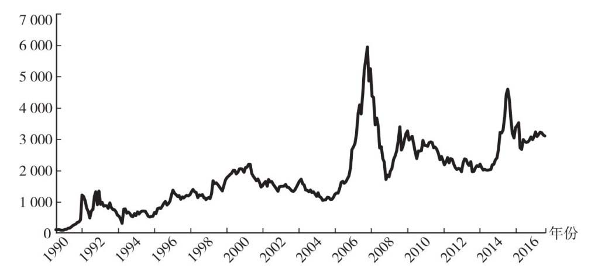
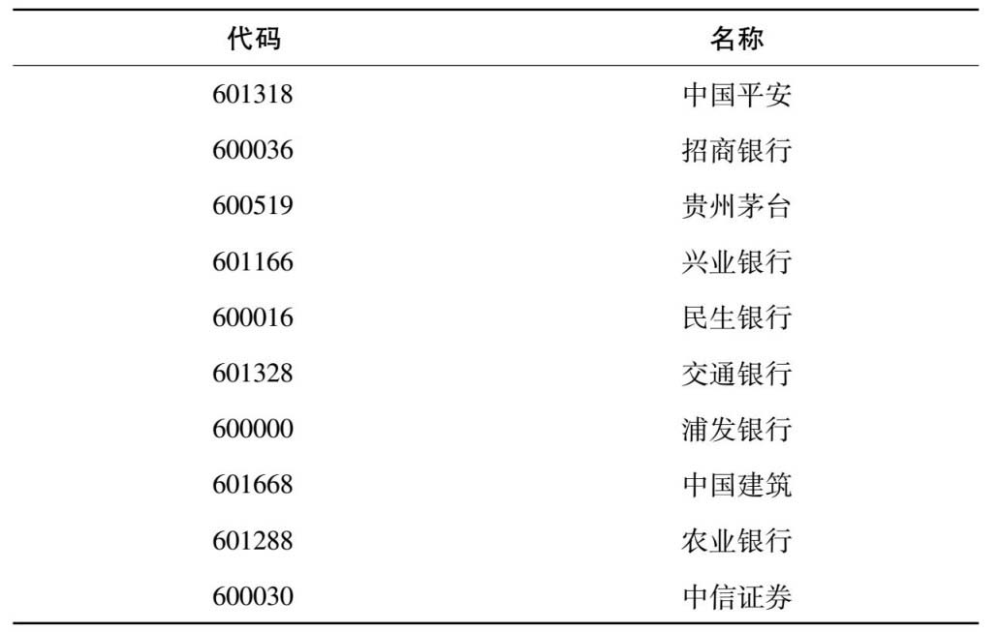
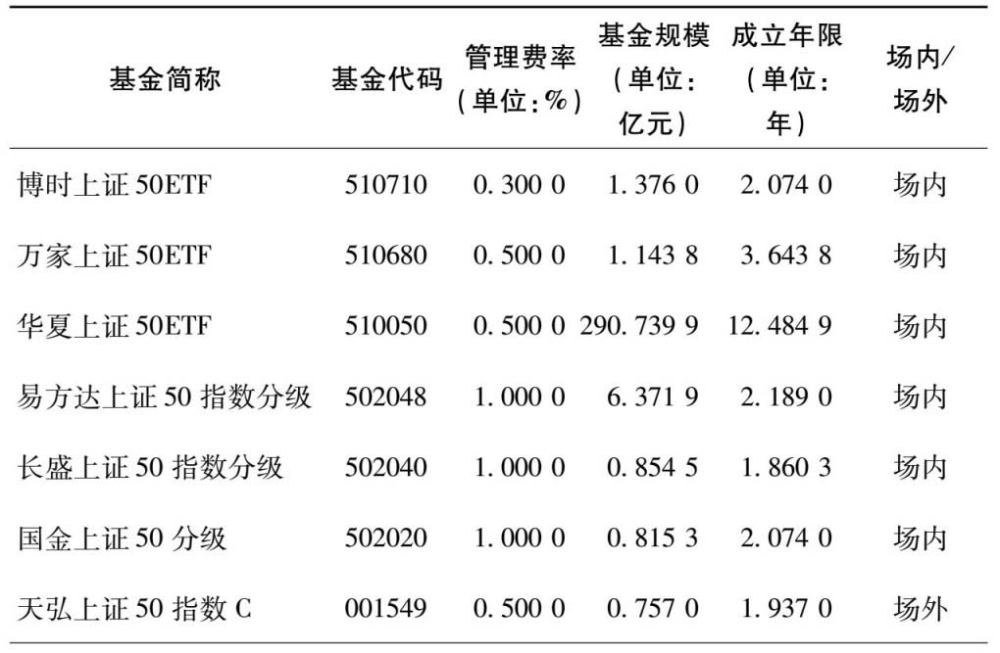
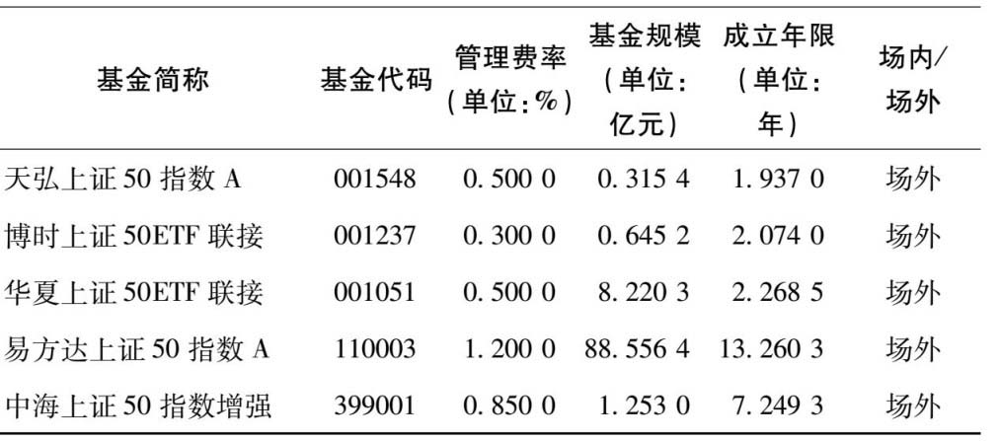
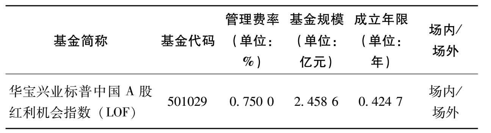

## 第1章 想成为富人，你得攒资产

> 现金是死的，它自己不会增值，所以我们要用现金去买“资产”，例如股票、基金等。只有资产才能自己“生钱”，避免贬值的悲剧。记住一句话，现金不是资产，长期不用的现金，我们应该拿来买真正的资产。

> 减少消费并不是说要做“葛朗台”式的吝啬之人，而是说要更加理性地消费，而不是承担自己支付不起的消费。

> 所有不能产生现金流的资产，价格都是由供求关系决定的。

> 这里有一个比较通用的概念：**能产生现金流的资产通常比不能产生现金流的资产长期收益率更高；能产生现金流的资产中，现金流越高，长期收益率更高。**

> 《股市长线法宝》（*Stocks For The Long Run* ）的作者杰里米丁·西格尔（Jeremy J.Siegel）教授对200多年的美国金融市场做过统计，*股票是长期投资中收益最高的资产，其次是企业债券和短期国债。而且任何债券都无法长期跑赢通货膨胀，只有股票可以长期跑赢通货膨胀。*

> 如果有人说他可以轻轻松松帮你取得年化30%以上的收益率，甚至月赚30%，那毫无疑问，这是骗局。

> 复利的关键在于，如何获取长期稳定的投资收益。

### 最适合上班族的基金——指数基金

> 简单理解，基金就是一个篮子，里面可以按照预先设定好的规则，装入各种各样资产。这样做的好处是，把一篮子资产分割成若干小份，一小份才几元，用较少的资金就可以投资了。这样一来，原来普通人买不起的资产，现在可以通过购买基金的方式投资了。
>
> 例如：
>
> - 装入各种短期债券、短期理财、现金，就是货币基金。
> - 装入各种企业债、国债，就是债券基金。
> - 装入各个公司的股票，就是股票基金。
> - 装入股票和债券，就是混合基金。

## 第2章 投资工具这么多，为什么要选指数基金

### 什么是指数

> 指数是一个选股规则，它的目的是按照某个规则挑选出一篮子股票，并反映这一篮子股票的平均价格走势。
>
> ---
>
> 例如我们熟悉的沪深300指数。沪深300指数是由上海和深圳证券市场中选取300只A股作为样本编制而成的成份股指数。
>
> 沪深300指数样本覆盖了沪深市场六成左右的市值，具有良好的市场代表性。沪深300指数是沪深证券交易所第一次联合发布的反映A股市场整体走势的指数。它的推出，丰富了市场现有的指数体系，增加了一项用于观察市场走势的指标，有利于投资者全面把握市场运行状况，也进一步为指数投资产品的创新和发展提供了基础条件。

### 谁开发的股票指数

`上证系列指数`, `深证系列指数 `, `中证系列指数`, `纳斯达克指数`, `标普500指数`, `道琼斯指数`, `恒生指数`, `H股指数`, `MSCI系列指数`

> 指数也不是凭空产生的，开发指数的机构主要有两类：证券交易所和指数公司。
>
> 国内有三大指数系列。上海证券交易所（简称上交所）开发的上证系列指数，深圳证券交易所（简称深交所）开发的深证系列指数，以及中证指数有限公司开发的中证系列指数。

> 指数基金把指数这个抽象的概念，变成了可以实际交易的产品。
>
> 因为指数的规则是公开的，所以各家基金公司拿到指数的规则之后，都可以自己开发出对应的指数基金产品。像国内比较出名的沪深300，追踪这个指数的指数基金就有几十只之多。因为追踪的是同样的指数，它们持有股票的种类、数量、比例都非常接近，所以它们的表现也都非常接近，并且都跟沪深300表现也比较近似。

> 简单来说，指数基金是一种特殊的股票基金。一般的股票基金依赖于基金经理的个人决策能力，而指数基金不一样：它是以某指数作为模仿对象，按照该指数构成的标准，购买该指数包含的证券市场中全部或部分的证券，目的在于获得与该指数相同的收益水平。

> 指数基金的概念我们已经了解了，看起来平平无奇。为何巴菲特还会如此推崇指数基金呢？这是因为指数基金有很多独有的好处。它主要有三个好处，还能帮助我们规避一些投资中的风险。
>
> 1. 指数基金“长生不老”（注：成份股不断更新）
> 2. 指数基金能长期上涨
> 3. 指数基金成本低

> 中国内地股市的平均收益也是非常不错的。衡量上交所平均股价的上证综指，从1991年年初的100点，上涨到了2017年5月的3 117点。再加上股息收益，年化收益率也达到了15%左右。详见图2.3。
>
> 

> 只要国家有一个稳定的环境，指数背后的公司就能创造越来越多的盈利。或许某些年份遭遇困境，盈利会下滑，但长期看盈利会不断上涨。这是指数长期上涨的根本动力。
>
> 股神巴菲特也提到过，买指数基金就是买国运。只要相信国家能继续发展，指数基金就能长期上涨，我们就能分享国家经济增长的收益。

> 点数代表指数背后公司的平均股价，而指数的点数是长期上涨的。看点数投资，可能某一段时间里有效，但长期看，就是刻舟求剑。

> 指数基金还有一个优势，就在于它成本比较低。
>
> 这里说的成本，主要是针对基金自身的运作成本。每只基金在运作的时候，每年都会收取基金**管理费和托管费**。
>
> ---
>
> *管理费是基金公司收入的主要来源。*
>
> 主动型基金一般会收取基金规模的1.5%作为管理费。
>
> 国内指数基金的平均管理费率在0.69%左右。部分规模较大、运行时间较长的基金，管理费率会降到0.5%以下。
>
> ---
>
> *托管费是交给基金的托管方的。*基金的庞大资产，并不是直接存放在基金公司，一般会在第三方托管方，例如某家大型银行。托管费就是支付给托管银行的费用。
>
> 国内指数基金的托管费率平均在0.14%左右，低的可以做到0.1%。托管费比管理费低很多，所以一般更重视管理费率是否较低。

> 市场越成熟，基金公司之间的竞争越激烈，基金整体的费率就会越低。对于我们基金投资者来说，这是一件好事情，相当于把原本归属基金公司的利润，让给了基金投资者。

### 投资中有很多风险

> 第一类风险是**个股黑天鹅风险**。黑天鹅风险指的是突发的无法预料的风险。这种风险只有发生了我们才意识到会有这种风险。
>
> 例如乳制品行业曾经遭遇过“三聚氰胺”事件、白酒行业遭遇过“塑化剂”事件。
>
> 因为指数基金包括几十上百只股票，单只股票出现问题并没有多少大碍。

> 第二类风险是**本金永久损失的风险**。假如我们看好了一家公司，觉得非常不错，打算长期投资，结果公司第二年倒闭了，只收回来很少的本金，亏损的部分再也无法从这个公司身上赚回来了。这就是本金永久损失的风险。
>
> 指数基金只会按指数去买股票，而且不会选择亏损、财务有问题的公司。指数基金所买入的几十只上百只股票，即使下跌也会有些限度，不会跌没。这种特性帮我们规避了本金永久损失的风险。

> 第三类风险是**制度风险**。投资市场的制度还是有很多不完善的地方。像传统股票基金，还是会存在利益输送、内幕交易等各种不完善的问题。人是有私欲的，让人来选股难免会受到主观情绪的影响。
>
> 指数基金是按照指数来选股，而指数的规则是早就确立好了的，任何人都可以查询、监督。所以指数基金不会有利益输送等情况出现。

## 第3章 常见指数基金品种

### （k）计划对我们有什么启示

> 国内大多数的家庭，目前并没有配置多少股票资产。如果想退休后过上体面的生活，必须要配置一定的股票类资产。如果每个月配合工资来定投低估值的指数基金，实际上就是对现有五险一金的一个很好的补充。相当于自制了一个401（k）计划。

### 指数基金的分类

`宽基指数`, `行业指数`

> 指数基金最常见的一种分类，就是分为宽基指数和行业指数。
>
> 有的指数基金在挑选股票的时候，并不限制非得是投资哪些行业；但有的指数基金在挑选股票的时候，会要求只投资哪些行业的股票。
>
> 例如消费行业指数基金，就要求主要投资消费行业的公司，这种指数基金就是行业指数基金。而像沪深300指数基金，它挑选股票的时候，并不限制行业，这种就是宽基指数基金。

### 常见宽基指数基金

`上证50指数`

#### 上证50指数

`发布日期`, `基准日期`

> 上证50指数是从上交所挑选沪市规模最大、流动性好、最具代表性的50只股票组成样本股，以综合反映沪市最具影响力的一批优质大盘企业的整体状况。

> 指数的发布日期是这个指数正式推向市场可供投资者查询的日期。不过指数公司会往前推一段时间，作为指数的基准日期。像上证50，它是2004年1月2日发布的，但却是以2003年12月31日为基准日期开始运作的。

> 编制上证50指数的目的是反映上交所的大盘股走势，所以上证50挑选的都是以大盘股为主的股票。
>
> 虽然说上证50是上交易所挑选规模最大，流动性最好的50只股票，但实际上指数挑选股票的时候，还有一些“潜规则”。
>
> 例如：上市不满一个季度的股票不选；暂停上市的股票不选；财务上有问题的股票不选；多年亏损的股票不选。
>
> 这些规则基本国内的指数都会默认遵循，可以一定限度地保护指数基金投资者的利益不受损失。

> 上证50里，规模最小的都有350多亿，规模最大的有万亿级别的公司。我们来看一下截至2017年5月底，上证50指数的前10大股票。详见表3.1。
>
> |              表3.1 上证50指数前10大股票及其代码              |
> | :----------------------------------------------------------: |
> |  |
>
> 资料来源：Choice金融终端。

> 这些股票基本都是关乎国计民生的大公司，一般是国家控股或在对应的行业里是数一数二的龙头公司。如果我们投资上证50，就持有了这些规模最大的50家企业的股票了。
>
> 这种大公司也被称为蓝筹股。
>
> 什么是蓝筹股？蓝筹这个词来自西方赌场。在西方赌场里，一般有三种颜色的筹码，其中蓝色筹码最为值钱。后来就用**蓝筹股，代表规模较大、有较大影响力的公司。**

> 上证50并不是一个投资市场整体的指数，它更多的是投资大盘股。

> 目前追踪上证50指数的指数基金有很多。由于篇幅所限，这里也不可能一一介绍，我们在投资的时候，可以挑选规模比较大、历史比较长、追踪效果还可以的品种。上证50相关的指数基金如表3.2所示。（注：本章节所列举的指数基金数据，都是截至2017年5月底的数据。）
>
> 
>
> 
>
> 资料来源：Choice金融终端。

> 指数基金从交易渠道上可以分为场内指数基金和场外指数基金。这个场指的是证券交易所。

> 我们如果想获得指数基金，可以跟基金公司**申购**。我们把钱给基金公司，基金公司给我们对应的基金份额，这就是基金的申购。如果我们不想要这个基金，我们可以把基金份额还给基金公司，基金公司按照基金净值给我们对应的现金，这就是基金的**赎回**。

> 场内基金在证券交易所上市，可以有“申购赎回”和“买入卖出”两套交易体系，其中买入卖出方式需要在证券交易所中进行，是通过股票交易软件来操作的。如果基金没有在证券交易所上市，那就是场外基金，它只有“申购赎回”一种交易方式。

> 这里有一个小细节，追踪同一个指数的不同指数基金，它们的单价可能会差很多，有的基金单价是0.9元，有的基金单价却是3元。这主要是由于基金成立时间的不同而导致的，对我们的投资并没有什么影响。
>
> 举个例子，一只上证50指数基金A，基金净值1元；另一只上证50指数基金B，基金净值2元。如果上证50指数上涨50%，那A基金净值会涨到1.5元，B基金会涨到3元，它们上涨的百分比是大致相同的。当然，前提是指数基金追踪指数的效果是正常的。

> **如果一个指数基金规模较小，它清盘的概率就比较大。基金清盘并不是说我们的投资血本无归了，而是按照某一个基金净值强制赎回，导致我们的投资中断。**如果基金规模太小，那么基金公司运作这个基金可能就是亏本的，基金公司就有可能停止这个基金的运作。所以一般挑选指数基金的时候，会避开规模较小的指数基金，最好规模在1亿以上再考虑。

#### 沪深300指数

`增强型指数基金`, `联接基金`

> 沪深300指数（简称沪深300）是由中证指数公司开发的，从上交所和深交所挑选规模最大、流动性最好的300只股票。它的成份股数目比上证50多，也都是以大公司为主。沪深300指数所包括的公司，从市值规模上来说，占到国内股市全部规模的60%以上，比较有代表性，所以沪深300也被认为是国内股市最具代表性的指数。

> 沪深300指数的代码有两个：000300和399300。这是因为沪深300指数同时包括上海和深圳两个交易所的股票，所以沪深300在上交所的代码是000300，在深交所的代码是399300。这两个代码其实都是代表沪深300指数的。

> 沪深300指数仍然是以大公司为主的，不过因为数量扩充到300只，所以覆盖范围更广。它基本上把国内的大型上市公司都包括在内了。沪深300指数中，规模最小的公司也在百亿规模以上。

> 挑选指数基金，一般有两种思路。第一种思路是寻找费用最低、误差最小的品种，这是“指数基金之父”约翰·博格所提倡的。因为基金费用越低、误差越小，指数基金的表现就越贴近于指数。这也是挑选指数基金最常用的方式。

> 我们知道，指数基金的目的是复制指数。不过有的时候，股市会出现一些比较明显的能获得超额收益的机会。于是，有的指数基金就会在追踪指数的基础上，去做一些操作来赚取超额收益，例如打新、量化模型等，希望相对于指数获得一些增强收益。这就是增强型指数基金。

> 增强型指数基金主要是场外指数基金

> 联接基金是基金公司开发的特殊品种。场内基金投资需要开股票账户，具体操作在步骤上也比较麻烦，也没有自动定投的功能。所以基金公司就开发了一个联接基金，方便从场外来投资。
>
> 联接基金是一种场外基金，通过申购赎回来交易。但它并不直接投资股票，而是通过投资对应的场内指数基金来实现复制指数的目的，也是指数基金的一种。

> 很多基金公司成立ETF基金（交易型开放式指数基金）的时候，大多数也会成立对应的ETF联接基金。ETF联接基金是投资到对应的ETF基金上的，一般不会再单独收取基金管理费，因为ETF已经收取了基金管理费，若再对ETF联接基金收取费用则会导致双重收费。所以联接基金不再单独收费，整体费率跟对应的ETF基金一样。

> 沪深300代表了中国上市企业中规模最大、流动性最好的300家企业

#### 中证500指数

> 将全部沪深300指数的300家公司排除，然后将最近一年日均总市值排名前300名的企业也排除，这样可以最大限度地避免选入大公司。在剩下的公司中，选择日均总市值排名前500名的企业，这就是中证500指数啦。
>
> 中证500指数跟沪深300没有重合，是国内中型公司的代表。我们可以回顾下，上证50指数投资上交所的大型企业，沪深300指数投资上海和深圳交易所的大型企业，中证500指数则投资上海和深圳交易所的中型企业。

> 中证500本身是以中型上市公司为主，从定位上，它与沪深300和上证50重合度很低。上证50指数包含的50家大型公司，其实基本上也都在沪深300里，这两个指数很多时候的表现都比较重合。但中证500是与沪深300无重合的股票，所以它的定位和表现就与另外两者不同。

#### 创业板指数

> 在主板上市交易，门槛是很高的，公司需要达到一定规模，而且也要有足够的盈利才可以。但是有一些小公司，目前盈利还不好，达不到主板上市的条件。国家就给这类公司提供了一个门槛更低的市场：创业板市场。

> 主板市场也被称为一板，对发行人的营业期限、股本大小、盈利水平、最低市值等方面的要求标准较高，上市企业多为大型成熟企业，具有较大的资本规模以及稳定的盈利能力。
>
> ---
>
> 如果达不到主板的上市条件，可以退而求其次，选择在二板上市。国内的二板市场就是创业板了。

> 创业板相关的指数有两个，一个是创业板综指，另一个是创业板指数。
>
> ---
>
> 创业板综指是为了衡量创业板所有上市公司的股价平均表现而设立的，代码是399102。它包括创业板全部的500多家企业。
>
> ---
>
> 创业板指数是为了衡量创业板最主要的100家企业的平均表现而设立的，代码是399006。创业板指数限制了成份股的数量，只从创业板上市公司中，挑选出规模最大、流动性最好的100只股票。
>
> ---
>
> 创业板50指数，是从创业板指数的100家企业中，再挑选出流动性最好的50家，相当于创业板的“上证50”。创业板50指数的代码是399673。
>
> ---
>
> 这三个指数中，被开发成指数基金产品的，主要是创业板指数和创业板50指数。

#### 红利指数

`市值加权`, `策略加权指数`, `上证红利指数`, `深证红利指数`, `中证红利指数`, `红利机会指数`

> 上证50、沪深300、中证500、创业板，它们虽然各自有特点，挑选股票的范围也不同，但是有一个共同点，就是它们都是按照市值来加权的，即股票规模越大，权重越高。这也是指数基金的主流加权方式。但实际上，除了市值加权，市场上还有另一类指数基金，它们是按照一定的策略来加权的，也被称为策略加权指数。

> 红利指数，就是按照股息率来决定权重，哪个股票的股息率越高，这个股票的权重就越大。所以有的股票市值规模虽然小，但股息率高，可能在红利指数中占比反而更高一些。

> 有人会说股票分红，股价也会除权下跌，实际上分红没有意义。这种看法是错误的。
>
> 股票的分红是公司盈利的一部分。公司一年里赚到的盈利，并不是在某一天突然产生的，而是在一年的时间里逐渐积累起来的。分红作为公司盈利的一部分，也是在这一年里慢慢积累起来的。分红的那一天股价下跌，只是将这部分盈利分到股东手里的一个具体体现。实际上每年都会产生新的盈利、新的分红，源源不断。

> 时间越长，分红在我们投资股票的收益中所占的比例就越大。

> 红利策略的有效性久经考验，所以各家指数发布商都发布了基于红利策略的指数。上证有上证红利指数，深证有深证红利指数，中证有中证红利指数，标普指数公司也为A股开发了红利机会指数。

> **上证红利指数**
>
> 最老牌的一个红利指数，也是非常出名的一个红利指数。这个指数挑选了上交所过去两年平均现金股息率最高的50只股票，指数代码为000015。A股的第一个红利指数基金就是围绕上证红利指数开发的。

> **中证红利指数**由中证指数公司编制，同时从上交所和深交所挑选过去两年平均现金股息率最高的股票，成份股数量扩大到100只。

> **深证红利指数**与上证红利指数对应，专门投资深交所的高现金股息率的股票，不过成份股只有40只。

> **红利机会指数**是标普公司围绕A股开发的红利指数。红利机会指数在传统红利指数的基础上增加了一些筛选条件。
>
> 传统的红利指数，一般只是挑选高股息率的股票，没有其他的要求。但是红利机会指数有3个要求：*过去3年盈利增长必须为正；过去12个月的净利润必须为正；每只股票权重不超过3%，单个行业不超过33%。*
>
> 符合这3个要求的成份股才能入选，所有入选的股票再按照股息率排名选出股息率最高的100只股票，构成红利机会指数。
>
> 

> 指数（注：红利指数）的特点
>
> - 特点之一：高股息率，在熊市更有优势。
> - 特点之二：能持续发放现金股息的公司，盈利能力和财务健康状况好的概率越高。
> - 特点之三：提供分红现金流。

> 不过指数基金发放基金分红并不是强制的，有的指数基金会把基金分红直接归入到基金净值中，相当于直接替投资者再投入了。

#### 基本面指数

> 策略加权的指数有很多。除了挑选高股息率股票的红利指数，还有一类影响力也非常大的策略加权指数：基本面指数。

> 我们经常能听到基本面这个词。基本面覆盖了一个公司的运营的各个方面，比如说营业收入、现金流、净资产、分红等。通过基本面来选股，也就是说，谁的基本面更好，谁占的权重更高。
>
> 那我们怎么知道一个企业基本面的好坏呢？目前一般从4个维度去衡量：**营业收入，现金流，净资产和分红**。而基本面指数也正是从这4个维度去挑选股票的。

> 基本面指数中，在国内最出名的就是**中证基本面50指数**。这个指数是按照4个基本面指标，挑选出综合排名前50的公司。具体来说，是从上市公司过去5年的年报数据中，计算4个基本面指标。
>
> - **营业收入**：公司过去5年营业收入的平均值。
> - **现金流**：公司过去5年现金流的平均值。
> - **净资产**：公司在定期调整时的净资产。
> - **分红**：公司过去5年分红总额的平均值。

## 书目

《股市长线法宝》（*Stocks For The Long Run* ）——杰里米丁·西格尔（Jeremy J.Siegel）