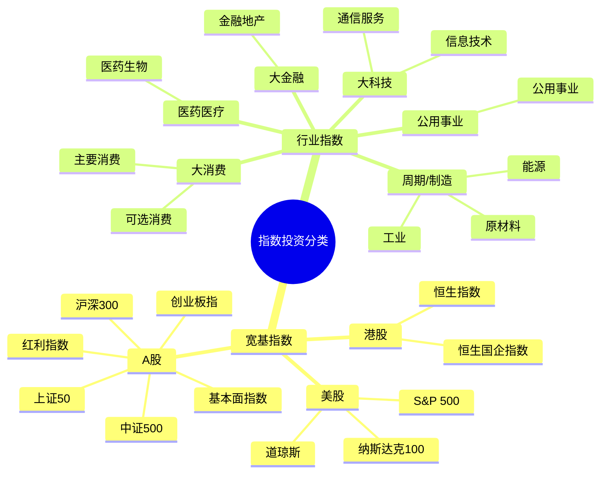

## 国内有三大指数

- 上海证券交易所（简称上交所）开发的上证系列指数

- 深圳证券交易所（简称深交所）开发的深证系列指数

- 中证指数有限公司开发的中证系列指数


## 指数大分类

- 宽基指数

- 行业指数


## 费用

- 管理费：基金公司收入的主要来源

- 托管费：交给基金的托管方的。基金的庞大资产，并不是直接存放在基金公司，一般会在第三方托管方，例如某家大型银行。**托管费就是支付给托管银行的费用**。


## 约定俗成的概念

- **蓝筹股**：代表规模较大、有较大影响力的公司


## 书中提到的指数





## 指数基金的挑选和定投

- 盈利收益率法
- 博格公式


### 盈利收益率法

### 选指数基金

大于 10% 盈率收益率的。

### 定投指数基金

- 当盈利收益率大于10%时，分批投资
- 盈利收益率小于10%，但大于 x 时，坚定持有已经买入的基金份额
- 当盈利收益率小于 x 时，分批卖出基金
注：x 是债券基金的平均收益。

### 局限性

盈利收益率法也是有它的局限性的。盈利收益率的使用条件比较苛刻，**只适合于流通性比较好、盈利比较稳定的品种**。如果是盈利增长速度较快，或者盈利波动比较大的指数基金，则不适合使用盈利收益率法。

## 博格公式
### 博格公式计算预期的年复合收益率

书中提到约翰·博格（投资稳赚的作者）发现决定股市长期回报的最关键的三个因素。分别是：**初始投资时刻的股息率、投资期内的市盈率变化、投资期内的盈利增长率**。

当前书作者认为利用这三个因素可计算得指数基金的预期年复合收益率。初始投资时刻的股息率不用计算直接可获得。后两者，从基金历史数据中获取10年前的数据和当前的数据，以计算预期的变化率：

```math
\text{年化变化率} = \left( \frac{\text{期末值}}{\text{期初值}} \right)^{\frac{1}{n}} - 1
```

### 基于博格的发现去选基金

选低估的基金才有更大几率获取正向或大的收益。

- 因素1 - 股息率：作者认为越是低估，也就是当其价格越低于其内在价值时，股息率一般越高；
- 因素2 - 市盈率：作者认为市盈率是以周期性变化的。统计指数历史市盈率的波动范围，对比当前市盈率，若处于相对低位即是可取的；
- 因素3 - 盈利：作者认为**只要国家经济长期发展，盈利就会长期上涨**

*总结之下：在股息率高的时候买入，在市盈率处于历史较低位置时买入。*


## 定投方法

有别于常见的定期定额的方式，作者建议的是定期不定额，每次定投的金额是变动的，具体金额根据下面两个方法决定：

- 盈利收益率法
- 博格公式法

*下面几个公式中都涉及到 n 这个参数。n 的取值随个人喜好，并非具体某个已有的数据。*

### 盈利收益率法

```math
\text{首次低估时的定投资金} \times \left( \frac{\text{当月的盈利收益率}}{\text{首次的盈利收益率}} \right)^{n}
```

### 博格公式法

```math
\text{首次低估时的定投资金} \times \left( \frac{\text{首次的市盈率}}{\text{当月的市盈率}} \right)^{n}
```

### 博格公式的变种

```math
\text{首次低估时的定投资金} \times \left( \frac{\text{首次的市净率}}{\text{当月的市净率}} \right)^{n}
```

## 货币基金

比如余额宝。风险低、流动性高。流动性高即存取几乎没有限制（锁定期）。债券则是有存储期限。

不同货币基金之间差距并不大，同质化比较严重，所以我们只需要寻找用起来方便的就可以了。

货币基金作为过渡性存储。一般一家基金公司出品的货币基金可以跟同公司出品的股票基金和债券基金相互转换，转换功能比先赎回再申购速度要快，而且不会多收申购费用，只收取申购费用的差价。

根据《货币市场基金管理暂行规定》，我国货币基金投资的主要对象包括：

- 现金。
- 1年以内（含1年）的银行定期存款、大额存单。
- 剩余期限在397天以内（含397天）的债券。
- 期限在1年以内（含1年）的债券回购。
- 期限在1年以内（含1年）的中央银行票据。
- 中国证监会、中国人民银行认可的其他具有良好流动性的货币市场工具。

## 债券基金

导致债券基金风险波动的最主要原因是利率。

部分债券基金有锁定期。

债券基金也是有 ETF，流动性最高。
