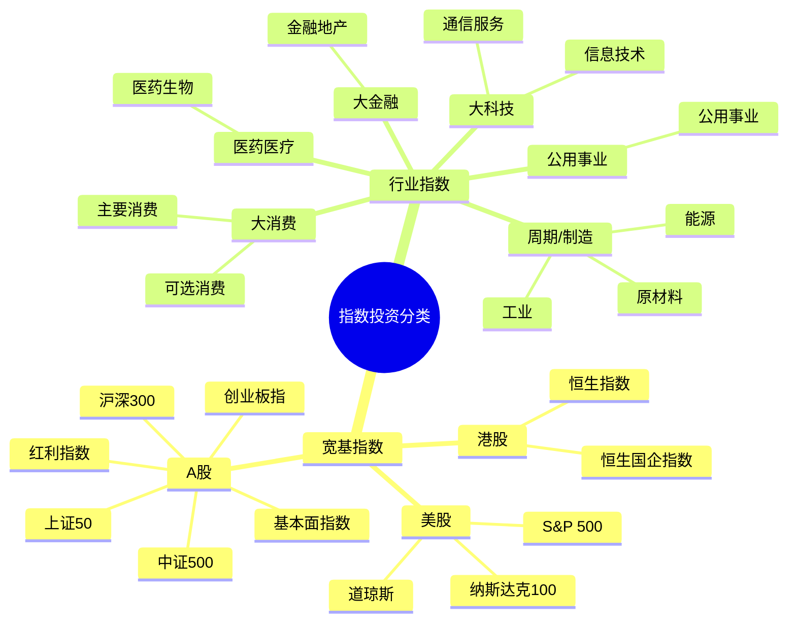

## 国内有三大指数

- 上海证券交易所（简称上交所）开发的上证系列指数

- 深圳证券交易所（简称深交所）开发的深证系列指数

- 中证指数有限公司开发的中证系列指数

## 指数打分类

- 宽基指数

- 行业指数

## 费用

- 管理费：基金公司收入的主要来源

- 托管费：交给基金的托管方的。基金的庞大资产，并不是直接存放在基金公司，一般会在第三方托管方，例如某家大型银行。**托管费就是支付给托管银行的费用**。

## 书中提到的指数

- 上证50指数

- 沪深300指数

## 约定俗成的概念

- **蓝筹股**：代表规模较大、有较大影响力的公司

## 涉及的指数基金

