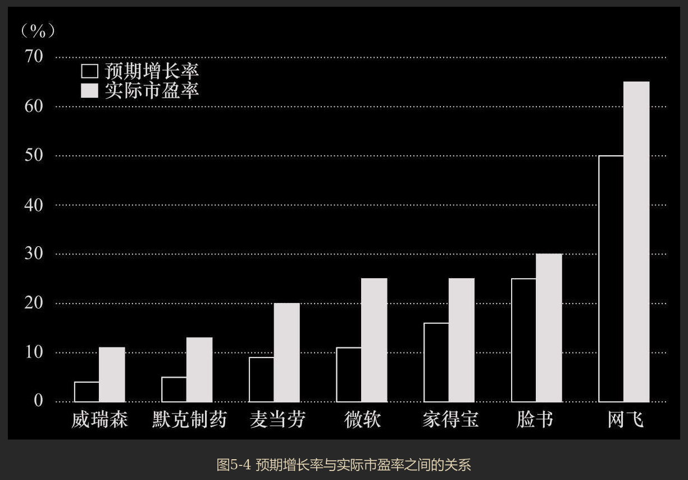
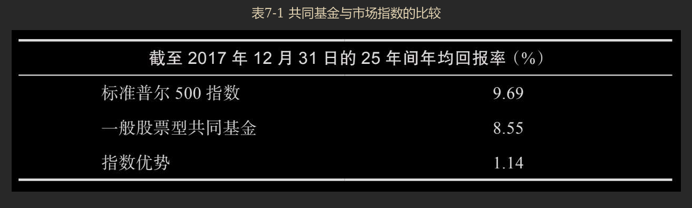
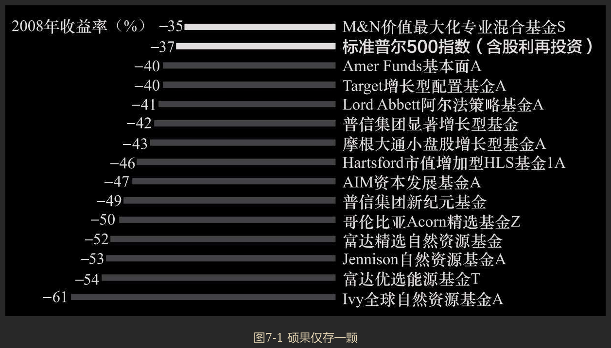
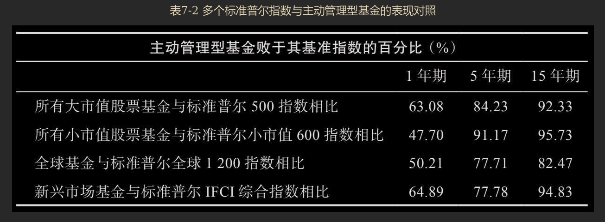

## 第一部分 股票及其价值

### 第1章 坚实基础与空中楼阁

`坚实基础理论`、`空中楼阁投资理论`、`协同效应（synergism）`、`市盈率`

> 投资与投机的区别，通常就在于对投资回报期的定义和投资回报的可预期性。投机者买入股票，希望在接下来的几天或几周内获得一笔短期收益；投资者买入股票，希望股票在未来会产生可靠的现金流回报，在几年或几十年里带来资本利得。

> 即使你将所有的资金托付给一家投资顾问公司或共同基金，你也得明白哪家顾问公司或共同基金最适合管理你的钱财。

> 坚实基础理论声称：每一个投资工具，无论它是一只股票还是一处房地产，都有一个被称为内在价值（intrinsic value）的坚实基础，通过细致分析这个投资工具的现状和前景，可以确定它的内在价值。当市场价格下跌而低于（上涨而高于）作为坚实基础的内在价值时，买入（卖出）的机会便出现了，因为按照该理论的说法，这种价格波动最终总会得以修正。

> 空中楼阁投资理论把注意力集中在心理价值上。1936年，著名经济学家、成功投资者约翰·梅纳德·凯恩斯（John Maynard Keynes）极为清晰地阐述了这一理论。在他看来，专业投资者不愿将精力用于估计内在价值，而宁愿分析投资大众将来会如何行动，分析他们在乐观时期如何将自己的希望建成空中楼阁。成功的投资者估计出什么样的投资形势最易被大众建成空中楼阁，然后在大众之前先行买入，从而努力占得市场先机。

### 第2章 大众疯狂

> 其实，要在股市中赚钱也并不难。真正难以避免的，是人们受到诱惑时，情不自禁地将自己的资金投向短期快速致富的投机狂欢之中。这一教训如此显而易见，却又常常为人所忽视。

### 第3章 20世纪60～90年代的投机泡沫

`概念股泡沫`

> 协同效应的特质就是让2加2等于5。因此，盈利能力同为200万美元的两家独立公司，合并后便可能产生500万美元的合并盈利。这种神奇的、必定带来盈利增长的新发明叫作集团企业。

基于“换股比例效应”，在算术层面上增加了盈利能力，实际无变化。相当于分子不变，缩小分母的结果。

> 随着集团企业的幻梦在身边纷纷破灭，投资基金的经理们发现了另一个充满魔力的字眼——“业绩”。很显然，如果一家共同基金投资组合中的股票比其竞争对手投资组合中的股票增值得更快，那么其基金份额就更容易出售。
>
> 的确，有些基金业绩优异，至少在短时间内表现很突出。弗雷德·卡尔（Fred Carr）领导的开创基金（Enterprise Fund）在竞争中广受关注，1967年斩获了117%的总回报率（包括股利和资本利得），1968年又实现了44%的回报率。同期标准普尔500指数的收益率则分别是25%和11%。优异的业绩为开创基金带来了大量新资金。大众发现把赌注押在赛马骑师身上，而不是在赛马身上，才是时尚的做法。

> 具有激动人心的概念；能讲出令人信服的好故事；市场现在就能领略到这些特点，而不是要等到很远的将来。因此，所谓的概念股便应运而生了。

> 当时，这种优质增长股只有50只左右。对于它们的名字，我们都耳熟能详，如IBM、施乐、雅芳、柯达、麦当劳、宝丽莱、华特迪士尼等，它们被统称为“漂亮50”（Nifty Fifty）。这些股票都是“大盘股”，市值很大，这意味着一家机构投资者可以重仓买入股票，同时又不会使股价产生大幅波动。再者，多数专业人士认识到，选定恰当时机买入股票虽然不是不可能，但也并非易事，所以这些股票在他们看来显得就很有意义。因此买入时的价格暂时过高，又有什么关系？事实已证明这些股票都是成长股，现在支付的过高价格迟早会证明是合理的。此外，这些股票好比传家宝，永远不会被卖掉，因而也被称为“一次性抉择股”。你只需做一次买入的抉择，从此，你的投资组合管理问题就一劳永逸地解决了。

### 第4章 21世纪初的超级泡沫

`有效市场假说`

> 欺诈的问题且不说，我们本应更有头脑、更明事理。我们本应知道，历史的事实已证明投资于正在给社会带来重大转变的技术，对投资者来说常常并不会产生什么回报。
>
> ---
>
> **投资的关键不在于某个行业会给社会带来多大影响，甚至也不在于该行业本身会有多大增长，而在于该行业是否能够创造利润并维持盈利。**历史告诉我们，所有过度繁荣的市场终将屈服于万有引力定律。据我个人的经验，在市场上一贯输钱的人，正是那些未能抵制被郁金香球茎热一类事件冲昏头脑的人。其实，要在股市赚钱并不难。我们在后面的内容中会看到，投资者只要购买并持有涵盖范围广泛的股票组合，就能获得相当丰厚的长期回报。真正难以避免的，是受到诱惑时情不自禁将自己的资金投向短期快速致富的投机盛宴之中。

> 在本章所讲的道德故事中有很多恶人：一些心心念念只想着承销费的券商，本应明白不能兜售那些被他们推向市场的垃圾股票；有些研究部门分析师成了券商投资银行部的拉拉队长，同时又热切推荐网络股，而患佣金饥渴症的经纪商会怂恿客户购买那些网络股；很多公司的高管利用“寻机性会计处理方法”虚增利润。然而，**泡沫得以膨胀的原因还是在于个人投资者既易受传染性贪婪的驱使，又易受快速致富骗局的不利影响。**

> 这种新体系导致银行和抵押贷款公司设立的信贷标准越来越宽松。如果贷款人放出抵押贷款所承担的风险，只是抵押贷款还没来得及卖给投资银行的几天里出现违约的风险，那么贷款人就没有必要对借款人的信用可靠性特别在意。于是，发放抵押贷款的标准也就急剧下降了。

放贷完就立刻转卖债务，相当于贷款机构转嫁了风险给买债务的买方，贷款机构几乎不用承担风险，既然如此就不需要在意借款人的信用，反正不用自己证但风险。这样就导致出现违约的概率大升。

> 《证券分析》一书的作者本杰明·格雷厄姆的智慧令我信服，他在书中写道：归根结底，股票市场不是投票机，而是称重机。估值标准并未改变，最终，任何股票的价值只能等于该公司的现金流现值。归根结底，真实价值终会胜出。

> 市场即便会犯错，也可以做到高度有效。有些错误非常离奇，简直让人匪夷所思，譬如，21世纪初的网络股，价格看上去不但透支了未来，而且还透支了“来世”。预测会无一例外地不正确。再者，投资风险从来就无法清晰地感知，所以未来盈利应以什么样的折现率进行折现，也永远是无法确定的。因此，市场价格必然总是错误。但是，在任何一个具体时点，谁也不能完全看清楚市场价格是过高还是过低。

核心逻辑链条是：**市场功能有效（套利快） ≠ 市场定价正确（泡沫多）→ 定价错因不可知（变量模糊）→ 导致即时判断不可行（无法精准择时）。**

这对于普通投资者的意义在于：

- **放弃“择时”与“精准抄底逃顶”**：既然没人能实时判断价格高低，试图预测泡沫破灭的时机是徒劳的。
- **拥抱“被动投资”**：既然单只股票或板块的价格常常“透支来世”，最优策略不是去挑战市场，而是通过指数化投资，**以低成本获取市场的平均回报**，坐享市场在长期中回归价值增长的那部分收益，而不是去赌那个永远看不清的“折现率”。

> 在华尔街，即便是最优秀、最聪明的人，也不能始终如一地区分正确的估值与错误的估值。没有任何证据证明，谁能通过持之以恒地下对赌注以战胜市场的集体智慧而获得超额收益。市场并非总是正确，甚或通常都不正确。但是，没有任何个人或机构能始终如一地比市场整体知道得更多。

> 比特币的价值具有极高波动性，正是这一点使得比特币无法满足第二和第三项关于货币的常见要求。一种资产，若每天增益或丧失很大一部分的初始价值，将既不能充当有用的计价单位，也不能充当可靠的价值贮藏手段。比特币的危险性，正是存在于此种波动之中。就加密货币而言，并不存在任何天然的价值之锚。对于力图避免承担比特币市场中高波动性的人们，需要进行进一步的交易，即将比特币换成价值更为稳定的资产或法定货币。至少就美元和世界上其他主要货币来说，还有中央银行在发挥作用，因为其管理目标包括维持本币价值的稳定。

> 货币的定义为何？这可能看起来是一个怪异的问题，但事实上，这一提问会引起一些与比特币相关的微妙问题。在经济学家看来，货币即是货币之所为。货币在经济中履行三种功能。首先，货币是一种交换媒介。我们之所以看重货币，是因为货币能让我们购买商品和服务。我们在钱包里存放现金，为的是能买来三明治当午餐，口渴时能买上一罐汽水。其次，货币是一种计价单位，是现在和将来呈现价格、记录负债所需要的价值尺度。《纽约时报》2018年售价一份3美元。如果我申请到一笔到期前仅付利息的10万美元抵押贷款，利息为5%，那么我每年将付息5000美元，贷款到期时我还欠10万美元。最后，货币是一种价值贮藏手段。一个卖家之所以接受货币而出售某一商品或服务，是因为卖家能使用货币在将来购买某物或某服务。虽然卖家可能持有另一种资产，比如股票，以贮藏价值，货币却是可以使用的最具流动性的资产。若在不远的将来可能需要做出购买行为，那么货币便是人们偏爱持有的资产。

> 比特币的情形令我想起那个沙丁鱼交易商的经典故事。此人有一个装满了一罐罐沙丁鱼的仓库。有一天，一个饥肠辘辘的工人打开其中一罐，希望美美地吃一顿午餐，却发现罐中满是沙子。面对交易商时，工人被告知这一罐罐沙丁鱼都是用来交易的，而非拿来吃的。看起来，这个故事也适用于比特币。

> **泡沫会通过富有吸引力的故事得到宣传，这些故事成了流行文化的一部分。**比特币的故事是一个理想范例，可以说明模仿传递行为如何在千禧一代中激发了别样的热情。报刊、电视和电影越来越多地提及比特币。有关加密货币的故事，一直以来并不局限于财经出版物，这类故事也俘获了主流媒体。

> 荷兰郁金香球茎泡沫爆裂之时，正是“投资者”和投机者最终决定让利润落袋为安之际。持有大量比特币者被称为“鲸鱼”，他们出售哪怕很少一部分所持比特币，便能让比特币价格一落千丈。据信，2018年，所有已存在的比特币，近半数握在不足50名持有者的手中。这些持有者也可能形成团伙，操纵市场。大量握有比特币的人相互讨论交易策略未必不合法度。由于比特币是一种货币，所以相对于在高度监管市场上交易的股票，比特币市场对于个体小投资者尤其不可信赖。

> 即便是真正的技术革命，亦不保证给投资者带来利益。

## 第二部分 专业人士如何参与城里这种最大的游戏

### 第5章 技术分析与基本面分析

`技术分析`、`基本面分析`、`预期增长率`、`预期股利支付率`、`有效市场假说`

> 技术分析是预测股票买卖适当时机所使用的方法，信奉股票定价空中楼阁理论的人会使用这种方法。基本面分析则用坚实基础理论的信条来挑选个股。

> 就本质而言，技术分析就是绘制并解读股票图表。因此，将这种分析法付诸实践的人便被称为图表分析师（chartist）或技术分析师（technician）。这群人虽为数不多，但异常执着。他们既研究股票价格的过去运行轨迹，也研究成交量，目的是预测股价的未来变动方向。

> 基本面分析师则持相反的观点，认为股票市场90%可以从逻辑的角度进行解释，只有10%可以从心理层面加以分析。他们对股价过去走势的具体图形不甚关心，总是力图确定股票的适当价值。这里所说的价值与一家公司的资产、盈利和股利的预期增长率、市场利率水平以及风险有关。通过研究这些因素，基本面分析师估测出某只股票的内在价值或者说坚实基础价值。如果这一价值高于股票的市场价格，那么就建议投资者买入这只股票。基本面分析师认为市场终会准确反映股票的真正价值。

> 如果有人知道明天股价会上涨到40美元，那么今天股价就会涨到40美元。

> 从某种意义上说，这个故事说明了技术分析师与基本面分析师之间的区别。技术分析师只对过去的股价感兴趣，而基本面分析师关注的主要是某只股票究竟价值几何。比较而言，基本面分析师力图不受群体的乐观情绪和悲观情绪的不良影响，并且认为某只股票的当前市价与其价值不能等而视之，应严格区分开来。

> 我们便有了基本面分析师评估股票的第一条规则。
>
> 规则1：一只股票的股利增长率和盈利增长率越高，理性投资者应愿意为其支付越高的价格。
>
> 规则1推论：一只股票的超常增长率预期持续时间越长，理性投资者应愿意为其支付越高的价格。

> 除了说明市场如何对增长率不同的股票进行估值之外，图5-4也可用作实际投资中的操作指南。假设你正考虑买入一只预期增长率为5%的股票，并假设你知道如默克制药之类增长率为5%的股票平均而言市盈率为13倍。如果你正考虑买入的股票市盈率是20倍，你可能会打消买入的念头，转而买入根据目前市场标准定价更加合理的股票。
>
> 

**不要孤立地看市盈率高低，而要将市盈率与增长率挂钩。** 如果增长率平庸，市盈率却鹤立鸡群，那它就是危险的“估值泡沫”，应该果断规避。

---

**书中的操作指南：如何利用这张图“避坑”**

书中的例子是一个典型的 **“锚定与偏离”** 判断法：

- **建立“锚点”**：假设你想买入的股票A，预期增长率是5%。通过图5-4找到同级别公司（如默克制药），发现市场公认的“公允价格”是**13倍市盈率**。
- **发现“偏离”**：你发现股票A的市盈率竟然是**20倍**。这意味着，在增长率同为5%的情况下，股票A比行业标准贵了约54%（20/13-1）。
- **做出决策（均值回归预期）**：马尔基尔认为，市场虽然会犯错，但长期来看会纠错。既然增长率只有5%，无法支撑20倍的高市盈率，那么未来股价极大概率会**下跌**或**长期停滞**，以等待盈利增长来消化估值。因此，理性的做法是**“打消买入念头”**，转而寻找图5-4趋势线附近、定价更合理的股票。

> 与股利增长率相比，将你收到的股利金额作为决定股价的一个重要因素，你一看就能明白。在其他条件相同的情况下，股利支付的金额越高，股票便越有价值。这里的问题在于“在其他条件相同的情况下”这一措辞。倘若增长前景不甚乐观，那么将很高比例的盈利作为股利支付给股东的股票，就可能是糟糕的投资对象。与此相反，很多处于强劲增长阶段的公司，常常不支付任何股利。有些公司往往会回购公司股票，而不增加股利。对于预期增长率相同的两只股票来说，持有股利支付率高的股票，较之股利支付率低的股票，会使你的财务状况更好。

> 规则2：在其他条件相同的情况下，一家公司发放的现金股利占其盈利的比例越高，理性投资者应愿意为其股票支付越高的价格。

> 风险在股票市场会发挥重要作用，这是股市如此富有魅力的原因所在。风险还会对股票的估值产生影响，甚至有人认为风险是考察股票时唯一需要考虑的因素。
>
> ---
>
> 规则3：在其他条件相同的情况下，一家公司的股票风险越低，理性投资者（以及厌恶风险的投资者）应愿意为其股票支付越高的价格。

> 股票的四条估值规则表明：公司的增长率越高，增长持续期越长，其股票的坚实基础价值（及市盈率）便越高；公司的股利支付越多，其股票的坚实基础价值（及市盈率）便越高；公司股票的风险越低，其股票的坚实基础价值（及市盈率）便越高；一般利率水平越低，公司股票的坚实基础价值（及市盈率）便越高。

> 需要记住的一点是，**无论你使用什么准则以预测未来，预测总是部分地建立在无法确定的前提之上。**塞缪尔·高德温（Samuel Goldwyn）过去常说：“预测是很难做的，尤其是关于未来的预测。”

> 如果使用不确定的参数，那你显然不可能得到精确的数值。然而，为了获得渴望得到的结果，投资者和分析师却始终在这样做。
>
> 我们以一家公司为例。假设你听到关于这家公司的很多利好信息，对公司的前景展开一番研究之后，你得出结论认为它能够长期保持高增长。“长期”是多长呢？10年怎么样？嗯，就10年。

> 这种游戏之所以能玩下去，是因为人们预测的超常增长期限越长，未来的股利流便会越大。由此可以看出，一只股票的现值完全可以随计算者的意愿而改变，以计算者的意志为转移。倘若11年也不能达到期望的效果，那么12年或13年很可能就够了。任何特定的“价值”，总可以通过增长率和增长期限的某个组合计算得到。*从这个意义上来说，要算出一只股票的内在价值，根本就不可能办到。我相信，即使从原则上来看，也根本无法确定股票的价值。*万能的上帝也不知道，对于一只股票，市盈率该达到多少倍才是适当的。

> 这一问题并没有一成不变的答案。在某些时期，如20世纪60年代初和70年代，人们认为增长尤其吸引人，市场愿为展示出高增长率的股票付出极高的价钱。在另外一些时候，如20世纪80年代后期和90年代早期，高增长型股票的市盈率较之一般股票的市盈率，却只是稍高一点。到2000年年初的时候，构成纳斯达克100指数（NASDAQ100Index）的增长型股票，其市盈率又达到了三位数。增长有时会像郁金香球茎那样风靡一时，投资增长型股票的投资者曾痛苦地认识到了这一点。
>
> 从实际操作的角度看，市场估值有时会发生迅速变化的事实表明，将任何一年的估值关系当作市场常态的指标来使用都是极其危险的。不过，通过比较增长型股票当前和历史上的估值情况，投资者应至少可以杜绝类似郁金香球茎热所带来的沉重打击。

> 尽管基本面分析看起来非常合理，有着科学的外衣，但这种分析方法有三个潜在缺陷：第一，分析师获得的信息和所做的分析可能不正确。第二，分析师对“内在价值”的估计值可能不正确。第三，股票价格可能不会向内在价值的估计值收敛。

> 第二个问题在于，即便信息正确，即便信息对未来增长的意义也得到了恰当的评估，分析师也可能做出错误的内在价值估计。要把具体的增长估计转化成一个确定的内在价值估计值，实际上是不可能做到的。的确，勉为其难地试图计量内在价值，也许是缘木求鱼，吃力不讨好。分析师能获得的所有信息，可能已在市场上准确反映出来了。股票的市场价格与内在价值之间存在的任何差异，可能只是由内在价值的估计值不正确造成的。

> 股票估值发生这样的变化并没有什么了不得（注：前面提到的一只股品，增长率 25%，市盈率 30倍，但几个月后，市盈率跌倒 20 倍），这是市场情绪惯常应有的波动，我们以往就曾经历过。不仅股票整体的平均市盈率可能会迅速变动，赋予“增长性”的溢价也可能会迅速变化。因此，很清楚，我们不应想当然地以为基本面分析必然会成功。

> 很多分析师综合使用分析方法，以判断个股是否有吸引力，是否值得买入。一个最合理、明智的综合使用两种分析方法的做法，可以简单地归纳为以下三条规则。有毅力、有耐心的读者会看出，这些规则是建立在前面阐述的股票定价原则之上的。
>
> 规则1：只买入盈利增长预期能连续五年以上超过平均水平的公司。
>
> 上市公司超乎寻常的长期盈利增长率，是促成多数股票投资获得成功的唯一最重要的因素。谷歌、网飞，以及其他所有历史上表现真正杰出的股票均属增长型股票之列。

> 规则2：千万不能为一只股票付出超过其坚实基础价值的价格。
>
> 尽管我已论证过（希望我的论证有说服力），你永远无法判断出一只股票的内在价值的精确值，但很多分析师觉得你可以大致地判断出一只股票何时看起来已达到了合理定价。**一般来说，把市场整体的市盈率作为一个衡量标准会有助于你做出判断。增长型股票，其市盈率若与这一标准持平或并未高出很多，那么常常是很值得持有的。**

> 有鉴于此，我们可以提出一个投资策略，就是买入尚未被市场认同的、市盈率并未高出市场平均水平的增长型股票。即便股票的增长性没有实现，盈利反而还下降了，如果一开始市盈率较低，那么你受到的打击很可能只是单一的；如果公司后来的盈利情况果真如你所料，那么好处却可能是双重的。这个策略是一条使你的赢面较大的投资佳径。

> 彼得·林奇（Peter Lynch）曾是麦哲伦基金非常成功的经理，现在已经退休。他在该基金运营初期的数年中运用了上述投资策略，使这种投资方法的有利之处得到充分展示。*对于每只可能要买入的股票，林奇会计算其市盈率与增长率之比，他只将这一比值相对较小的股票纳入自己管理的投资组合。*这并非购买低市盈率股票的投资策略，因为在林奇看来，一只增长率为50%、市盈率为25倍的股票（市盈率与增长率之比为1:2），比一只增长率为20%、市盈率为20倍的股票（市盈率与增长率之比为1:1）要好得多。谁像林奇一度做到的那样，能够正确地预测增长率，谁就会赢得优异的回报。

> 我们可以把以上讨论做个总结，将前两个规则重申如下：
>
> 寻觅低市盈率的增长型股票。如果增长性变成现实，常常会带来双重好处——盈利和市盈率均会上升，从而使投资者获得不菲的投资收益。同时，要小心那些市盈率很高的股票，因其未来增长性已被折现。如果增长性未变成现实，这会带来双重的重大损失——盈利和市盈率均会下降。

> 规则3：寻找投资者可在其预期增长故事之上建立空中楼阁的股票。我已强调过心理因素在股票定价中的重要性。个人投资者和机构投资者并不是计算机，能计算出合理的市盈率，然后打印出或买或卖的投资决策。投资者都是感情动物，在做股市决策时，会受到贪婪、赌性、希冀和恐惧的驱使。这正是成功的投资需兼备敏锐的智力和心理的原因。
>
> ---
>
> 要遵循规则3，你不必非得是个技术分析师。可能你只需凭借直觉或投机感便可以判断，自己手里股票的“故事”是否可能引起大众的喜爱，尤其是能否引起机构投资者的注意。

### 第6章 技术分析与随机漫步理论

`热手效应`

> 这种规律性的缺乏正是问题的关键所在。股价走势图中的“周期性变动”，与一般参赌的人碰到连续好运或连续不顺一样，都不是真正的周期。股价当前似乎处于上升趋势中这一“事实”，即便看起来与以前某时段股价上行的情形相似，也并没有提供任何有用的信息可据以确定当前上升趋势的可靠性或持续性。

> 我的学生通过完全随机的过程绘制了股价走势图。只要使用的硬币质地均匀，每抛掷一次得到正面朝上的机会就是50%，也就意味着股价上涨，同时得到反面朝上的机会也是50%，即股价下跌。就算他们连续抛出10次正面朝上，接下来抛出正面朝上的机会也还是50%。数学家将一个随机过程（像我们模拟股价走势图这样的过程）产生的一连串数字称为一次“随机漫步”。在股价走势图中，完全无法根据以前所发生的情况来预测股价的下一步变动。

> 随机漫步假说的“弱式有效形式”可准确地表述如下：
>
> 在管理投资组合时，投资者不可能从股价变动的历史中找到一贯战胜“买入持有”策略的任何有用信息。

> 在检验股市的“实验”中，与技术策略相比较的“对照剂”就是买入持有这一策略。技术策略确实经常为其使用者赚到钱，但买入持有策略也一样。的确，简简单单地将一个股市大型指数的所有成分股纳入投资组合的买入持有策略，在过去90年间为投资者提供了大约10%的年均投资回报率。只有当技术策略与市场相比能够提供更好的投资回报率时，技术策略才可以被视为有效。然而，时至今日，没有任何一种技术策略能够始终如一地通过这一检验。

> 人类生而喜爱秩序，很难接受随机性这一概念。无论概率法则告诉我们什么，我们还是会在随机事件中寻找模式，也不管随机事件在哪儿出现。不仅在股票市场，甚至在解释体育运动现象时，人们都会寻找模式。

> 随机漫步理论弱式有效形式的内涵只是：无法依据过去的股价来预测未来的股价。

> 即使技术分析师遵循我的建议，在多个不同时段检验自己的策略，并发现该策略能可靠地预测股价，我仍然相信技术分析最终必定没有价值。为了说明这一点，假定技术分析师已找到一个可靠的“年底回升效应”，也就是说，每年圣诞节与元旦之间股价会上涨。问题是，一旦这样一条规律为所有市场参与者所知，人们所采取的行动必然会阻止这一效应在将来发生。

> 如果人们知道一只股票明天将上涨，你可以断定这只股票今天就会上涨。股市中的任何规律若能被发现，且能据以产生利润，都必将自我毁灭。

> 各种技术理论只是让那些炮制和营销技术服务的人，以及雇用技术分析师的经纪券商更富有。这些经纪券商希望，分析师的分析有助于鼓动投资者更频繁地进行买入卖出的交易，从而为其带来佣金收入业务。

> 拉斯洛·比里尼（Laszlo Birinyi）在其著作《交易大师》（*Master Trader*）中研究了一个更长的时段，他计算之后得出一个结论：倘若一位投资者坚守买入持有策略，于1900年将1美元投入道指，那么到2013年年初，这1美元将升值为290美元。然而，倘若该投资者错过每年中最好的5个交易日，那么到2013年，1美元投资的价值将不足1美分。这里应记住的是，择时交易的人必然要冒错失为数不多的大幅飙升行情的风险，而这对投资业绩有着重大影响。

### 第7章 基本面分析究竟有多出色和有效市场理论

> 我希望你记住的，不是当前有哪些例外的公司，而是一个普遍情况：华尔街有很多人拒绝接受一个事实，即不可能从过去的记录中得出可靠的模式，以帮助分析师预测公司的未来增长。即使在20世纪90年代经济繁荣发展期间，也只有1/8的大公司每年成功实现了持续增长。而在进入新千年的头几年里，甚至没有一家大公司继续享有增长。分析师不可能预测到连续的长期增长，因为这本来就不存在。

> 然而，优秀的证券分析师会说，对于预测盈利，还有比只是考察过去的业绩记录多得多的衡量因素。有些证券分析师甚至承认，过去的业绩记录不是一个完美的衡量因素，但技能娴熟的投资组合分析师能做得好得多。很遗憾，证券分析师（基于行业研究、工厂参观等）认真估测的数据，并不比通过简单外推以往盈利趋势得到的估计准确多少，而我们已看到以往盈利趋势根本无助于预测未来。其实，与实际盈利增长率数据比较起来，证券分析师所做的估测数据，还不如几种幼稚的预测模型来得准确。这些发现已得到多个学术界研究的证实。如果财务预测看上去像科学，那么占星术看起来就令人肃然起敬了。

> 已有令人信服的证据表明，分析师做的推荐受到了券商盈利丰厚的投资银行业务的污染。数项研究对分析师选股的准确性进行了评估。加利福尼亚大学的布拉德·巴伯（Brad Barber）研究了华尔街分析师“强烈推荐买入”的股票在股市中的表现，他发现这些股票给投资者带来的损失完全称得上是“灾难性”的。的确，分析师强烈推荐买入的股票没有跑赢大盘，每月回报率比大盘少3%，而他们建议卖出的股票，其回报率却每月比大盘高出3.8%。更糟糕的是，达特茅斯大学和康奈尔大学研究人员发现，不从事投资银行业务的华尔街公司所推荐的股票，其表现要好于从事盈利丰厚的投资银行业务的券商所推荐的股票。投资者网站（Investors.com）做的一项研究发现，投资者若采纳华尔街券商分析师的建议，买入这些券商主承销或共同主承销的IPO股票，会损失50%以上的资金。券商向分析师支付报酬，基本上都是为了让他们吹捧其所承销的客户公司的股票。分析师自然会伸长舌头去舔给他们喂食的手。

> 表7-1显示了一般股票型共同基金在截至2017年12月31日的25年间年均投资回报率。为了进行比较，我们用标准普尔500指数来代表市场。*研究还发现，在不同时段里，养老基金以及其他投资者的业绩也大致相同。因此，简单地买入持有大型市场指数成分股，是专业投资组合经理也难以战胜的一个投资策略。*
>
> 

> 每年你都可以看到共同基金业绩排名，这些排名总会显示很多基金战胜平均指数[[1\]](part0051.xhtml#ch1_back)（beat the averages），有些基金甚至显著地超越了指数。但问题是，业绩并没有什么连续性。正如公司的以往盈利增长不能预测未来盈利，基金的过去表现也不能预测其未来投资成果。基金经理人也会受随机事件的影响：他们可能会发福，可能会变懒，也可能分道扬镳。一段时间里行之有效的投资策略，在接下来的时段很容易就变得令人失望。人们忍不住会做出结论，认为决定基金业绩排名的一个重要因素是我们的老朋友——幸运女神。

> 2009年，《华尔街日报》做了一个有趣的报道，说明杰出的投资表现可能会消逝得多么迅速。这篇文章指出，截至2007年年底，有14只基金连续9年战胜了标准普尔指数。但如图7-1所示，其中仅有一只基金在2008年延续了同样表现。指望哪只基金或哪个基金经理能持之以恒地战胜市场，简直毫无可能，哪怕过去的业绩记录显示其拥有非凡的投资技能。
>
> 

> 随着时间的推移，有利于指数投资的证据变得越来越有力。标准普尔公司每年发布报告，将主动管理型基金的业绩与多种标准普尔指数的收益率进行比较。2018年报告如表7-2所示。当我们观察5年期的表现时，会发现超过3/4的主动管理型基金输给了其基准指数。每年的报告都大同小异，每次我给本书做修订时，结果都是相似的。指数的表现并不平庸，其收益率超过了典型的主动管理型基金。无论股票市值大小，也无论国内或国际股票，这一结果都不变。而且，如果我们考察15年期的表现，亦会得出同样结果。此外，不但股票市场如此，债券市场也是这样。**指数投资可谓聪明投资。**
>
> 

---

**注：前面是 12 版的，而后面是 13 版的内容。**

---

> 如果聪明的投资者总是“货比三家”，寻找很划算的股票价格，卖出他们认为将会被证明高估的股票，买入他们认为目前被低估的股票，那么，他们这样行动的结果将必然是当前的股票价格已将股票的前景在自身进行了折现。因此，对那些消极被动的投资者来说，他们自己若不主动寻找被低估或被高估的股票，呈现在他们面前的股价情况将是随便买入一只股票，较买入另外一只股票，基本上无所谓好坏。消极被动的投资者只需采取随机选股的策略，恐怕就能取得与使用任何其他选股方法一样的效果。

> 有效市场假说的狭义（弱式）有效形式认为，技术分析，即考察股票的过去价格，不能给投资者带来什么帮助。股价从一个时期到另一个时期的不断变动与随机漫步非常相似。有效市场假说的广义（半强式和强式）有效形式声称，基本面分析也无济于事。关于公司盈利和股利预期增长的所有已知信息，以及基本面分析师可能去研究的所有可能影响公司发展的有利和不利因素，都已经在公司的股价中得到了反映。所以，购买一只持有大型指数所有成分股的基金，可望获得与专业证券分析师管理的投资组合一样好的投资业绩。
>
> 有效市场假说，并不像有些批评家公开声称的那样，认为股价总是正确的。事实上，股价始终是错误的。有效市场假说表明，没有任何人确切知道股价是过高还是过低。有效市场假说也不认为，股价变动漫无目的、反复无常，且股价对基本面信息发生的变化不做反应。恰恰相反，股价以随机漫步的方式进行变动，其原因正是出于相反的观点。市场如此有效——价格在信息出现时变动得如此迅速，以致没有任何个体投资者能以足够快的速度进行买卖而从中获利。而且，实际信息的形成是随机的，也就是说，是不可预知的。通过研究过去的股价信息，或研究基本面信息，都无法预测实际信息。

## 第三部分  新投资技术

`现代投资组合理论`, `同向变动`

###  第8章 新款漫步鞋：现代投资组合理论
> “嗯，我觉得有点不对头。”塞缪尔·巴特勒（Samuel Butler）很久前这样写道。市场上有人在赚钱，有些股票的确比其他股票表现得好。有些人能够战胜市场，而且确实战胜了市场。这并非全靠运气。对于这一点，很多学者表示同意，但他们认为，打败市场的办法不是运用胜人一筹的洞察未来的能力，而是承担更大的风险。只有风险能决定收益高于或低于市场平均水平的幅度。

> 对投资者而言，风险与未能实现预期证券收益的可能性相关，一旦学者接受了这个观点，对风险的测量自然而然就成了对未来收益可能的离散程度的测量。

> 对于相当对称的收益率分布情况，有一个非常有用的经验法则：2/3的月收益率往往落在平均收益率±1个标准差范围内，95%的月收益率落在±2个标准差范围内。很显然，标准差越大（收益率分布得越广），至少在某些时期，你在市场上亏损的可能性也就越大（投资风险越大）。

> 股票收益率的变动范围很大，有的年份获利高达50%以上（1933年），有的年份则几乎产生同样比例的损失（1931年）。显而易见，投资者之所以能从股票中获得超额收益（注：前文提到的，是相比长期债券和短期国债），是因为付出了代价，承担了比投资其他投资工具大得多的风险。

> 对于任何想降低风险的人，多样化都是应采用的一个明智策略。

> 研究表明，对于具有全球思维的投资者来说，黄金组合数大约也是50只。不过，这些投资者为自己的资金找到了更多保护，图8—1清楚地显示了这一点。这里的股票不仅仅选自美国股市，还选自国际股市。研究的结果不出所料，国际性多样化投资组合，往往比仅选取美国股票的投资组合风险更小。

> 结果表明，风险最小的投资组合由18%的外国股票和82%的美国股票构成。而且，向国内股票投资组合中加入18%的外国股票，也有提高投资组合收益率的趋势。从这个意义上说，国际性多样化提供了在全球证券市场可以获得的近乎免费午餐的好处。加入外国股票在使收益率提高的同时，还能让风险更小，任何投资者都不应对此视而不见。

> 此外，事实证明，安全的债券在降低风险方面也有其价值。即使在2008年股市剧烈下跌期间，如果投资于巴克莱资本大型债券指数，获得一个广泛多样化的债券投资组合也会获得5.2%的投资收益，让资金在这场金融危机期间，也有一个藏身之地。作为一种有效的多样化投资类别，债券（以及本书第四部分将论及的与债券相似的证券）已证明了其价值所在。

注：债券（债务关系，如国债）与证券（如股票、期权、期货）是不同的产品。

###  第9章 不冒风险，焉得财富

`资本资产定价模型`, `系统风险(市场风险)`

> 资本资产定价模型背后的基本逻辑是承担多样化可以分散掉的风险，不会获得任何溢价收益。因此，为了从投资组合中获取更高的长期平均收益，你得相应提高组合中多样化不能分散掉的风险的水平。

> 系统风险，也被称为市场风险，记录单只股票（或投资组合）对市场整体波动的反应。有些股票和投资组合对市场变动非常敏感，而有些则更为稳定。这种因市场变动而具有的相对波动性或敏感性，可以根据过去的数据估算出来。算出的结果就用众所周知的希腊字母β来表示。
>
> ---
>
> 从根本上说，β就是对系统风险的数字描述。尽管其中涉及一些精巧的数学处理，但β测量法背后的基本思想，就是将一些精确的数字置于资金管理者多年来所具有的主观感觉之上。计算β值，实质上就是将单只股票（或投资组合）的价格变动与市场整体的变动做一个比较。
>
> ---
>
> 计算开始时，先将一个涵盖范围广泛的市场指数的β值设定为1。如果某只股票的β值为2，那么平均而言，这只股票的波动幅度就是市场的两倍。如果市场上涨10%，那么这只股票往往上涨20%。要是这只股票的β值为0.5，那么当市场上涨或下跌10%时，它往往上涨或下跌5%。专业人士常把β值高的股票称为激进型投资品，而给β值低的股票贴上保守型标签。

