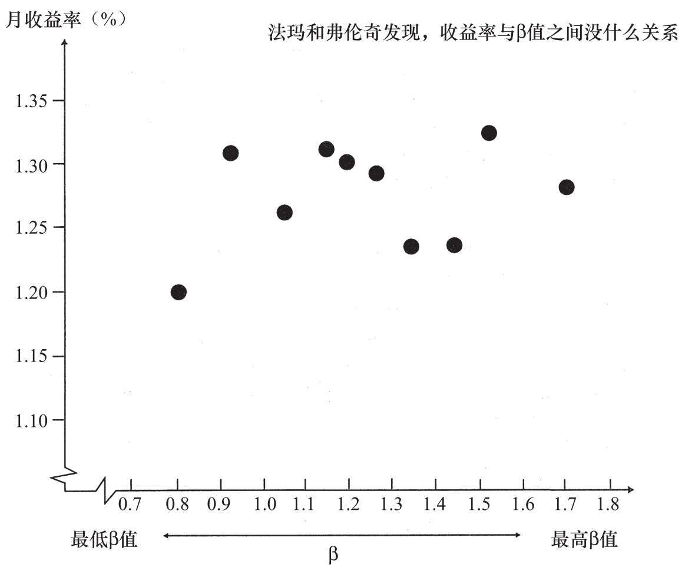
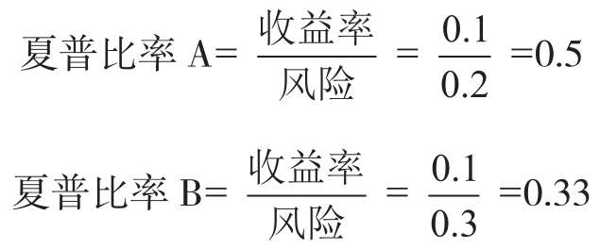
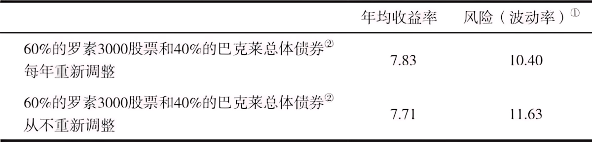

## 第一部分 股票及其价值

### 第1章 坚实基础与空中楼阁

`坚实基础理论`、`空中楼阁投资理论`、`协同效应（synergism）`、`市盈率`

- **市盈率（P/E， 股价对收益的倍数）**
  **公式**：`市盈率 = 股价 ÷ 每股收益`
  **含义**：市场愿意为该公司每赚取的 **1元钱利润** 支付多少价格。它代表了市场对公司**未来盈利增长**的预期。30倍意味着你要花30元买它1元的年利润，隐含的回本周期是30年。

> 投资与投机的区别，通常就在于对投资回报期的定义和投资回报的可预期性。投机者买入股票，希望在接下来的几天或几周内获得一笔短期收益；投资者买入股票，希望股票在未来会产生可靠的现金流回报，在几年或几十年里带来资本利得。

> 即使你将所有的资金托付给一家投资顾问公司或共同基金，你也得明白哪家顾问公司或共同基金最适合管理你的钱财。

> 坚实基础理论声称：每一个投资工具，无论它是一只股票还是一处房地产，都有一个被称为内在价值（intrinsic value）的坚实基础，通过细致分析这个投资工具的现状和前景，可以确定它的内在价值。当市场价格下跌而低于（上涨而高于）作为坚实基础的内在价值时，买入（卖出）的机会便出现了，因为按照该理论的说法，这种价格波动最终总会得以修正。

> 空中楼阁投资理论把注意力集中在心理价值上。1936年，著名经济学家、成功投资者约翰·梅纳德·凯恩斯（John Maynard Keynes）极为清晰地阐述了这一理论。在他看来，专业投资者不愿将精力用于估计内在价值，而宁愿分析投资大众将来会如何行动，分析他们在乐观时期如何将自己的希望建成空中楼阁。成功的投资者估计出什么样的投资形势最易被大众建成空中楼阁，然后在大众之前先行买入，从而努力占得市场先机。

### 第2章 大众疯狂

> 其实，要在股市中赚钱也并不难。真正难以避免的，是人们受到诱惑时，情不自禁地将自己的资金投向短期快速致富的投机狂欢之中。这一教训如此显而易见，却又常常为人所忽视。

### 第3章 20世纪60～90年代的投机泡沫

`概念股泡沫`

> 协同效应的特质就是让2加2等于5。因此，盈利能力同为200万美元的两家独立公司，合并后便可能产生500万美元的合并盈利。这种神奇的、必定带来盈利增长的新发明叫作集团企业。

基于“换股比例效应”，在算术层面上增加了盈利能力，实际无变化。相当于分子不变，缩小分母的结果。

> 随着集团企业的幻梦在身边纷纷破灭，投资基金的经理们发现了另一个充满魔力的字眼——“业绩”。很显然，如果一家共同基金投资组合中的股票比其竞争对手投资组合中的股票增值得更快，那么其基金份额就更容易出售。
>
> 的确，有些基金业绩优异，至少在短时间内表现很突出。弗雷德·卡尔（Fred Carr）领导的开创基金（Enterprise Fund）在竞争中广受关注，1967年斩获了117%的总回报率（包括股利和资本利得），1968年又实现了44%的回报率。同期标准普尔500指数的收益率则分别是25%和11%。优异的业绩为开创基金带来了大量新资金。大众发现把赌注押在赛马骑师身上，而不是在赛马身上，才是时尚的做法。

> 具有激动人心的概念；能讲出令人信服的好故事；市场现在就能领略到这些特点，而不是要等到很远的将来。因此，所谓的概念股便应运而生了。

> 当时，这种优质增长股只有50只左右。对于它们的名字，我们都耳熟能详，如IBM、施乐、雅芳、柯达、麦当劳、宝丽莱、华特迪士尼等，它们被统称为“漂亮50”（Nifty Fifty）。这些股票都是“大盘股”，市值很大，这意味着一家机构投资者可以重仓买入股票，同时又不会使股价产生大幅波动。再者，多数专业人士认识到，选定恰当时机买入股票虽然不是不可能，但也并非易事，所以这些股票在他们看来显得就很有意义。因此买入时的价格暂时过高，又有什么关系？事实已证明这些股票都是成长股，现在支付的过高价格迟早会证明是合理的。此外，这些股票好比传家宝，永远不会被卖掉，因而也被称为“一次性抉择股”。你只需做一次买入的抉择，从此，你的投资组合管理问题就一劳永逸地解决了。

### 第4章 21世纪初的超级泡沫

`有效市场假说`

> 欺诈的问题且不说，我们本应更有头脑、更明事理。我们本应知道，历史的事实已证明投资于正在给社会带来重大转变的技术，对投资者来说常常并不会产生什么回报。
>
> ---
>
> **投资的关键不在于某个行业会给社会带来多大影响，甚至也不在于该行业本身会有多大增长，而在于该行业是否能够创造利润并维持盈利。**历史告诉我们，所有过度繁荣的市场终将屈服于万有引力定律。据我个人的经验，在市场上一贯输钱的人，正是那些未能抵制被郁金香球茎热一类事件冲昏头脑的人。其实，要在股市赚钱并不难。我们在后面的内容中会看到，投资者只要购买并持有涵盖范围广泛的股票组合，就能获得相当丰厚的长期回报。真正难以避免的，是受到诱惑时情不自禁将自己的资金投向短期快速致富的投机盛宴之中。

> 在本章所讲的道德故事中有很多恶人：一些心心念念只想着承销费的券商，本应明白不能兜售那些被他们推向市场的垃圾股票；有些研究部门分析师成了券商投资银行部的拉拉队长，同时又热切推荐网络股，而患佣金饥渴症的经纪商会怂恿客户购买那些网络股；很多公司的高管利用“寻机性会计处理方法”虚增利润。然而，**泡沫得以膨胀的原因还是在于个人投资者既易受传染性贪婪的驱使，又易受快速致富骗局的不利影响。**

> 这种新体系导致银行和抵押贷款公司设立的信贷标准越来越宽松。如果贷款人放出抵押贷款所承担的风险，只是抵押贷款还没来得及卖给投资银行的几天里出现违约的风险，那么贷款人就没有必要对借款人的信用可靠性特别在意。于是，发放抵押贷款的标准也就急剧下降了。

放贷完就立刻转卖债务，相当于贷款机构转嫁了风险给买债务的买方，贷款机构几乎不用承担风险，既然如此就不需要在意借款人的信用，反正不用自己证但风险。这样就导致出现违约的概率大升。

> 《证券分析》一书的作者本杰明·格雷厄姆的智慧令我信服，他在书中写道：归根结底，股票市场不是投票机，而是称重机。估值标准并未改变，最终，任何股票的价值只能等于该公司的现金流现值。归根结底，真实价值终会胜出。

> 市场即便会犯错，也可以做到高度有效。有些错误非常离奇，简直让人匪夷所思，譬如，21世纪初的网络股，价格看上去不但透支了未来，而且还透支了“来世”。预测会无一例外地不正确。再者，投资风险从来就无法清晰地感知，所以未来盈利应以什么样的折现率进行折现，也永远是无法确定的。因此，市场价格必然总是错误。但是，在任何一个具体时点，谁也不能完全看清楚市场价格是过高还是过低。

核心逻辑链条是：**市场功能有效（套利快） ≠ 市场定价正确（泡沫多）→ 定价错因不可知（变量模糊）→ 导致即时判断不可行（无法精准择时）。**

这对于普通投资者的意义在于：

- **放弃“择时”与“精准抄底逃顶”**：既然没人能实时判断价格高低，试图预测泡沫破灭的时机是徒劳的。
- **拥抱“被动投资”**：既然单只股票或板块的价格常常“透支来世”，最优策略不是去挑战市场，而是通过指数化投资，**以低成本获取市场的平均回报**，坐享市场在长期中回归价值增长的那部分收益，而不是去赌那个永远看不清的“折现率”。

> 在华尔街，即便是最优秀、最聪明的人，也不能始终如一地区分正确的估值与错误的估值。没有任何证据证明，谁能通过持之以恒地下对赌注以战胜市场的集体智慧而获得超额收益。市场并非总是正确，甚或通常都不正确。但是，没有任何个人或机构能始终如一地比市场整体知道得更多。

> 比特币的价值具有极高波动性，正是这一点使得比特币无法满足第二和第三项关于货币的常见要求。一种资产，若每天增益或丧失很大一部分的初始价值，将既不能充当有用的计价单位，也不能充当可靠的价值贮藏手段。比特币的危险性，正是存在于此种波动之中。就加密货币而言，并不存在任何天然的价值之锚。对于力图避免承担比特币市场中高波动性的人们，需要进行进一步的交易，即将比特币换成价值更为稳定的资产或法定货币。至少就美元和世界上其他主要货币来说，还有中央银行在发挥作用，因为其管理目标包括维持本币价值的稳定。

> 货币的定义为何？这可能看起来是一个怪异的问题，但事实上，这一提问会引起一些与比特币相关的微妙问题。在经济学家看来，货币即是货币之所为。货币在经济中履行三种功能。首先，货币是一种交换媒介。我们之所以看重货币，是因为货币能让我们购买商品和服务。我们在钱包里存放现金，为的是能买来三明治当午餐，口渴时能买上一罐汽水。其次，货币是一种计价单位，是现在和将来呈现价格、记录负债所需要的价值尺度。《纽约时报》2018年售价一份3美元。如果我申请到一笔到期前仅付利息的10万美元抵押贷款，利息为5%，那么我每年将付息5000美元，贷款到期时我还欠10万美元。最后，货币是一种价值贮藏手段。一个卖家之所以接受货币而出售某一商品或服务，是因为卖家能使用货币在将来购买某物或某服务。虽然卖家可能持有另一种资产，比如股票，以贮藏价值，货币却是可以使用的最具流动性的资产。若在不远的将来可能需要做出购买行为，那么货币便是人们偏爱持有的资产。

> 比特币的情形令我想起那个沙丁鱼交易商的经典故事。此人有一个装满了一罐罐沙丁鱼的仓库。有一天，一个饥肠辘辘的工人打开其中一罐，希望美美地吃一顿午餐，却发现罐中满是沙子。面对交易商时，工人被告知这一罐罐沙丁鱼都是用来交易的，而非拿来吃的。看起来，这个故事也适用于比特币。

> **泡沫会通过富有吸引力的故事得到宣传，这些故事成了流行文化的一部分。**比特币的故事是一个理想范例，可以说明模仿传递行为如何在千禧一代中激发了别样的热情。报刊、电视和电影越来越多地提及比特币。有关加密货币的故事，一直以来并不局限于财经出版物，这类故事也俘获了主流媒体。

> 荷兰郁金香球茎泡沫爆裂之时，正是“投资者”和投机者最终决定让利润落袋为安之际。持有大量比特币者被称为“鲸鱼”，他们出售哪怕很少一部分所持比特币，便能让比特币价格一落千丈。据信，2018年，所有已存在的比特币，近半数握在不足50名持有者的手中。这些持有者也可能形成团伙，操纵市场。大量握有比特币的人相互讨论交易策略未必不合法度。由于比特币是一种货币，所以相对于在高度监管市场上交易的股票，比特币市场对于个体小投资者尤其不可信赖。

> 即便是真正的技术革命，亦不保证给投资者带来利益。

## 第二部分 专业人士如何参与城里这种最大的游戏

### 第5章 技术分析与基本面分析

`技术分析`、`基本面分析`、`预期增长率`、`预期股利支付率`、`有效市场假说`

> 技术分析是预测股票买卖适当时机所使用的方法，信奉股票定价空中楼阁理论的人会使用这种方法。基本面分析则用坚实基础理论的信条来挑选个股。

> 就本质而言，技术分析就是绘制并解读股票图表。因此，将这种分析法付诸实践的人便被称为图表分析师（chartist）或技术分析师（technician）。这群人虽为数不多，但异常执着。他们既研究股票价格的过去运行轨迹，也研究成交量，目的是预测股价的未来变动方向。

> 基本面分析师则持相反的观点，认为股票市场90%可以从逻辑的角度进行解释，只有10%可以从心理层面加以分析。他们对股价过去走势的具体图形不甚关心，总是力图确定股票的适当价值。这里所说的价值与一家公司的资产、盈利和股利的预期增长率、市场利率水平以及风险有关。通过研究这些因素，基本面分析师估测出某只股票的内在价值或者说坚实基础价值。如果这一价值高于股票的市场价格，那么就建议投资者买入这只股票。基本面分析师认为市场终会准确反映股票的真正价值。

> 如果有人知道明天股价会上涨到40美元，那么今天股价就会涨到40美元。

> 从某种意义上说，这个故事说明了技术分析师与基本面分析师之间的区别。技术分析师只对过去的股价感兴趣，而基本面分析师关注的主要是某只股票究竟价值几何。比较而言，基本面分析师力图不受群体的乐观情绪和悲观情绪的不良影响，并且认为某只股票的当前市价与其价值不能等而视之，应严格区分开来。

> 我们便有了基本面分析师评估股票的第一条规则。
>
> 规则1：一只股票的股利增长率和盈利增长率越高，理性投资者应愿意为其支付越高的价格。
>
> 规则1推论：一只股票的超常增长率预期持续时间越长，理性投资者应愿意为其支付越高的价格。

> 除了说明市场如何对增长率不同的股票进行估值之外，图5-4也可用作实际投资中的操作指南。假设你正考虑买入一只预期增长率为5%的股票，并假设你知道如默克制药之类增长率为5%的股票平均而言市盈率为13倍。如果你正考虑买入的股票市盈率是20倍，你可能会打消买入的念头，转而买入根据目前市场标准定价更加合理的股票。
>
> 

**不要孤立地看市盈率高低，而要将市盈率与增长率挂钩。** 如果增长率平庸，市盈率却鹤立鸡群，那它就是危险的“估值泡沫”，应该果断规避。

---

**书中的操作指南：如何利用这张图“避坑”**

书中的例子是一个典型的 **“锚定与偏离”** 判断法：

- **建立“锚点”**：假设你想买入的股票A，预期增长率是5%。通过图5-4找到同级别公司（如默克制药），发现市场公认的“公允价格”是**13倍市盈率**。
- **发现“偏离”**：你发现股票A的市盈率竟然是**20倍**。这意味着，在增长率同为5%的情况下，股票A比行业标准贵了约54%（20/13-1）。
- **做出决策（均值回归预期）**：马尔基尔认为，市场虽然会犯错，但长期来看会纠错。既然增长率只有5%，无法支撑20倍的高市盈率，那么未来股价极大概率会**下跌**或**长期停滞**，以等待盈利增长来消化估值。因此，理性的做法是**“打消买入念头”**，转而寻找图5-4趋势线附近、定价更合理的股票。

> 与股利增长率相比，将你收到的股利金额作为决定股价的一个重要因素，你一看就能明白。在其他条件相同的情况下，股利支付的金额越高，股票便越有价值。这里的问题在于“在其他条件相同的情况下”这一措辞。倘若增长前景不甚乐观，那么将很高比例的盈利作为股利支付给股东的股票，就可能是糟糕的投资对象。与此相反，很多处于强劲增长阶段的公司，常常不支付任何股利。有些公司往往会回购公司股票，而不增加股利。对于预期增长率相同的两只股票来说，持有股利支付率高的股票，较之股利支付率低的股票，会使你的财务状况更好。

> 规则2：在其他条件相同的情况下，一家公司发放的现金股利占其盈利的比例越高，理性投资者应愿意为其股票支付越高的价格。

> 风险在股票市场会发挥重要作用，这是股市如此富有魅力的原因所在。风险还会对股票的估值产生影响，甚至有人认为风险是考察股票时唯一需要考虑的因素。
>
> ---
>
> 规则3：在其他条件相同的情况下，一家公司的股票风险越低，理性投资者（以及厌恶风险的投资者）应愿意为其股票支付越高的价格。

> 股票的四条估值规则表明：公司的增长率越高，增长持续期越长，其股票的坚实基础价值（及市盈率）便越高；公司的股利支付越多，其股票的坚实基础价值（及市盈率）便越高；公司股票的风险越低，其股票的坚实基础价值（及市盈率）便越高；一般利率水平越低，公司股票的坚实基础价值（及市盈率）便越高。

> 需要记住的一点是，**无论你使用什么准则以预测未来，预测总是部分地建立在无法确定的前提之上。**塞缪尔·高德温（Samuel Goldwyn）过去常说：“预测是很难做的，尤其是关于未来的预测。”

> 如果使用不确定的参数，那你显然不可能得到精确的数值。然而，为了获得渴望得到的结果，投资者和分析师却始终在这样做。
>
> 我们以一家公司为例。假设你听到关于这家公司的很多利好信息，对公司的前景展开一番研究之后，你得出结论认为它能够长期保持高增长。“长期”是多长呢？10年怎么样？嗯，就10年。

> 这种游戏之所以能玩下去，是因为人们预测的超常增长期限越长，未来的股利流便会越大。由此可以看出，一只股票的现值完全可以随计算者的意愿而改变，以计算者的意志为转移。倘若11年也不能达到期望的效果，那么12年或13年很可能就够了。任何特定的“价值”，总可以通过增长率和增长期限的某个组合计算得到。*从这个意义上来说，要算出一只股票的内在价值，根本就不可能办到。我相信，即使从原则上来看，也根本无法确定股票的价值。*万能的上帝也不知道，对于一只股票，市盈率该达到多少倍才是适当的。

> 这一问题并没有一成不变的答案。在某些时期，如20世纪60年代初和70年代，人们认为增长尤其吸引人，市场愿为展示出高增长率的股票付出极高的价钱。在另外一些时候，如20世纪80年代后期和90年代早期，高增长型股票的市盈率较之一般股票的市盈率，却只是稍高一点。到2000年年初的时候，构成纳斯达克100指数（NASDAQ100Index）的增长型股票，其市盈率又达到了三位数。增长有时会像郁金香球茎那样风靡一时，投资增长型股票的投资者曾痛苦地认识到了这一点。
>
> 从实际操作的角度看，市场估值有时会发生迅速变化的事实表明，将任何一年的估值关系当作市场常态的指标来使用都是极其危险的。不过，通过比较增长型股票当前和历史上的估值情况，投资者应至少可以杜绝类似郁金香球茎热所带来的沉重打击。

> 尽管基本面分析看起来非常合理，有着科学的外衣，但这种分析方法有三个潜在缺陷：第一，分析师获得的信息和所做的分析可能不正确。第二，分析师对“内在价值”的估计值可能不正确。第三，股票价格可能不会向内在价值的估计值收敛。

> 第二个问题在于，即便信息正确，即便信息对未来增长的意义也得到了恰当的评估，分析师也可能做出错误的内在价值估计。要把具体的增长估计转化成一个确定的内在价值估计值，实际上是不可能做到的。的确，勉为其难地试图计量内在价值，也许是缘木求鱼，吃力不讨好。分析师能获得的所有信息，可能已在市场上准确反映出来了。股票的市场价格与内在价值之间存在的任何差异，可能只是由内在价值的估计值不正确造成的。

> 股票估值发生这样的变化并没有什么了不得（注：前面提到的一只股品，增长率 25%，市盈率 30倍，但几个月后，市盈率跌倒 20 倍），这是市场情绪惯常应有的波动，我们以往就曾经历过。不仅股票整体的平均市盈率可能会迅速变动，赋予“增长性”的溢价也可能会迅速变化。因此，很清楚，我们不应想当然地以为基本面分析必然会成功。

> 很多分析师综合使用分析方法，以判断个股是否有吸引力，是否值得买入。一个最合理、明智的综合使用两种分析方法的做法，可以简单地归纳为以下三条规则。有毅力、有耐心的读者会看出，这些规则是建立在前面阐述的股票定价原则之上的。
>
> 规则1：只买入盈利增长预期能连续五年以上超过平均水平的公司。
>
> 上市公司超乎寻常的长期盈利增长率，是促成多数股票投资获得成功的唯一最重要的因素。谷歌、网飞，以及其他所有历史上表现真正杰出的股票均属增长型股票之列。

> 规则2：千万不能为一只股票付出超过其坚实基础价值的价格。
>
> 尽管我已论证过（希望我的论证有说服力），你永远无法判断出一只股票的内在价值的精确值，但很多分析师觉得你可以大致地判断出一只股票何时看起来已达到了合理定价。**一般来说，把市场整体的市盈率作为一个衡量标准会有助于你做出判断。增长型股票，其市盈率若与这一标准持平或并未高出很多，那么常常是很值得持有的。**

> 有鉴于此，我们可以提出一个投资策略，就是买入尚未被市场认同的、市盈率并未高出市场平均水平的增长型股票。即便股票的增长性没有实现，盈利反而还下降了，如果一开始市盈率较低，那么你受到的打击很可能只是单一的；如果公司后来的盈利情况果真如你所料，那么好处却可能是双重的。这个策略是一条使你的赢面较大的投资佳径。

> 彼得·林奇（Peter Lynch）曾是麦哲伦基金非常成功的经理，现在已经退休。他在该基金运营初期的数年中运用了上述投资策略，使这种投资方法的有利之处得到充分展示。*对于每只可能要买入的股票，林奇会计算其市盈率与增长率之比，他只将这一比值相对较小的股票纳入自己管理的投资组合。*这并非购买低市盈率股票的投资策略，因为在林奇看来，一只增长率为50%、市盈率为25倍的股票（市盈率与增长率之比为1:2），比一只增长率为20%、市盈率为20倍的股票（市盈率与增长率之比为1:1）要好得多。谁像林奇一度做到的那样，能够正确地预测增长率，谁就会赢得优异的回报。

> 我们可以把以上讨论做个总结，将前两个规则重申如下：
>
> 寻觅低市盈率的增长型股票。如果增长性变成现实，常常会带来双重好处——盈利和市盈率均会上升，从而使投资者获得不菲的投资收益。同时，要小心那些市盈率很高的股票，因其未来增长性已被折现。如果增长性未变成现实，这会带来双重的重大损失——盈利和市盈率均会下降。

> 规则3：寻找投资者可在其预期增长故事之上建立空中楼阁的股票。我已强调过心理因素在股票定价中的重要性。个人投资者和机构投资者并不是计算机，能计算出合理的市盈率，然后打印出或买或卖的投资决策。投资者都是感情动物，在做股市决策时，会受到贪婪、赌性、希冀和恐惧的驱使。这正是成功的投资需兼备敏锐的智力和心理的原因。
>
> ---
>
> 要遵循规则3，你不必非得是个技术分析师。可能你只需凭借直觉或投机感便可以判断，自己手里股票的“故事”是否可能引起大众的喜爱，尤其是能否引起机构投资者的注意。

### 第6章 技术分析与随机漫步理论

`热手效应`

> 这种规律性的缺乏正是问题的关键所在。股价走势图中的“周期性变动”，与一般参赌的人碰到连续好运或连续不顺一样，都不是真正的周期。股价当前似乎处于上升趋势中这一“事实”，即便看起来与以前某时段股价上行的情形相似，也并没有提供任何有用的信息可据以确定当前上升趋势的可靠性或持续性。

> 我的学生通过完全随机的过程绘制了股价走势图。只要使用的硬币质地均匀，每抛掷一次得到正面朝上的机会就是50%，也就意味着股价上涨，同时得到反面朝上的机会也是50%，即股价下跌。就算他们连续抛出10次正面朝上，接下来抛出正面朝上的机会也还是50%。数学家将一个随机过程（像我们模拟股价走势图这样的过程）产生的一连串数字称为一次“随机漫步”。在股价走势图中，完全无法根据以前所发生的情况来预测股价的下一步变动。

> 随机漫步假说的“弱式有效形式”可准确地表述如下：
>
> 在管理投资组合时，投资者不可能从股价变动的历史中找到一贯战胜“买入持有”策略的任何有用信息。

> 在检验股市的“实验”中，与技术策略相比较的“对照剂”就是买入持有这一策略。技术策略确实经常为其使用者赚到钱，但买入持有策略也一样。的确，简简单单地将一个股市大型指数的所有成分股纳入投资组合的买入持有策略，在过去90年间为投资者提供了大约10%的年均投资回报率。只有当技术策略与市场相比能够提供更好的投资回报率时，技术策略才可以被视为有效。然而，时至今日，没有任何一种技术策略能够始终如一地通过这一检验。

> 人类生而喜爱秩序，很难接受随机性这一概念。无论概率法则告诉我们什么，我们还是会在随机事件中寻找模式，也不管随机事件在哪儿出现。不仅在股票市场，甚至在解释体育运动现象时，人们都会寻找模式。

> 随机漫步理论弱式有效形式的内涵只是：无法依据过去的股价来预测未来的股价。

> 即使技术分析师遵循我的建议，在多个不同时段检验自己的策略，并发现该策略能可靠地预测股价，我仍然相信技术分析最终必定没有价值。为了说明这一点，假定技术分析师已找到一个可靠的“年底回升效应”，也就是说，每年圣诞节与元旦之间股价会上涨。问题是，一旦这样一条规律为所有市场参与者所知，人们所采取的行动必然会阻止这一效应在将来发生。

> 如果人们知道一只股票明天将上涨，你可以断定这只股票今天就会上涨。股市中的任何规律若能被发现，且能据以产生利润，都必将自我毁灭。

> 各种技术理论只是让那些炮制和营销技术服务的人，以及雇用技术分析师的经纪券商更富有。这些经纪券商希望，分析师的分析有助于鼓动投资者更频繁地进行买入卖出的交易，从而为其带来佣金收入业务。

> 拉斯洛·比里尼（Laszlo Birinyi）在其著作《交易大师》（*Master Trader*）中研究了一个更长的时段，他计算之后得出一个结论：倘若一位投资者坚守买入持有策略，于1900年将1美元投入道指，那么到2013年年初，这1美元将升值为290美元。然而，倘若该投资者错过每年中最好的5个交易日，那么到2013年，1美元投资的价值将不足1美分。这里应记住的是，择时交易的人必然要冒错失为数不多的大幅飙升行情的风险，而这对投资业绩有着重大影响。

### 第7章 基本面分析究竟有多出色和有效市场理论

> 我希望你记住的，不是当前有哪些例外的公司，而是一个普遍情况：华尔街有很多人拒绝接受一个事实，即不可能从过去的记录中得出可靠的模式，以帮助分析师预测公司的未来增长。即使在20世纪90年代经济繁荣发展期间，也只有1/8的大公司每年成功实现了持续增长。而在进入新千年的头几年里，甚至没有一家大公司继续享有增长。分析师不可能预测到连续的长期增长，因为这本来就不存在。

> 然而，优秀的证券分析师会说，对于预测盈利，还有比只是考察过去的业绩记录多得多的衡量因素。有些证券分析师甚至承认，过去的业绩记录不是一个完美的衡量因素，但技能娴熟的投资组合分析师能做得好得多。很遗憾，证券分析师（基于行业研究、工厂参观等）认真估测的数据，并不比通过简单外推以往盈利趋势得到的估计准确多少，而我们已看到以往盈利趋势根本无助于预测未来。其实，与实际盈利增长率数据比较起来，证券分析师所做的估测数据，还不如几种幼稚的预测模型来得准确。这些发现已得到多个学术界研究的证实。如果财务预测看上去像科学，那么占星术看起来就令人肃然起敬了。

> 已有令人信服的证据表明，分析师做的推荐受到了券商盈利丰厚的投资银行业务的污染。数项研究对分析师选股的准确性进行了评估。加利福尼亚大学的布拉德·巴伯（Brad Barber）研究了华尔街分析师“强烈推荐买入”的股票在股市中的表现，他发现这些股票给投资者带来的损失完全称得上是“灾难性”的。的确，分析师强烈推荐买入的股票没有跑赢大盘，每月回报率比大盘少3%，而他们建议卖出的股票，其回报率却每月比大盘高出3.8%。更糟糕的是，达特茅斯大学和康奈尔大学研究人员发现，不从事投资银行业务的华尔街公司所推荐的股票，其表现要好于从事盈利丰厚的投资银行业务的券商所推荐的股票。投资者网站（Investors.com）做的一项研究发现，投资者若采纳华尔街券商分析师的建议，买入这些券商主承销或共同主承销的IPO股票，会损失50%以上的资金。券商向分析师支付报酬，基本上都是为了让他们吹捧其所承销的客户公司的股票。分析师自然会伸长舌头去舔给他们喂食的手。

> 表7-1显示了一般股票型共同基金在截至2017年12月31日的25年间年均投资回报率。为了进行比较，我们用标准普尔500指数来代表市场。*研究还发现，在不同时段里，养老基金以及其他投资者的业绩也大致相同。因此，简单地买入持有大型市场指数成分股，是专业投资组合经理也难以战胜的一个投资策略。*
>
> 

> 每年你都可以看到共同基金业绩排名，这些排名总会显示很多基金战胜平均指数[[1\]](part0051.xhtml#ch1_back)（beat the averages），有些基金甚至显著地超越了指数。但问题是，业绩并没有什么连续性。正如公司的以往盈利增长不能预测未来盈利，基金的过去表现也不能预测其未来投资成果。基金经理人也会受随机事件的影响：他们可能会发福，可能会变懒，也可能分道扬镳。一段时间里行之有效的投资策略，在接下来的时段很容易就变得令人失望。人们忍不住会做出结论，认为决定基金业绩排名的一个重要因素是我们的老朋友——幸运女神。

> 2009年，《华尔街日报》做了一个有趣的报道，说明杰出的投资表现可能会消逝得多么迅速。这篇文章指出，截至2007年年底，有14只基金连续9年战胜了标准普尔指数。但如图7-1所示，其中仅有一只基金在2008年延续了同样表现。指望哪只基金或哪个基金经理能持之以恒地战胜市场，简直毫无可能，哪怕过去的业绩记录显示其拥有非凡的投资技能。
>
> 

> 随着时间的推移，有利于指数投资的证据变得越来越有力。标准普尔公司每年发布报告，将主动管理型基金的业绩与多种标准普尔指数的收益率进行比较。2018年报告如表7-2所示。当我们观察5年期的表现时，会发现超过3/4的主动管理型基金输给了其基准指数。每年的报告都大同小异，每次我给本书做修订时，结果都是相似的。指数的表现并不平庸，其收益率超过了典型的主动管理型基金。无论股票市值大小，也无论国内或国际股票，这一结果都不变。而且，如果我们考察15年期的表现，亦会得出同样结果。此外，不但股票市场如此，债券市场也是这样。**指数投资可谓聪明投资。**
>
> 

---

**注：前面是 12 版的，而后面是 13 版的内容。**

---

> 如果聪明的投资者总是“货比三家”，寻找很划算的股票价格，卖出他们认为将会被证明高估的股票，买入他们认为目前被低估的股票，那么，他们这样行动的结果将必然是当前的股票价格已将股票的前景在自身进行了折现。因此，对那些消极被动的投资者来说，他们自己若不主动寻找被低估或被高估的股票，呈现在他们面前的股价情况将是随便买入一只股票，较买入另外一只股票，基本上无所谓好坏。消极被动的投资者只需采取随机选股的策略，恐怕就能取得与使用任何其他选股方法一样的效果。

> 有效市场假说的狭义（弱式）有效形式认为，技术分析，即考察股票的过去价格，不能给投资者带来什么帮助。股价从一个时期到另一个时期的不断变动与随机漫步非常相似。有效市场假说的广义（半强式和强式）有效形式声称，基本面分析也无济于事。关于公司盈利和股利预期增长的所有已知信息，以及基本面分析师可能去研究的所有可能影响公司发展的有利和不利因素，都已经在公司的股价中得到了反映。所以，购买一只持有大型指数所有成分股的基金，可望获得与专业证券分析师管理的投资组合一样好的投资业绩。
>
> 有效市场假说，并不像有些批评家公开声称的那样，认为股价总是正确的。事实上，股价始终是错误的。有效市场假说表明，没有任何人确切知道股价是过高还是过低。有效市场假说也不认为，股价变动漫无目的、反复无常，且股价对基本面信息发生的变化不做反应。恰恰相反，股价以随机漫步的方式进行变动，其原因正是出于相反的观点。市场如此有效——价格在信息出现时变动得如此迅速，以致没有任何个体投资者能以足够快的速度进行买卖而从中获利。而且，实际信息的形成是随机的，也就是说，是不可预知的。通过研究过去的股价信息，或研究基本面信息，都无法预测实际信息。

## 第三部分  新投资技术

`现代投资组合理论`, `同向变动`

###  第8章 新款漫步鞋：现代投资组合理论
> “嗯，我觉得有点不对头。”塞缪尔·巴特勒（Samuel Butler）很久前这样写道。市场上有人在赚钱，有些股票的确比其他股票表现得好。有些人能够战胜市场，而且确实战胜了市场。这并非全靠运气。对于这一点，很多学者表示同意，但他们认为，打败市场的办法不是运用胜人一筹的洞察未来的能力，而是承担更大的风险。只有风险能决定收益高于或低于市场平均水平的幅度。

> 对投资者而言，风险与未能实现预期证券收益的可能性相关，一旦学者接受了这个观点，对风险的测量自然而然就成了对未来收益可能的离散程度的测量。

> 对于相当对称的收益率分布情况，有一个非常有用的经验法则：2/3的月收益率往往落在平均收益率±1个标准差范围内，95%的月收益率落在±2个标准差范围内。很显然，标准差越大（收益率分布得越广），至少在某些时期，你在市场上亏损的可能性也就越大（投资风险越大）。

> 股票收益率的变动范围很大，有的年份获利高达50%以上（1933年），有的年份则几乎产生同样比例的损失（1931年）。显而易见，投资者之所以能从股票中获得超额收益（注：前文提到的，是相比长期债券和短期国债），是因为付出了代价，承担了比投资其他投资工具大得多的风险。

> 对于任何想降低风险的人，多样化都是应采用的一个明智策略。

> 研究表明，对于具有全球思维的投资者来说，黄金组合数大约也是50只。不过，这些投资者为自己的资金找到了更多保护，图8—1清楚地显示了这一点。这里的股票不仅仅选自美国股市，还选自国际股市。研究的结果不出所料，国际性多样化投资组合，往往比仅选取美国股票的投资组合风险更小。

> 结果表明，风险最小的投资组合由18%的外国股票和82%的美国股票构成。而且，向国内股票投资组合中加入18%的外国股票，也有提高投资组合收益率的趋势。从这个意义上说，国际性多样化提供了在全球证券市场可以获得的近乎免费午餐的好处。加入外国股票在使收益率提高的同时，还能让风险更小，任何投资者都不应对此视而不见。

> 此外，事实证明，安全的债券在降低风险方面也有其价值。即使在2008年股市剧烈下跌期间，如果投资于巴克莱资本大型债券指数，获得一个广泛多样化的债券投资组合也会获得5.2%的投资收益，让资金在这场金融危机期间，也有一个藏身之地。作为一种有效的多样化投资类别，债券（以及本书第四部分将论及的与债券相似的证券）已证明了其价值所在。

注：债券（债务关系，如国债）与证券（如股票、期权、期货）是不同的产品。

###  第9章 不冒风险，焉得财富

`资本资产定价模型`, `系统风险(市场风险, β)`, `非系统风险（亦称特有风险）`, `套利定价理论（APT）`, `市净率`

- **市净率（Price-to-Book Ratio, P/B）** 就是**每股股价**与**每股净资产（账面价值）**的比值。

> 资本资产定价模型背后的基本逻辑是承担多样化可以分散掉的风险，不会获得任何溢价收益。因此，为了从投资组合中获取更高的长期平均收益，你得相应提高组合中多样化不能分散掉的风险的水平。

> 系统风险，也被称为市场风险，记录单只股票（或投资组合）对市场整体波动的反应。有些股票和投资组合对市场变动非常敏感，而有些则更为稳定。这种因市场变动而具有的相对波动性或敏感性，可以根据过去的数据估算出来。算出的结果就用众所周知的希腊字母β来表示。
>
> ---
>
> 从根本上说，β就是对系统风险的数字描述。尽管其中涉及一些精巧的数学处理，但β测量法背后的基本思想，就是将一些精确的数字置于资金管理者多年来所具有的主观感觉之上。计算β值，实质上就是将单只股票（或投资组合）的价格变动与市场整体的变动做一个比较。
>
> ---
>
> 计算开始时，先将一个涵盖范围广泛的市场指数的β值设定为1。如果某只股票的β值为2，那么平均而言，这只股票的波动幅度就是市场的两倍。如果市场上涨10%，那么这只股票往往上涨20%。要是这只股票的β值为0.5，那么当市场上涨或下跌10%时，它往往上涨或下跌5%。专业人士常把β值高的股票称为激进型投资品，而给β值低的股票贴上保守型标签。

> 非系统风险（亦称特有风险），是由特定公司的特有因素所引起的股票价格（进而引起股票收益）的变动。签订新的大额合同、找到新的矿源、劳资纠纷、会计欺诈、发现公司财务人员贪污公款等，凡此种种特有因素，都会使公司的股价独立于市场而发生变动。与这种变动相关的风险，才是多样化可以降低的风险。投资组合的全部要义在于，只要股票价格不总是同向变动，任何一只股票的收益变动往往会被其他股票的互补性收益变动所冲抵。

> 现在，我们要讨论论证中的关键一步。无论金融理论家还是金融从业人员都一致认为，投资者既然承担了更多风险，理应获得更高的预期收益作为补偿。因而，当人们感觉风险更大时，股票价格必须做出调整，以提供更高收益来确保所有股票都有人愿意持有。显而易见，没有超额的预期收益，厌恶风险的投资者不愿购买具有超额风险的股票。但是，在确定因承担风险而享有的风险溢价时，并非单只证券的所有风险都是相关因素。总风险中的非系统风险，通过充分适当的多样化，能够轻而易举地加以消除。因此，我们没有理由认为，投资者由于承担了非系统风险而会获得额外补偿。*投资者从承担的所有风险中获得补偿的，仅为多样化无力消除的系统风险部分*。所以，资本资产定价模型说的是，任何股票（或投资组合）的收益（和风险溢价）总是与β相关，即与多样化无法分散掉的系统风险相关。

> 由于股票可以放在一起构建投资组合来消除特有风险，所以只有不能被分散的风险或系统风险才能要求风险溢价。投资者不会因承担可以分散掉的风险而获得报酬。这便是资本资产定价模型背后的逻辑。

> 如果一位投资者所持投资组合的β值为0，比如他将全部资金投放在由政府担保的银行储蓄存单上（因为存单收益率完全不会随股票市场的波动而发生改变，所以β值为0），那么这位投资者将会获得一个适中的收益率，一般称之为无风险利率。然而，随着投资者承担更多风险，收益率应会相应提高。如果投资者所持投资组合的β值为1（比如持有一只投资于大型指数的基金时，β值便为1），那么他得到的收益率将等于股票提供的平均收益率。从长期来看，这个收益率已超过了无风险利率，但同时，这样的投资也是有风险的。在某些时期，这类投资的收益率比无风险利率要低得多，投资者不得不承受重大损失。这正是风险的含义。

> 在1992年公布的一份研究报告中，尤金·法玛（Eugene Fama）和肯尼思·弗伦奇（Kenneth French）根据1963～1990年的β测算值，将所有有交易的股票进行了十分位划分。第一个十分位包含β值最低的10%股票，第十个十分位包含β值最高的10%股票。如图9-3所示，研究结果令人吃惊，在这些十分位投资组合的收益率与其β值之间，实质上不存在任何关系。我在共同基金的投资组合收益率与其β值之间关系上，也发现了相似的结果。在股票或投资组合收益率与其风险测算值β之间，确实不存在什么关系。
>
> 

> 无论如何，我们一定要当心，不能将β或任何别的测量方法当作捷径来评估风险，并确定地预测未来收益。你应当了解新投资技术中现代投资技巧的精华——它们有时可能会提供帮助。但永远也不会出现一个俊美的精灵来解决我们所有的投资难题。

### 第10章 行为金融学

`后见之明偏差`, `合成规律`, `前景理论（prospect theory）`, `套利操作`

> 行为金融学家认为市场价格很不准确。而且，人们的行为与理性在一些方面存在着系统性偏离；投资者的非理性交易往往是相互关联的。行为金融学进一步断言可以量化这样的非理性行为，或对这样的非理性行为进行分类。大致说来，有四种因素使非理性的市场行为得以存在，这些因素是：过度自信、判断偏差、羊群效应、损失厌恶。

> “套利交易者”这个别致的词语是用来描述这样一类人：只要市场价格偏离其理性价值，他们就会进行交易从中获利。
>
> ---
>
> “套利”这个术语已扩展应用到这样的情形：两只很相似的股票以不同的估值进行交易，或者如果两家公司计划中的并购交易获准通过，一只股票预期将以更高的价格来交换另一只股票。从最不严格的意义上说，“套利”这个术语是用来描述买入看上去“价值低估”的股票，卖出价格已涨得“太高”的股票。在这样的买卖过程中，辛勤操作的套利交易者可以抹平非理性的股价波动，从而创造出有效定价的市场。

> 认知心理学研究者已证实，人们在不确定的情形下做判断时，会有一些方面与理性产生系统性偏差。这些偏差中最普遍的一种是，人们往往对自己的信念和能力过于自信，对未来的评估过于乐观。
>
> ---
>
> 丹尼尔·卡尼曼指出，这种过度自信的倾向在投资者中表现得尤为强烈。与其他多数人群比起来，投资者往往更会夸大自己的技能和技巧，否认机会和运气的作用。他们会高估自己的知识水平，低估有关风险，夸大自己控制局面的能力。

> 从这些研究中我们该得出什么结论呢？显而易见，人们在自己做预测时设置的置信区间太过精确。他们夸大自己的技能，对未来的看法太过乐观。在股票市场上，这些偏差会以各种方式体现出来。   
>
> 首先最重要的是，很多个人投资者错误地确信自己能够战胜市场。结果，他们会过度投机，过度交易。两位行为金融学家特伦斯·奥迪恩（Terrance Odean）和布莱德·巴布尔（Brad Barber），研究了取自一家大型佣金折扣经纪券商在很长一段时间内的个人交易账户。他们发现，个人投资者交易越多，投资表现越差。而且，男性投资者比女性投资者交易频繁得多，投资结果也相应地更加糟糕。

> 这种理财技能错觉很可能是由另一个心理学发现造成的，该发现被称为后见之明偏差。这样的偏差是靠选择性记忆得以维持的。你会记得那些投资。事后想来，你很容易就让自己确信你“本来就知道谷歌在首次公开发行后，股价立马会飙升3倍”。人们倾向于将好的结果归因于自己的能力，而辩解说不好的结果由不寻常的外部事件造成。两三件成功的趣闻逸事，总是比一般的经历更能让我们动心。事后聪明会使过度自信更加膨胀，并让幻觉潜滋暗长，以为这个世界比其实际好预测得多。

> 很多行为金融学家认为，投资者过度自信有能力预测公司的未来增长性，导致所谓增长型股票普遍具有被高估的倾向。如果令人兴奋的新型计算机技术、医疗器械和经销渠道能激发大众的想象力，那么投资者通常会推断相关公司将获得成功，预测它们将拥有很高的增长率，而且投资者对这些想法所持有的信心，比在合理预测的情况下要大得多。高增长预测会使增长型股票的估值更高，但这些对未来充满希望的美妙预测常常会落空。公司的盈利可能下降，因而股票市盈率也可能下滑，继而导致投资绩效非常糟糕。因此，在对令人兴奋的公司进行增长预测时表现出来的过度乐观，可能是行为金融学家认为增长型股票往往表现逊于价值型股票的一个原因。

> 撇开股市长期向上的趋势不谈，连续出现股票收益过高的情形并不会持久，这之后的未来收益一般而言会走低。均值回归总是存在。同样道理，金融万有引力定律也会反向起作用。至少对股市总体来说，跌下去的终究会涨回来。然而在各个时代，人们典型的普遍看法却是认为异乎寻常的好行情总会更好，非同一般的糟糕行情总会更加糟糕。

> 心理学家早已发现，个体往往会受到错觉的欺骗，对实际上并不具有控制力的局面，错误地以为具有一定的控制力。

> 正是这种控制错觉，可能引导投资者看见实际上根本不存在的趋势，或者使其相信能够发现某个能预测未来股价的股价运行模式。实际上，尽管有人不辞辛苦，从股价数据中梳理出某种形式的可预测规律，但从一个时期到另一个时期，股价走势却非常接近于随机漫步，未来的股价变动与过去的股价变动之间实质上并不相关。

> 判断偏差会因人们具有某种倾向而得到强化（要有心理准备，下面还会涉及一些专业术语），这种倾向就是人们往往错误地用“相似性”或“代表性”来代替合理的概率性思考。

> 卡尼曼和特沃斯基想出“代表性启发式”这个术语来描述这一实验发现。这一术语的应用又导致若干种其他判断偏差的发现，比如忽视基础比率的偏差。概率论的一个基本法则（贝叶斯定理）告诉我们，在判断某人属于某一特定群体的可能性时，我们应该将“代表性”与基础比率（各类群体占样本总体的百分比）结合起来考虑。用日常语言来说，贝叶斯定理意味着，如果我们见到某个看起来像罪犯的人（他似乎代表了我们对罪犯的刻板印象），我们在评估他是罪犯的概率时，也要求我们知道基础比率——罪犯的百分比。然而，在一次又一次的实验中，实验对象都表现出了这样的现象：做预测时，对基础比率的知识并未充分加以利用。尽管这一切显得有些神秘，但代表性启发式很可能给一些投资错误做出了合理解释，比如追逐热门基金或根据最近的证据进行过度外推。

> 这一研究的思路是：如果在群体面前放弃己见是由社会压力造成的，那么我们应该看到控制冲突的前脑区域会发生变化；但是，如果在群体面前放弃己见是因感知实际发生了变化而引起的，那么我们应该期待控制图像和空间感知的后脑区域会发生变化。该项研究发现，当人们给出错误答案以与群体保持一致时，管理空间认知的大脑区域的活动增加了。换句话说，他人的意见看上去真的改变了实验对象对自己所见事物的看法。由此看来，他人的错误真的会影响一个人对外部世界的感知。

> 经济史学家查尔斯·金德尔伯格（Charles Kindleberger）说过：“没什么比看到朋友发财更能打破自己心境、扰乱自己判断的了。”

> 行为金融学告诉我们的最重要的教训之一便是，个人投资者千万要避免被群体行为冲昏头脑。

> 一般而言，在诸如哈里·马科维茨之类的金融学家建立的模型中，都有这样的一个假设：个人做出的决策建立在决策选择对个人最终财富可能产生何等影响的基础之上。前景理论则挑战这一假设，认为人们的选择是由他们对得与失、损与益赋予的价值所驱动的。相对于合乎意愿的收益来说，等值损失被认为令人厌恶得多。陈述得与失、损与益时使用的语言，用心理学术语来说，就是“如何框定选择”，会影响最终做出的决策。
>
> ---
>
> 举个例子。有人告诉你，抛掷一枚质地均匀的硬币，如果正面朝上，你将获得100美元。不过，如果反面朝上，你必须付出100美元。你乐意接受这样的赌局吗？即使从反复抛掷硬币后你会盈亏相抵的意义上说，这个赌局非常公平，多数人恐怕也不愿参与。

> 卡尼曼和特沃斯基后来对众多不同对象实施这一实验，他们不断变换赌赢收益的数字，以测试赌赢收益达到多少，才会使人们愿意接受这个赌局。他们发现赌赢收益得在250美元左右。请注意，若赌赢收益定为250美元左右，赌局的收益期望值便是75美元，因此参加这样的赌局就非常有利。   
>
> ​    期望值=1/2×250美元+1/2×（-100美元）=75美元   
>
> 卡尼曼和特沃斯基下结论认为，损失令人厌恶的程度2.5倍于等值收益让人希望拥有的程度。

> 卡尼曼和特沃斯基还发现了一个与此有关且非常重要的“框定效应”（framing effect）。以不同方式给决策者框定选择，可能会导致截然不同的结果。两位学者提出如下问题：   
>
> 想象一下，美国正准备应付一种罕见疾病的爆发和流行，预计这次疾病流行会造成600人死亡。现已提出两种与此疾病做抗争的备选方案。假设两种方案结果的精确科学估计是：       
>
> - 如果采纳方案A，会有200人得救；       
>
> - 如果采纳方案B，600人得救的概率是1/3，无人得救的概率是2/3。       
>
> 首先请注意两种方案中获救人数的期望值都是200人。但是根据前景理论，当人们思考这两种方案可能带来的益处时，他们会厌恶风险。不出所料，大约2/3的实验对象回答这一问题时，选择方案A作为更可取的方案。   
>
> 但是，假设我们以另外一种方式框定这个问题：   
>
> - 如果采纳方案`A*`，会有400人死亡；
>
> - 如果采纳方案`B*`，无人死亡的概率是1/3，死亡600人的概率是2/3。       
>
> 请注意，选择A和`A*`以及选择B和`B*`全都等值。但是，第二次框定后的问题，是从人们遭遇死亡风险的角度进行描述的。当问题以如此方式被框定时，超过75%的实验对象选择了方案`B*`。这既证明了“框定效应”的存在，又证明了人们在损失值域内追求风险的偏好。

> 行为金融学家还强调，自豪与悔恨之类的情绪也是影响投资者行为的重要因素。投资者甚至对于自己，也很难承认在股市做了什么不好的决策。如果必须向朋友或配偶承认，悔恨的感觉可能会因此放大。然而，投资者通常会很得意地告诉他人，自己做了什么成功的投资，获得了很大收益。
>
> 很多投资者可能会觉得，自己若坚守正在赔钱的仓位，最终总会把亏的钱赚回来，这样便可以免去悔恨。投资者往往会抱着亏钱的仓位不放，卖掉正在赚钱的仓位，这种倾向的背后可能就有自豪与悔恨的情绪。
>
> ---
>
> 巴布尔和奥迪恩对一家大型折扣经纪券商10000名客户的交易记录做了研究，他们发现明显存在一种“处置效应”（disposition effect）。投资者中有一个处理股票的明显倾向：卖掉赚钱的股票，而抱牢赔钱的股票不卖。卖掉已上涨的股票，会使投资者实现利润，也使他们建立自豪感。如果抛售赔钱的股票，他们会受到损失，产生悔恨的痛苦情绪。

> 心理学家告诉我们，当这种损失厌恶与自我控制的难以展现、拖延带来的心情放松，以及不做任何变化带来的安逸自在（维持现状偏差）同时存在时，就完全可以理解为什么人们往往储蓄极少了。

> 我们假设，非理性投资者的交易使一家石油公司的股票，相对于其基础价值以及与其品质相当的同行业公司的股票，已定价过高*。套利交易者可以直接卖空定价过高的股票，买入一家类似的替代石油公司的股票。*这样，套利交易者便做到了对冲，因为影响石油行业的有利或不利事件对两家公司都会产生影响。石油价格的上涨会引起被卖空股票的价格上涨，同时也会使套利交易者多头仓位的价值上升。

> 在卖空定价过高的股票并买入定价过低的股票这种游戏中，全球对冲基金是再自然不过的玩家，它们有着数万亿美元的资金可供投资。你可能以为这些对冲基金会认识到网络股的价格难以为继，因而会利用误定价做空来从中渔利。马库斯·布伦纳梅尔（Markus Brunnermeier）和斯蒂芬·内格尔（Stefan Nagel）进行了一项研究，仔细考察了对冲基金在1998～2000年的表现，希望发现这些基金是否抑制了最受追捧的投机性股票的价格疯涨。   
>
> 研究结果出人意料。在网络股泡沫期间，像对冲基金这样成熟老到的投机者并不是一股矫正力量。它们没有狙击泡沫，而是骑上泡沫乘风破浪，实际上助长了泡沫的膨胀。自1998年至2000年初，对冲基金始终是网络股的净买入者。它们的操作策略反映了它们持有的信念，即认为缺乏经验的投资者蔓延的热情和跟风行为会使误定价更加严重。对冲基金在这期间玩的游戏，就是早先在凯恩斯所描述的著名报纸选美比赛中讲到的游戏。虽然一只卖价30美元的股票可能仅“值”15美元，但是，如果一些更傻的傻瓜愿意在将来某个时候为这只股票支付60美元，那么按30美元买入就很合算。

> 不过，这一套利交易有风险。一只定价过高的股票价格可能会一直上涨，给做空者造成损失。今天的便宜货明天可能会变得更加便宜。显然，我们不能完全依赖套利交易来消除市场价格与基础价值之间的偏离。

> 投资者会过度自信，遭受群体踩踏，拥有控制错觉，拒绝承认投资失误。

> 有一个古老的谚语与玩扑克牌有关，说的是：如果你在牌桌边落座，辨不出谁是容易上当受骗的傻瓜，那就起身离开牌桌，因为你就是那个傻瓜。

> 他根据自己观察到的情况说在业余网球比赛中，多数得分并不是非凭你这一方打得如何聪明、如何有技巧获得，而是靠你的对手那一方失误得来。投资中的道理也是如此。埃利斯提出多数投资者采用错误的股市投资策略，不接受他在本书中推荐的依据指数买入持有的消极被动策略，从而让自己打败了自己。从多数投资者的行为方式看，投资股市对他们来说变成了永远只赔不赚的游戏。

> 要对付我们的不良行为习惯造成的恶劣影响，第一步是要认清这些行为怪癖。还是屈服于市场智慧吧。正如业余网球手不用花拳绣腿，只是尽量把球打过去，通常就会赢得比赛，投资者若简单地买入持有由市场上交易的所有股票构成的多样化投资组合，通常也会是获得投资成功的一方。不要做你自己的敌人，避免使用愚蠢的所谓投资技巧吧。

> 行为金融学家了解导致投资者随大流的反馈机制。当网络股一路高歌时，面对人们异常兴奋的情绪，尤其是看到你所有的朋友都在夸耀从股市中赚到了大把钞票时，你很难不失去自制力。大量文献的记载说明，朋友对一个人的投资决策产生的影响无所不在。

> 也有一种“错误选择基金造成的惩罚”。2000年初市场处于顶部位置，资金流向“增长”导向型共同基金，这类基金一般都是投资于科技股和网络股；而价值型基金则遭遇了资金流出，这类基金持有市净率和市盈率偏低的“旧经济”股票。接下来的三年间，价值型基金为投资者创造了丰厚的收益，而增长型基金的价值急剧下挫。纳斯达克指数从最高点下跌80%之后，2002年第三季度，增长型基金遭遇了大量赎回。**由此可知，今天追逐火热的投资品种，通常会让你在明天遭遇投资的严寒期。**

> 行为金融学家发现，投资者往往对自己的判断过于自信，并且为了追求自己的财务幸福感，总是过度交易。很多投资者不断地换股，或者不断地更换共同基金，与在玩金罗美纸牌游戏时选牌和发牌一样。除了导致大量的交易成本，以及支付更多税款之外，投资者从频繁的交易中一无所获。短期资本利得是按照通常的所得税率课税的。买入持有型投资者会延迟支付在资本利得上的税款，如果股票一直持有到作为自己的一部分遗产分配给继承人，还可能完全免交税款。请记住传奇投资家沃伦·巴菲特给出的建议：树懒似的无所作为，仍然是最好的投资风格。对股票投资来说，正确的持有期限是永远。

> 我的建议是：你不应该以最初的发行价买入IPO股票，并且，在这些股票以比发行价更高的价格开始交易之后，你也不应该买入。从过往的历史看，买入IPO股票都不合算。通过衡量所有IPO股票发行5年之后的表现，研究者发现这类股票的收益率与股市整体比较起来，大约每年低4个百分点。IPO股票上市交易之后，大约6个月便开始表现不佳。一般而言，这6个月被设定为“锁定期”，在此期间，内部人不得向公众抛售股票。一旦此限制解除，股票的价格常会剧烈下跌。
>
> ---
>
> 对个人投资者来说，投资的结果甚至更糟。真正质地好的IPO股票，你永远也没有可能以最初的发行价买到手。IPO热门股都被大型机构投资者或承销商最好的富有客户抢购走了。

> 不过，从长期角度看，我赞成20世纪早期传奇投资家伯纳德·巴鲁克的观点，他说：“只有骗子才可能实现择机出入股市。”20世纪后期的传奇投资家约翰·博格也说：“我不知道有什么人能始终如一地做到这一点（择机进出市场）。”

> 麦道夫诈骗案的“天才之处”在于麦道夫提供的收益率看起来适中又安全。倘若他提供的收益率是50%，对这样天上掉馅饼的承诺，人们很可能会心生疑窦。但是，每年获得10%～12%的收益率，看上去却是大有可能。实际上，年复一年地赚取如此高的收益率，在股票市场（或其他任何市场）毫无可能，这样的声明本应很容易让人看清背后的真相。在很长的时间跨度中，美国股市大约平均产生了超过9%的年收益率，但其间伴随着大幅波动，包括在有些年份，投资者的本金损失多达40%。像麦道夫报告那样的投资表现，只有伪造业绩记录才能做到。
>
> ---
>
> 唯一能保护你的，是要认识到：任何东西若看上去太好、不真实，那毫无疑问就是不真实。

### 第11章 构建投资组合的新方法：聪明的β、风险平价和ESG投资

`市值`, `夏普比率`, `风险平价`, `CRSP美国大市值价值指数`, `保证金融资（Margin Financing）`, `ESG投资`， `无风险利率`

- 市值：指的是**一家上市公司在证券市场上的“总身价”**。**市值 = 发行在外的股份数 × 当前的股票价格**

- **保证金融资（Margin Financing）** 通俗来说就是 **“借钱买资产”**——投资者向券商借入资金，用来买入更多的债券（或股票），以此放大投资规模和潜在收益。

  在书中这个例子里，**“以50%的保证金融资买入债券”**，具体指的是：

  - 投资者自己出 **50%** 的资金。
  - 券商借给投资者剩下的 **50%** 资金。
  - 用这 **100%** 的总资金去买债券。

  这就相当于给债券投资加了一个 **2倍杠杆**（总资产 / 自有资金 = 100% / 50% = 2倍）。

- 利率或无风险利率：在现实的金融世界里，这个抽象概念最具体、最常用的**锚定物**就是：**10年期国债收益率（对于美国市场，就是“10年期美债收益率”；对于中国市场，就是“10年期中国国债收益率”）**。国债背后是国家信用，被公认为没有违约风险。因此，它是所有投资者进行投资时**最低的“机会成本”**。

> 在评估投资组合向任一方向倾斜或向多个方向倾斜的有利作用时，我们会运用一个通常被学者和从业者使用的统计数字。这一统计数字被称为夏普比率，由威廉·夏普首创（William Sharpe），他是资本资产定价模型的开发者之一。我们知道，投资者渴望高回报（高收益）和低风险（低波动性）。夏普比率将这两个因素融于一个统计数字之中。在夏普比率公式中，分子是投资策略带来的收益率，或者按照更常见的说法，是超过无风险利率（通常指3个月期美国国债利率）的超额收益率。分母是投资策略的风险或波动性，由收益率标准差（即随着时间推移收益率产生的波动）来衡量。如果策略A产生10%的额外收益率，波动率为20%，而策略B产生同样的收益率，波动率为30%，我们便可以说，策略A会受人偏爱，因为该策略具有更高的夏普比率，即每单位风险收益率更高。
>
> 

> 我挑选股票所秉持的原则之一，就是寻找有良好增长前景的股票，而且股票的这种前景尚未被市场发现，因此该股票具有相当低的市盈率。这种投资方法常被描述为“以合理价格购买增长型股票”（growth at a reasonable price，GARP）。我一再提醒投资者，要注意防范风靡一时的高市盈率股票中存在的风险。盈利增长尤其难以预测，因此持有低市盈率股票会好得多。如果增长得以实现，那么盈利和市盈率将可能双双上升，从而给投资者带来双重益处。购买高市盈率股票，其盈利增长未能实现，会让投资者遭受双重打击。盈利和市盈率将双双下跌。

> 价值这一因素的标准测量值被称为HML（注：High Minus Low，即“高减低”）——市净率最高的30%的股票收益率减去市净率最低的30%的股票收益率。

> 已有人提出两个可能存在的原因，解释为何股价运行中存在着趋势：第一个原因建立在行为金融学的思考之上；第二个原因是市场对新信息反应迟缓。罗伯特·希勒是行为金融学领域主要研究者之一，他于2000年强调说，心理反馈机制使得股价被赋予了一定程度的趋势，在市场热情极为高涨期间，尤其如此。个人投资者看到股票价格正在上涨，便在一种“从众追涨效应”（bandwagon effect）的影响下，被吸引过来进了场。第二种解释基于这样的观点：当新消息出现时，投资者未立即调整自己的预期，尤其是关于公司盈利的消息超过（或未达到）自己的预期时。盈利出现积极的意外消息之后，股票收益率常常异常走高，股票价格看上去在对盈利信息逐渐做出反应。

> 一般情况下，趋势通过考察不包括最近一个月的近12个月收益率来衡量。（最近一个月之所以排除在外，是因为这个月常常出现一次收益反转的情形。）趋势这一因素的测量值等于，表现最佳的30%股票的平均收益率，减去表现最差30%的股票的平均收益率。
>
> ---
>
> 当然，对所有因素的测量都存在一个假设：投资者做多趋势最强、市净率和市盈率最低、市值规模最小的股票，并做空与此相反的另一只股票。交易成本、税收以及其他可能的实施成本不考虑在内。

> 回想一下第9章的讨论，其中的实证研究结果表明，β值与收益之间没什么关系。高β值股票并未产生资本资产定价模型假定的更高收益。但是，既然低β值股票波动性较小，那么投资者便可以通过持有低β值股票组合提高夏普比率。因此，低波动性可以视为一个额外因素，能改善投资者的风险收益平衡。

> 投资策略在投资结果公布之后变得广为人知时，常常会使其丧失有效性。如果投资策略依赖市场误定价而不是对风险给予补偿，投资策略尤其会失去有效性。如果你的确想冒险，赌一赌某些风险因素未来会产生更好的风险调整后收益，那么你可以非常谨慎地冒险一试，前提条件是你的投资组合核心部分，得由按市值确定权重、跟踪大型指数的指数基金构成。   

> 风险平价技术赖以存在的基于证据的原则是，相对安全的资产所提供的收益常常高于其风险水平所要求的收益，而风险更高的资产相对定价过高，回报低于其应有水平。因此，为了提高风险和收益，投资者可以给低风险资产加杠杆，用借入的资金购买低风险资产来提升收益。

> 有相当多的证据表明，个体对获胜希望渺茫，但若获胜就有重大潜在回报的押注对象投入过多资金。

> 有两个方法投资者可望借以提高投资组合的收益和风险。一个方法是，在投资组合里超权重配置风险更高的资产，比如股票。另一个方法是投资于广泛多样化的投资组合，赋予相对安全的资产以更大的权重，相对安全的资产须有望带来尚可的收益和相对低的预期波动。然后可以对这种相对安全的资产加上杠杆，以提高其风险和收益，并为投资者提供更好的预期每单位风险收益。毫无疑问，加杠杆可能会带来其自身独有的一组额外风险，因为加杠杆的投资者面对常常席卷金融市场的临时风暴时，安然度过的能力会较弱。但是，对于有能力接受杠杆额外风险的投资者，风险平价投资组合可能具有足够的吸引力，值得在整个投资组合中占有一席之地。

> 低风险资产看起来会提供高于其风险特征所必然要求的收益率，这一研究发现不仅在股票市场立得住，在不同的资产类别中也适用。债券的波动性大约为股票的一半。债券收益的波动率大约比股票收益低50%（股票收益率标准差为2%，债券收益率标准差不足1%）。但是，在截至2022年的90年间，债券产生了5.9%的平均收益，股票则是10.3%。   

> 注意，这种投资技术并不依赖对投资组合进行主动管理。投资组合的组成部分可以跟踪指数，进行被动管理。这种投资技术不依赖根据投资组合经理的择时直觉而在不同类别资产间转换持仓的做法。而且，即便其他风险测量值，譬如对行情下行的敏感度，被视为比整个投资组合波动性更加适当的风险测量值，风险平价技术也适用。需要做到的是，对资产配置进行调整，使得投资组合的所有组成部分对投资组合风险具有同等贡献度。

> 个人投资组合的核心部分应当由成本低廉、具有广泛多样性的指数基金构成。

> 我仍然相信，以大型指数为跟踪对象的整体股市指数基金应当成为每个人投资组合的核心部分。对于预期这样的基金产品会产生怎样的收益，其中可能会踩到什么样的坑，投资者也需要抱有完全现实的态度。没有任何一只基金可以替代以大型指数为基础、多样化程度很高的指数化核心投资。

## 第四部分 随机漫步者及其他投资者实务指南

### 第12章 随机漫步者及其他投资者健身手册

`货币市场共同基金（money-market mutual fund, 或称货币基金）`, `短期国债（treasury bills）`, `防通胀国债（treasury inflation-protection securities，TIPS）`, `公司债券`, `房地产投资信托`, `开放式债券型（共同）基金`, `免税债券`

> 你推迟投资一年，要实现最终的退休目标，难度便增加一分。要相信时间的力量，**不要相信你能选择时间**。

> 货币市场共同基金（money-market mutual fund）是满足投资者“停泊”现金储备需求的最佳投资工具。

> 银行定期存单甚至比货币市场共同基金还要安全，通常会提供较高的收益率，并且对那些至少可以将流动资金锁定6个月的投资者来说，也是一种极好的投资工具。

> 确定清晰的投资目标是整个投资过程中不可或缺的一部分，但有太多的人跳过了这一步骤，结果招致灾难性损失。从一开始，你就必须确定你愿意承受何种程度的风险，哪些种类的投资工具最适合你的税收等级。证券市场好比一个大餐馆，里面有各种菜肴，适合不同的口味和需要。就像没有任何一种食品能成为所有人的最爱，同样没有任何一种投资工具对所有投资者而言都是最好的。

> 每个投资者都必须在自己吃得好与睡得香之间找到自己愿意接受的平衡点。如何确定这种平衡点，全由你自己掌握。要想实现高投资回报，只能以承担高风险为代价。找到你的睡眠点，是你必须采取的最重要的投资步骤之一。

> 几乎可以肯定地说，在很大程度上影响你睡眠的是投资损失会以什么样的方式影响你的财务安全。

> 房地产投资信托何以在你的投资计划中发挥作用，有很多理由可以解释。首先，房地产所有权已产生了与股票不相上下的收益率。同样重要的是，在提供投资多样化益处方面，房地产是一种理想的工具，这在第8章已做过阐述。因为房地产的收益与其他资产之间的相关性比较小，所以在你的投资组合中加入一部分房地产会降低投资组合的整体风险。此外，房地产一直是可靠的对付通货膨胀的防范手段。

> 此外，事实证明，债券是让投资实现多样化的极好的投资品，因为从1980年一直到2021年，债券与股票之间的相关性一直很低或者为负。在我看来，有四种债券你可能特别想要考虑购买：①零息债券（在事先确定的时间内，允许你锁定高收益率）；②以资产净值出售的债券型共同基金（允许你购买投资于债券组合的基金份额）；③免税债券和债券基金（适合有幸身居高税收等级的个人购买）；④美国防通胀债券，但是这些债券的投资吸引力随着市场状况的变化而变化。而且，考虑到21世纪20年代初期利率水平很低，投资者涉入债券市场时必须非常谨慎。

> 开放式债券型（共同）基金，不但有零息债券的某些长期优势，而且买卖起来也更加方便，费用更少。我在附录中列举的那些债券型基金全都投资于长期债券。虽然不能保证你能以恒定的收益率将你的利息收入再投资，但这些基金确实能够提供长期稳定的收入，并且特别适合那些计划靠利息收入过日子的投资者。
>
> ---
>
> 无论如何，你都不应该购买收取佣金且需缴纳手续费的债券型基金。如果能免费获得什么东西，而你却要花钱，那就没有任何意义了。

> 如果你直接购买债券（而不是通过共同基金间接购买），我建议你购买新发行的债券，而不要购买已流通的债券。新鲜出炉的债券，其收益率通常要比已流通的熟券稍微划算一些，而且购买新券时，你避免了支付交易费用。

> 债券有个令人生厌的特性，那就是“抛出正面我赢，抛出反面你输”。如果市场利率水平上升，你所持债券的价格就会下跌；如果市场利率水平下降，债券发行人又经常会将债券从你手中“召回”（提前偿付），然后以更低的利率发行新券。为了保护自己，你要确保所持长期债券具有为期10年的赎回保障条款，这可以防止发行人“召回”债券，再以更低的利率发行新券。

> 如果你将债券投资严格限定在高品质债券上，那你就没什么必要进行多样化操作，并且你也会获得更多利息。然而，如果你只有几千美元可供投资，基金就能提供较好的流动性和投资多样性。

> 对垃圾债券投反对票的人指出，信用品质较低的债券只有在经济繁荣时期，才有可能给付全额利息。若经济出现衰退，那可要当心了。

> 来自黄金的收益与来自非实物资产的收益之间的相关性往往非常小。因此，即使少量持有黄金（比如说，占投资组合的5%）对投资者降低投资组合的整体波动性也会有所帮助。而且，万一通货膨胀卷土重来，黄金可能会产生不错的收益。但是，就审慎投资而言，黄金最多只能作为增加投资组合多样性的一种工具，只能发挥有限的作用。

> 你应该因为喜爱那些东西才去买，不要因你期待它们会增值而去买。别忘了赝品和仿品随处可见。一个由藏品构成的投资组合常常还需要很多保险费用，需要无穷无尽的维护费用——你一直在花钱，而不是在收获股利或利息。要想通过收藏挣钱，你还需要有非常独特的见解和品位。在我看来，认为自己在收藏利润的人实际上多数是在收藏麻烦。

> 还有一个投资工具近来很流行，叫作商品期货合约。你不但可以购买黄金，还可以购买交割各种商品的合约，这些商品有粮食、金属，也有外汇。商品期货市场风云变幻，行情变化很快，专业投资者有时可能会获得巨大收益，但对有些涉入其中的人来说，他们都不知道自己在干什么，可能轻易就会遭受重大损失。我给非专业投资者的建议是：不要逆势而为。

> 我也建议投资者不要考虑对冲基金、私募股权基金和风险投资基金。这些类型的基金可能是基金经理赚大钱的工具，因为他们会把大量的管理费和20%的利润提成揣进自己的腰包，但个人投资者通常是难以从中获利的。这些类型基金的平均业绩非常令人失望。没错，最好的基金确实做得不错，但除非你是机构投资者，已确立了明显的优待地位，否则，能投资最佳基金的机会，实事求是地说是零。别想这些奇异的东西了——它们不属于你。

> 我会避开加密货币、非同质化代币，以及其他已吸引社交媒体注意的东西。这些东西都是为赌博者而存在的。它们不属于为退休生活管理资金的投资组合。

> 另外，要记住购买共同基金时成本很重要。收取费用最低的基金往往会给投资者带来最好的净收益率。共同基金业就是这样一种行当，在此，你得到的实际上是你未付出的。当然，典型的低成本基金是指数基金，这类基金在税收方面往往也是有吸引力的。   
>
> 关于投资，有很多你无法控制的因素。股市和债市是涨是跌，你都无能为力。但你可以控制你的投资成本。而且，你可以组织好自己的投资以便让税收最小化。在设计明智的投资策略时，控制自己所能控制的因素应该起到核心作用。

> 多样化投资可以降低风险，并且实现符合投资目标的理想的长期平均收益率的可能性也大得多。因此，在每一个投资类别中，你都应该持有多种具体品种；尽管股票应该成为你的投资组合的一个重要部分，但股票不应该是唯一的投资工具。
>
> ---
>
> 无论投资目标是什么，聪明的投资者都会进行多样化安排的。

> 经济学家研究出的那些估值理论和专业投资者的业绩记录都导向了唯一的结论：没有必然成功的通向财富之路，亦无轻易可行的坦途。要实现高收益，只有承担高风险（或许还得接受较低的投资流动性）。

### 第13章 金融竞赛的障碍：理解、预测股票和债券收益

`周期调整市盈率（CAPE）`

> 从长期的角度看，股票提供的收益取决于两个关键因素：购买时的股利收益率、盈利和股利的未来增长率。

> 股利流（或者公司通过股票回购返还给股东的资金）的折现值，可以运用下面这个非常简单的计算长期收益率的公式得出。这个计算公式不但适用于计算个股的长期收益率，也适用于计算市场整体的长期收益率。   
>
> ​    *股票长期收益率=初始股利收益率+增长率*   
>
> 比如说，从1926年一直到2018年，股票提供的年均收益率大约为10%。1926年1月1日，市场整体的股利收益率大约为5%。盈利和股利的长期增长率也大约为5%。因此，将初始股利收益率与增长率相加就得出了实际收益率的近似值。

> 从更短时期的角度看，比如1年甚至几年，在决定收益率时，还有一个因素也起到了至关重要的作用。这个因素就是估值关系的变化，具体说来，就是股价对股利的倍数或股价对盈利的倍数（市盈率）的变化（股价对股利的倍数，其增加或减少往往与使用更普遍的市盈率同向变动）。

> 比如说，在非常乐观的时期，如2000年3月初，股票市盈率远远超过了30倍，股价对股利的倍数超过了80。在非常悲观的时期，如1982年，股票市盈率只有8倍，股价对股利的倍数是17。股价对股利的倍数和市盈率也会受利率水平的影响。当利率水平低的时候，为了与债券争夺投资者手中的储蓄，股票往往以低股利收益率和高市盈率出售；当利率水平高的时候，为了更具竞争力，股票收益率会上升，股票往往会以低市盈率出售。1968～1982年，股票收益率远远低于长期平均水平，每年大约只有5.5%。在这一时期开始的时候，股票以3%的股利收益率出售，盈利和股利增长率每年为6%，这一增长率比长期平均水平略高一点。倘若市盈率（以及股利收益率）保持不变，那么每年6%的股利增长率转换成6%的资本增值率，股票本可以产生9%的年收益率。但实际上，股利增长率的大幅上升（市盈率大幅下降），使年均收益率降低了3.5%左右。

**股价（P， Price）**：股票在二级市场上的实时交易价格。

**每股收益（EPS， Earnings Per Share）**：公司在一定时期内（通常为一年）为每股股票创造的净利润。它是公司**实实在在赚到的钱**。

**每股股利（DPS， Dividends Per Share）**：公司从净利润中拿出一部分，**实际分给股东**的现金（每股金额）。

**市盈率（P/E， 股价对收益的倍数）**
**公式**：`市盈率 = 股价 ÷ 每股收益`
**含义**：市场愿意为该公司每赚取的 **1元钱利润** 支付多少价格。它代表了市场对公司**未来盈利增长**的预期。30倍意味着你要花30元买它1元的年利润，隐含的回本周期是30年。

注：**收益率**，即**市盈率的倒数**要上升

- **静态市盈率（LYR）**：基于**去年**年报的每股收益（最滞后）。

- **滚动市盈率（TTM）**：基于**最近四个季度**的实际盈利（最常用，你看到的大概率是这个）。

- **动态市盈率（Forward / 预测）**：基于**券商分析师预测的明年每股收益**。这个确实是“估计”的，通常用来判断公司未来是否便宜。

注：在券商APP上，个人可以在上面设置买/卖的数量和价格。因此，在美股收益固定的前提下，市盈率是基于交易的股价（变量）产成的动态数据。

**数学推演过程：**
假设某公司每股收益（E）是5元。

- **昨天（乐观时）**：你、机构、散户都觉得它好，抢着在100元买入。此时，最新的成交价（P）= 100元。PE = 100 ÷ 5 = **20倍**。
- **今天（财报暴雷后）**：你觉得它不值100元，只想出80元买；机构觉得它会跌，在90元大量抛售。此时，最新的成交价（P）变成了 80元。PE = 80 ÷ 5 = **16倍**。

**结论**：并不是“市场把PE从20倍调到了16倍”，而是**“市场参与者通过买卖行为把股价（P）从100元砸到了80元”，计算机自动用这个新价格除以固定的盈利（E），得出了新的PE（16倍）**。市场只负责交易“价格”，市盈率只是交易结果留下的“脚印”。

---

**股价对股利的倍数（P/D， 股价对股息的倍数）**
**公式**：`股价对股利倍数 = 股价 ÷ 每股股利`
**含义**：市场愿意为该公司每派发的 **1元钱现金红利** 支付多少价格。它纯粹基于**现金回报**，不考虑公司留存的未分配利润。

**股利支付率** = `每股股利 ÷ 每股收益` （即公司赚了1块钱，愿意分几毛给股东）。

**计算验证**：
假设一只股票股价100元，每股收益5元（市盈率20倍），股利支付率为40%（即每股股利2元）。

- 股价对股利倍数 = 100元 ÷ 2元 = **50倍**。
- 用公式验证：20倍 ÷ 40% = **50倍**。

**结论**：如果一家公司**极度吝啬**（股利支付率极低，比如10%），那么即使市盈率一般（如20倍），其“股价对股利倍数”也会变得极高（200倍）。这就是为什么文中提到，在2000年科技股泡沫时，市盈率30多倍，但股利倍数却超过了80倍——**因为那时的科技公司几乎不分红，把大部分利润都留存起来用于扩张，导致分母（每股股利）极小。**

**股票收益率（总收益率）**：这是投资者**最终拿到手里的综合年化回报率**。它由两部分组成——**股利收益率** + **资本增值率**（股价上涨带来的回报）。

**股利收益率（股息率）**：**你拿到的现金分红 ÷ 你买入时的股价**。比如花100元买股票，每年分3元现金，股利收益率就是 **3%**。它衡量的是“不卖股票，光靠分红能赚多少”。

> 很多分析师质疑，现在股利是否还像过去那样，在决定股票收益率时具有相关性。他们指出，上市公司现在日益倾向于通过股票回购而非增加股利的方式，将增长的盈利分配给股东。*对于这种公司行为，有人给出了两种观点：一种认为出于服务股东的目的，另一种认为出于使管理层得利的目的。*税法的规定使股东获得了利益。已实现的长期资本利得所适用的税率，常常只是股利所适用的最高收入税率的一小部分。回购股票的公司往往因减少了流通股票的数量，而增加了每股盈利，每股盈利的上升又使股价上涨。因此，股票回购往往会带来资本利得。再者，资本利得税可以延迟到股票卖出时缴纳；如果股票后来被遗赠，资本利得税甚至可以全部避免。所以，为股东利益着想的公司管理层会更愿意回购股票，而非增加股利。
>
> 从不好的方面看，管理层更多的是出于对自身利益的考虑，才让公司回购股票。管理层很大一部分收入来自股票期权，只有当盈利和股价上升的时候，股票期权才有价值。股票回购是一条使盈利、股价和期权价值上升的简单途径。增值的股票会使管理层持有的股票期权的价值增加，从而使管理层得利；而增加的股利只会进了当前股东的口袋。

**股票期权（Stock Options）**，在公司语境下，通常指**“看涨期权”**。它不是股票本身，而是一张**“未来以固定价格购买公司股票的权利凭证”**。

> 尽管我认为市场并非总是完全理性，但是如果一定要我在股票市场与经济学界同行之间下注的话，我每次还是要赌股票市场赢。我的看法是，当投资者致使股价对股利的倍数以及市盈率急剧下跌的时候，他们并非不理性——他们只是吓着了。

> 经验清楚地告诉我们，如果你想对某个十年内的收益率变化情况做出解释，那么估值关系的变化会起到一个至关重要的作用。在1969～1981年，盈利增长率的的确确补偿了这期间的通货膨胀，但股价对股利的倍数以及市盈率的下降——我相信这种下降反映了已感知到的风险上升了，正是谋杀股票市场的元凶。

> 无可否认，市场利率在2022年初相对较低。*当市场利率低时，稍高一些的市盈率和较低的股利收益率便是合理的。*但我们不能简单假设市场利率总会如此之低，而且通货膨胀总会如此温和。出乎意料之事常会发生。

> 在计算市场整体市盈率倍数时，并不使用实际的每股收益，而是使用根据经济周期进行调整的盈利数字。因此，这样计算得到的市盈率常常被称为周期调整市盈率（CAPE）。罗伯特·希勒的网站上可以查到周期调整市盈率，而且其计算所用的盈利是过去10年间的平均盈利。（要得到过去5年的盈利数字，可以进行类似计算。）希勒测算2022年的周期调整市盈率平均值超过35倍，仅有2000年初的估值水平高于此值。对于预测未来10年的收益率，周期调整市盈率的表现相当不错，并且证实了此处所呈现的未来多年收益率预测数值位于不算高的个位数，前面已提及此预测值可能显著低于6%。当然，如果你的投资期限不足10年，那么，谁也无法以任何准确度去预测你将会获得的收益率。

其中关于**周期调整市盈率（CAPE，即席勒市盈率）**最核心的阐述。要彻底理解它，我们需要跳出“只看当下”的惯性思维，从“均值回归”的宏观视角来拆解。

**为什么不用“实际的每股收益”？——破解“景气假象”**

普通的市盈率（Trailing P/E）是用**最近四个季度**的收益计算的。这在经济平稳时没问题，但在**经济周期极端**时，会严重误导投资者：

- **经济繁荣顶峰（如2021年）**：企业利润被景气度推得极高（E虚高）。此时用股价除以这个虚高的E，算出来的PE会**异常偏低**（看起来“很便宜”），但这其实是“虚假的安全”——因为一旦衰退来临，E会暴跌，PE会瞬间被动飙升。
- **经济衰退谷底（如2009年）**：企业利润暴跌（E虚低）。此时算出来的PE会**异常偏高**（看起来“贵得离谱”），但这其实是“虚假的昂贵”——因为一旦复苏，E大幅反弹，PE会迅速回落。

**CAPE的解法**：用**过去10年的平均盈利**（且经通胀调整）。这样就把一个完整的经济周期（繁荣-衰退-复苏）都囊括进来了，**熨平了短期的景气波动**，让你看到企业在“正常年景”下真实的赚钱能力。

**为什么是“10年”？——覆盖完整的经济周期**

一个典型的经济周期（从波峰到波谷再到波峰）通常在7-10年左右。如果只取5年，可能正好跨越一个单边牛市或熊市，数据依然存在偏差。而**10年足以覆盖至少一个完整的朱格拉周期（投资周期）**，这确保了计算基数（分母E）的**中性**和**稳定**。

**如何理解“2022年CAPE超过35倍”意味着什么？**

在罗伯特·希勒（Robert Shiller）的模型中，CAPE的**历史中位数通常在16-17倍左右**。

- **35倍**意味着：市场正在以“高于历史均值两倍标准差”的价格在交易。
- **数学推导**：收益率≈ `1/CAPE` 。当CAPE=35时，隐含的未来长期收益率仅为 1/35≈2.8% 左右（这是长期均值回归的理论基础）。
- 文中提到“预测值可能显著低于6%”，逻辑在于：在极高估值（35倍）的起点入场，未来10年必然要经历**估值收缩（均值回归）**。这股向下的拉力会严重侵蚀盈利增长带来的收益，导致最终复合年化收益率被压低至个位数（甚至显著低于6%）。

**为什么“投资期限不足10年，无法准确预测”？**

这是CAPE模型成立的根本前提——**“均值回归”需要足够长的时间才能显现**。

- **短期（1-3年）**：股价波动完全由**市场情绪、货币政策、突发事件**（如疫情、战争）决定。CAPE高达35倍时，短期完全可能因为流动性泛滥而继续冲到40倍（你赚了），也可能因为加息而瞬间暴跌到25倍（你亏了）。短期是“投票机”，毫无规律。
- **长期（10年以上）**：情绪的噪音被过滤，股价最终回归到“盈利增长”这一核心变量上。高CAPE（贵）意味着未来10年的回报必定被压缩；低CAPE（便宜）意味着未来10年回报必定丰厚。这是统计上的高度负相关（相关系数可达0.8以上）。

### 第14章 生命周期投资指南
`生命周期基金`, `年金`

> 罗杰·伊博森将毕生精力用于测量各种不同投资组合带来的收益，据他研究，在投资者获得的总收益中，有90%以上的收益取决于选择什么样的资产类别，以及这些资产类别在投资组合中所占比例。由投资者选择哪些具体股票或共同基金所决定的投资收益，不到总收益的10%。

> 我在此并非想说，在长期持有的时段中，股票没有风险。毫无疑问，你持有股票的时间长，投资组合最终价值的变动性就会上升。此外，我们知道投资者也曾经历过十年间股票总体收益接近于零的情形。但是，有些投资者的持有期能以20年以上的时间来衡量，股票提供的收益率便很可能高于安全的债券，甚至高于由政府担保的储蓄账户；对于其中把股利用于再投资的投资者，甚至通过定期等额平均成本投资法增加所持投资的投资者而言，股票更有可能带来很好的收益。

> 有一种非常简单的投资策略，被称为重新调整投资组合内资产类别权重。使用这种策略可以降低风险，在某些情况下，甚至可以提高投资收益。简而言之，这种策略就是对已投资于不同资产类别（如股票、债券等）的资产比例加以调整，使之重新达到与你的年龄以及你对风险的态度和承受能力相适应的比例。假设你认定自己的投资组合应该由60%的股票和40%的债券构成，并且在投资计划执行初期，你将资金按这样的比例在两类资产中进行分配。但一年之后，你发现自己持有的股票价格已大幅上涨，而所持债券价格却下跌了，投资组合从而变成了股票占70%、债券占30%的情况。70:30这样的构成比例与最适合你风险承受力的构成比例相比是一个风险更大的配置比例。为了使配置比例重新回到60:40，重新调整资产类别权重这一策略便要求你卖出一些股票（或股票型共同基金），同时买入一些债券。
>
> 
>
> 注：在此22年间，每年重新调整一次资产权重，使得投资组合的波动性变得更小，也带来了更高的收益率。    
>
> ①收益率标准差。    
>
> ②股票由一只罗素3000整体股市指数基金代表，债券由一只巴克莱整体债市指数基金代表。（不考虑纳税。）

> 风险容忍度是制订任何理财计划时必须考虑的一个重要方面，只有你自己才能评估你对风险持有什么样的态度。

> 股票和长期债券投资中所蕴含的风险，会随着你逐渐积累和持有投资品的期限延长而得以降低，你从这个事实中多少可以获得一些慰藉。不过，当你的投资组合价值在短期内发生相当大的波动时，你必须具有接受这种波动的良好心态。

> 就多数人而言，我建议投资者构建投资组合时，应使用涵盖范围广泛的整体股市指数基金，而不要选择个股。我这样建议是出于两个理由。首先，多数人都没有足够多的资本进行适当的多样化投资。其次，我注意到多数较年轻的人没有多少资产，他们得靠逐月投资渐渐积累起投资组合。这样一来，共同基金便成了非常好的选择。随着你的资产增加，你应该增持一只美国股市基金，同时增持一只包含快速发展的新兴经济体股票的整体国际股票（指数）基金。你不一定要购买我建议的指数基金，但一定要确保你购买的共同基金都是真正“以资产净值出售”的低成本基金。

> 随着自己渐渐变老，你想避免调整投资组合的麻烦吗？投资于不同资产类别的资产在组合中所占比例，因市场行情的涨跌而发生变动，你想费心费力每年重新调整一次资产比例吗？21世纪已有一种新型金融产品被开发出来，可以满足这种设定投资计划后便想将之抛诸脑后的投资者。这种产品被称为“生命周期基金”或“目标日期基金”，会自动重新调整你的资产权重，并且随着你的年龄增长，会使投资组合逐渐转向更加安全的配置比例。

> 有些工作可做的人更会感觉到自身的价值，更会感觉到与外界还一直保持着联系，同时也会更加健康。实际上，我倒是建议每个人都尽量推迟退休，并且推迟到足龄才开始领取社会保障福利金，以使今后每年领取的福利金达到最多。只有对于那些健康状况很差因而预期寿命很短的个人，我才会建议他们在能开始领取福利金的最早年龄便开始领取。

> 如果你先知先觉，已为退休后的生活做了储蓄，那么，你应该采取什么样的投资策略，才会有助于确保你的钱与你活得一样长久呢？有两个基本选择可供考虑。第一，你可以将自己的退休储蓄金全部或部分年金化。第二，你可以继续持有自己的投资组合，同时确定一个提用资金的比例，这一比例既能为舒适的退休生活提供保障，又能使你活着时储蓄不够用的风险最小化。那么，该如何在这两个备选策略中做出取舍呢？

> 年金经常被称为“长寿保险”。所谓年金，就是与保险公司签订的一种合同；据此合同，投资者向保险公司支付一笔资金，以保证年金持有人在未来可以收到一系列定期支付的金额，该系列款项的支付持续期一直到年金持有人死亡时为止。

> 与自己投资退休储蓄金的策略比较起来，年金具有一个很大优势。年金可以保证你活着的时候总会有钱供养你。如果你有福气，拥有非常健康的身体，能活到90多岁，那么保险公司便会承担风险，它支付给你的金额可能会远远超过你当初购买年金时付出的本金及其以后的投资收益。厌恶风险的投资者当然应该考虑，一退休便将经年累月积攒下来的一部分甚至全部储蓄，投入年金合同之中。

> 鉴于年金所具有的以上潜在缺点，聪明的投资者该如何是好呢？我给出的看法是：至少将部分储蓄投入年金。这通常很有意义。要确保你不会活得比你的收入能供养你的时间更长，这是唯一无风险的办法。一些信誉卓著的公司会提供低成本无销售佣金的年金。为了做出明智的年金投资决策，你应该在互联网上货比三家，考察不同的公司。

> 费多少呢？我在本书以前数版中曾建议你使用“4%解决方案”。鉴于利率已低至2022年那样的水平，3.5%（甚或3%）解决方案，更有可能给予你一些保证，让能供养你的储蓄金不会活得比你更短。
>
> ---
>
> 为什么非得是3.5%呢？在未来的岁月里，股票和债券投资组合的收益率极有可能超过3.5%。不过，之所以要限定提款消费的比例，是出于两个原因。第一，你需要让每月支出随着时间的推移按通货膨胀率保持增长。第二，你需要确保自己能安然渡过股市难免会出现的几年萧条期，股市在某些时期可能会熊途漫漫。

### 第15章 三种步伐漫步华尔街
`交易所交易基金型指数基金（exchange-traded index funds）`, `管理费率`, `仓位周转率`， `TLH抵税技巧（Tax-Loss Harvesting，税收损失收割）`

> 运用第一种方法，*你只需要购买各种涵盖范围广泛的指数基金，这些指数基金旨在追踪不同类型的股票，你买了这些基金就等于进行了多样化股票投资。*这种方法还有个优点，就是操作起来绝对简单。即使你在随机漫步时嚼口香糖都觉得困难，你也能驾轻就熟地掌握这种方法。实际上，是市场拉着你一道向前迈步。对于多数投资者，尤其是那些更喜欢采用简单的低风险方法解决投资问题的投资者，我建议他们屈从于市场智慧，使用涉及国内和国际股市的指数基金构建整个投资组合。不过，对于所有投资者，我建议将投资组合的核心部分——特别是退休储蓄金那部分，投资于指数基金或交易所交易基金。

> 我建议你，为舒适的退休生活提供保障而储蓄的正经资金要投在一个多样化的指数基金投资组合上。但是，如果你想要拿一些输得起的闲钱去冒冒险

> 标普500股票指数是一种综合指数，大约代表了美国所有上市股票3/4的价值，它在漫长的登山途中打败了多数专家。购买这一指数的所有成分股而构建一个投资组合，是一种轻松的拥有股票的方式。我早在1973年（本书第1版中）就指出，小额投资者迫切需要拥有采用这种投资策略的投资工具

> 历史经验确凿地表明：购买指数基金的投资者所得收益，很可能会超过一般基金经理，对基金经理而言，大量管理费用和投资组合高周转率往往会削减投资收益。

> 很多人错误地把指数化投资与只是买入标普500指数等同起来。利用标普500指数进行指数化投资，已不再是“城中唯一的游戏”了。标普500指数忽略了数千个经济活动中最富活力的小型公司。因此，我现在认为如果一位投资者只想购买一只美国国内股票指数基金，那么，对美国总体股市指数仿真度最高的，便是一只涵盖范围更广的指数，如罗素3000指数、威尔希尔整体市场指数（Wilshire Total Market Index）、CRSP指数，或摩根士丹利资本国际公司推出的美国大型市场指数（MSCI U.S. Broad Market Index），而不是标普500指数。

> 90年来，市场的历史已证实，总体而言，规模较小的股票，其表现往往会优于规模较大的股票。在长期，由规模较小的股票构成的投资组合每年带来的收益率大约为12%，而由规模较大的股票构成的投资组合（如标普500指数成分股）产生的收益率大约为10%。尽管规模较小的股票比大型蓝筹股更具风险，但关键在于，由小型公司股票构成的多样化程度很高的投资组合，可能会带来更高的收益率。基于这一理由，我现在赞成投资于涵盖范围广泛得多的指数，这种指数应更广泛地代表美国公司，其中应包括为数众多的可能尚处增长周期早期阶段的小型公司。

> 标普500指数代表了美国所有股票75%～80%的流通市值。这样说来，数千家公司代表了所有美国股票市值余下的20%～25%。在很多情况下，这些公司都是提供较高投资收益率（风险也更高）的新兴增长型公司。CRSP整体市场指数囊括了所有公开交易的美国股票。除了规模最小（流动性也小得多）的股票，罗素3000指数和摩根士丹利资本国际指数包含了其他所有市场上的股票。

> 指数化投资策略与慈善活动不同，不必“始于本国（终于本国）”。我在第8章曾论证过，投资者可以通过国际多样化投资来降低风险，可以通过将房地产之类的资产类别纳入投资组合来降低风险，还可以通过将部分资产投资于包括防通胀国债的债券来降低风险。这是现代投资组合理论的基本观点。所以说，投资者不应只是购买美国股市指数基金，而不持有其他证券。

> 投资者常犯的一个最大错误是，在投资上未能进行足够的国际多样化。美国在世界经济中所占的比重大约只有三分之一。不可否认，一只美国整体股市指数基金的确会提供一些全球性多样化，因为很多美国跨国公司在国外有大量业务。但是，全球新兴市场经济体（如中国和印度），其经济增长一段时间以来一直比发达经济体都要快得多，而且预期将继续如此。因此，在我下面的推荐中，我建议每一个投资组合中都要将很大一部分比例投资于新兴市场。

> 在新兴市场，进行指数化投资也是一个极其高效的投资策略。即使新兴市场不太可能像发达国家市场那样有效，进入新兴市场并进行交易的代价还是很高的。新兴市场主动管理型基金的费率远高于发达国家市场。而且，在新兴市场，流动性更低，交易成本更高。因此，考虑了所有费用之后，指数化投资还是一个极好的投资策略。

> 前文已提及被动型投资组合管理（也就是买入并持有指数基金）的优势之一在于，这种投资策略可以最大限度降低交易成本和税收。斯坦福大学的两位经济学家乔尔·迪克森（Joel Dickson）和约翰·肖文（John Shoven）已证明，税收是投资理财时必须考虑的一个关键因素。

> 与常规的指数基金相比，交易所交易基金型指数基金（exchange-traded index funds），比如“蜘蛛基金”（一种标普500指数基金）和“蝰蛇基金”（一种整体股市指数基金），往往在避税方面更加高效，因为这类交易所交易基金能够利用“实物”赎回的优势。在投资者申请赎回基金份额时，实物赎回通过交付低成本的一揽子股票来进行。对交易所交易基金而言，这并非一种应税交易，因此这一过程并不实现必须分配的资本利得。而且，赎回基金份额的投资者，根据自己当初购买基金份额时交付的一揽子股票的成本来支付税款，而不是根据基金为应其赎回而交付的一揽子股票的成本来纳税。交易所交易基金收取的费用也最为低廉。现在已有很多种交易所交易基金既对应美国股票也对应外国股票。对于计划投放于指数基金的一次性投资资金，交易所交易基金是一种绝好的投资工具。

> 这种基金不适合以小额资金逐渐积累指数基金份额的投资者，以资产净值出售的常规指数共同基金对这类投资者更为适用。要能抵御诱惑，不要经常买卖交易所交易基金。我很赞同先锋集团创始人约翰·博格的观点，他说：“投资者交易这类基金的时候，也就是他们自寻死路的时候。”

> 即使你想购买个股，也要去做机构投资者在做的事情：根据建议的资产配置比例，将投资组合的核心部分投资于指数基金，然后用额外的资金去积极下注。有了指数基金核心投资，你再去赌一把，比起将整个投资组合都交由主动管理型基金管理，风险也会小得多。即便你犯一些错，也不致命。

> 在实施我的策略（投资个股）之前，你还需要知道从哪些渠道获取投资信息。大部分投资信息可以从公共图书馆获得。你应该密切关注几份日报的财经版面，尤其是《纽约时报》和《华尔街日报》。《巴伦周刊》之类的周刊也应在必读之列。像《彭博商业周刊》《财富》《福布斯》这样的财经杂志，对于了解投资理念和投资观点也颇有价值。大型投资咨询服务机构也是很好的信息来源。比如说，你应该接触标准普尔公司的《展望》（         *Outlook*        ）、价值线公司的《价值线投资调查》（         *Value Line Investment Survey*        ）以及《晨星》（         *Morningstar*        ）。最后，在互联网上可以获取丰富信息，其中也包括证券分析师的推荐。

> 50年前，我在《漫步华尔街》第1版中就提出成功选股的四条规则。我发现这些规则今天依然适用。在前面一些章节中，我已论述过这些规则，现在以节略的形式列示如下。
>
> **规则1**        ：所购股票限于盈利增长看起来至少能够连续五年超过平均水平的公司。
>
> 虽然选中增长率多年持续高于平均水平的股票非常不易，但这是投资要获得回报最需要做到的事情。公司持续不断的成长不仅会提高其盈利和股利，还可能提升市场愿意赋予其股票的市盈率。因此，若能买入盈利开始快速增长的股票，买家将会赢得双重潜在好处——盈利和市盈率都可能增长。
>
> ---
>
> **规则2**        ：绝不能为一只股票支付超过其坚实基础价值所能合理解释的价格。
>
> 我深信你永远也无法判断一只股票的确切内在价值，但我确实又觉得你大致可以估量一只股票何时已达到了合理定价。整个市场的市盈率便是一个考量的出发点，你应该买入市盈率与整个市场的市盈率持平或高出不多的股票。要寻找尚未被市场认识，从而其价格未被推高的有增长前景的股票。
>
> 请注意，尽管这一规则与“买入低市盈率股票”的策略有相似之处，但我绝不是表示赞成低市盈率策略。根据我的规则，只要公司的未来盈利增长高出平均水平很多，买入市盈率稍高于市场平均水平的股票也是完全正确的。你不妨称这种策略为“经过调整的低市盈率”策略。有些人称之为*“以合理价格买入增长”策略（GARP）*。你应买入市盈率相对于其增长前景比较低的股票。如果你甚至能相当准确地选出增长率确确实实高于平均水平的公司，那你的回报必定能高于平均水平。
>
> ---
>
> **规则3**        ：买入投资者可以在其预期增长的故事之上建立空中楼阁的股票会有帮助。
>
> 心理因素在股票定价中起着非常重要的作用。无论个人投资者还是机构投资者，他们都不是计算机，可以计算出恰当的市盈率，然后打印出买卖决策。他们都是感情动物——在做股市决策时，都会受贪婪、冒险本能、希望和恐惧的驱使。这正是成功投资需要兼备敏锐的智力和心理的原因。
>
> 我的建议是你得扪心自问，你手里股票的故事是否能引起大众的喜爱，能从这个故事中生发出富有感染力的梦想吗？投资者是否能在这个故事之上建立空中楼阁，真正坐落在某个坚实基础之上的空中楼阁？
>
> ---
>
> **规则4**        ：尽可能少交易。
>
> 除了在实现资本利得时加重自己的税收负担之外，频繁换股只会让你一无所成。当然，我并不是说“永远别卖出已赚钱的股票”。
>
> 只要我持有的股票已造成了损失，我总会在每个日历年的年底之前将它们卖掉。之所以把卖出时间安排在这时候，是因为从税收角度考虑，亏损可以抵税（可达到一定数额），或者可以抵消可能已实现的资本利得。这样一来，让损失变成现实，可能会减少纳税额。如果我预期的盈利增长开始实现，同时我又确信自己手上的股票以后会有好结果，我可能会持有在赔钱的仓位。但我还是建议你在股票有亏损时不要忍耐太久，尤其是当果断行动能够带来立竿见影的税收益处时，更应该立即卖出亏损的股票。
>
> 有效市场理论告诫我们，即便遵循上面提出的这些合理的规则，你也不太可能获得优异的投资收益。非专业投资者自己辛辛苦苦地选股会碰到诸多障碍。上市公司公布的盈利报告并非总是可信。再说，一旦某个故事在常规媒体中报道出来，市场可能已经考虑到这一信息，将之反映在股价里了。挑选个股好比培育纯种箭猪，你反反复复地研究，终于下定了决心，还得小心翼翼地继续进行下去。
>
> **如果你的确想自己挑选股票，我强烈建议你采用混合策略：将你投资组合的核心部分进行指数化投资，将能承担得起更大一些风险的那部分钱用于选股游戏。**

> 连巴菲特在截至2022年的10年里也落后于标普500指数，现在他强烈赞成指数化投资。

> 我已对50余年间共同基金业绩的持续性展开研究，得出的结论是，*投资者购买近期表现最优的基金，根本不能保证自己获得高于平均水平的投资收益。*我检验过一种策略，按照这种策略，投资者在每年年初根据基金过去12个月、5年或10年业绩记录对所有股票型基金进行业绩排名。并且，我假设投资者购买排名前十、前二十等基金。结果显示，购买过去表现最佳的共同基金，投资者并不能持续战胜市场。

> 实际上，一个时期受到热捧的靓丽基金，在下一个时期变得形容枯槁，倒是经常发生的事情。

> 前面说过，过去的业绩无助于预测将来的业绩。有两个变量在预测基金未来表现方面最可靠，就是*管理费率*和*仓位周转率*。
>
> ---
>
> 表现最好的主动管理型共同基金，其管理费率和仓位周转率都很适中。提供投资服务的基金公司收取的费用越低，给投资者留下的收益也就越大。正如先锋集团创始人约翰·博格所言，在共同基金这个行业，“你所得到的，是你没有付出去的”。

> 如果你觉得非要请投资顾问不可，一定要确保是“仅收取顾问费”的投资顾问。这些投资顾问不会为获得报酬而分销投资产品，因此更可能做出完全符合你利益而非他们利益的决策。

> 客户回答与态度相关的问题，越是不那么连贯一致，客户个人对风险的忍受度越是可能较低。（注：描述的是顾问服务）

> TLH抵税技巧是税务管理皇冠上的明珠。操作时需要卖出正在亏钱的投资，同时代之以高度相关但不完全相同的投资。如此操作，可使你维持投资组合的风险收益特征，同时产生的亏损可用来减少你的当前税负。

境内A股投资：❌ 不可行

个人投资者在A股市场的股票交易所得，**目前暂免征收个人所得税**。与之对应，A股投资产生的亏损同样不能用于抵扣任何税负

> 很显然，能够持续胜过市场平均指数的极为稀少。无论对股票坚实基础价值所进行的基本面分析，还是对市场建造空中楼阁倾向所进行的技术分析，都不可能带来可靠的出色结果。即便是专业投资者，当他们将自己的投资结果与向圆靶投掷飞镖选股的结果进行比较时，也一定会羞愧地低下头来。

> 指数化投资策略是我最愿意推荐投资者采用的策略。至少每一个投资组合的核心部分应该做到指数化。

> 投资真是一种艺术，你需要某种天赋，也需要某种称为运气的神秘力量出现。实际上，战胜平均指数的为数极少的人之所以获得了成功，可能99%的原因还是靠运气。

> 拉罗什福科曾写道：“尽管人们会吹嘘自己有过哪些了不起的作为，但这些作为之所以常常出现，与其说是个人了不起的设计所产生的结果，不如说是或然性给予的安排。”

> 永不过时的经验教训包括：投资时要进行广泛的多样化安排、每年重新调整投资组合内资产类别权重、使用指数基金以及将这一切坚持到底。

